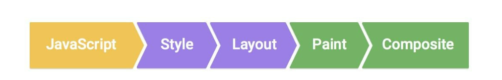
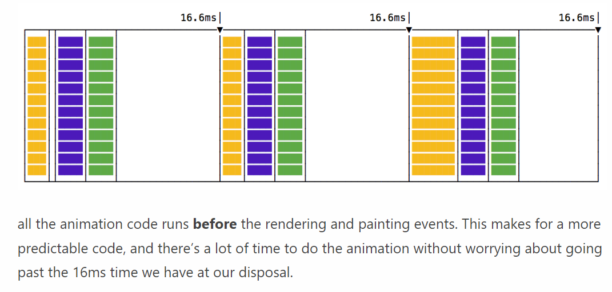

# Animation for JS

```html
function animate({timing, draw, duration}) {

  let start = performance.now();

  requestAnimationFrame(function animate(time) {
    // timeFraction goes from 0 to 1
    let timeFraction = (time - start) / duration;
    if (timeFraction > 1) timeFraction = 1;

    calculate the current animation state
    let progress = timing(timeFraction);
    
    draw(progress); // draw it
    
    if (timeFraction < 1) {
      requestAnimationFrame(animate);
    }

  });
}
```

requestAnimationFrame안에는 animation 콜백이 들어감.

콜백에는 performance.now와 같은 애니메이션 실행 시점 timestamp가 들어가게됨.
requestAnimationFrame은 엔진이 리패인트 하기 전에 실행되는 애니메이션을 위한 함수임.

초기 바깥 animate는 decorater패턴에서 가져왔음.

duration은 animation이 몇초간 진행될 것이냐를 정함 1000ms => 1s
timing과 같은 경우는 **수학적 함수**가 들어가야함. duration을 통해 계산된 x축에 해당하는 y값이 progress로 전달됨
draw는 이 progress 값을 받아서 화면의 UI를 움직이는 역할을 한다.


---

## 웹 브라우저에서 외곽을 그리는 flow



Style : DOM 객체 및 Style 객체 생성

Layout : DOM 객체가 그려질 위치를 생성함

Paint : 위치 생성하고 그 부분에 색을 칠함

Composite : 현재 레이어 합성


