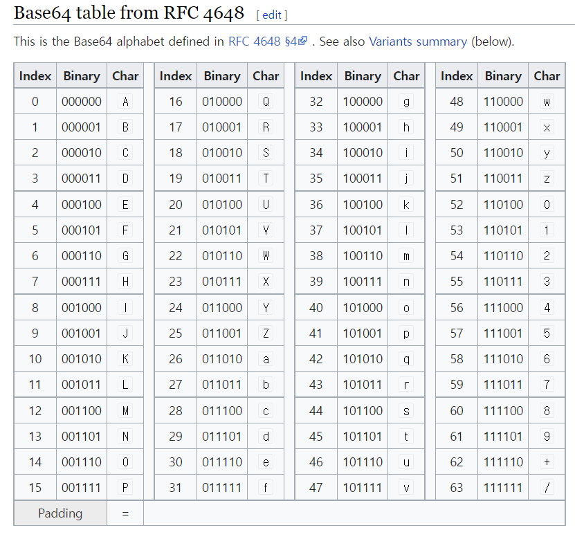

# Blob

`ArrayBuffer` and views are a part of ECMA standard, a part of JavaScript.

In the browser, there are additional higher-level objects, described in [File API](https://www.w3.org/TR/FileAPI/), in particular `Blob`.

`Blob` consists of an optional string `type` (a MIME-type usually), plus `blobParts` – a sequence of other `Blob` objects, strings and `BufferSource`.

The constructor syntax is:

```javascript
new Blob(blobParts, options);
```


# MIME types (IANA media types)

A **media type** (also known as a **Multipurpose Internet Mail Extensions or MIME type**) indicates the nature and format of a document, file, or assortment of bytes. MIME types are defined and standardized in IETF's [RFC 6838](https://datatracker.ietf.org/doc/html/rfc6838).


## [Structure of a MIME type](https://developer.mozilla.org/en-US/docs/Web/HTTP/Basics_of_HTTP/MIME_types#structure_of_a_mime_type)

A simplest MIME type consists of a *type* and a *subtype*. A MIME type comprises these strings concatenated with a slash (`/`). No whitespace is allowed in a MIME type:

```
type/subtype
```

The ***type\*** represents the general category into which the data type falls, such as `video` or `text`.

The ***subtype\*** identifies the exact kind of data of the specified type the MIME type represents. For example, for the MIME type `text`, the subtype might be `plain` (plain text), `html` ([HTML](https://developer.mozilla.org/en-US/docs/Glossary/HTML) source code), or `calendar` (for iCalendar/`.ics`) files.

Each type has its own set of possible subtypes. A MIME type always has both a type and a subtype, never just one or the other.

An optional **parameter** can be added to provide additional details:

```
type/subtype;parameter=value
```

For example, for any MIME type whose main type is `text`, you can add the optional `charset` parameter to specify the character set used for the characters in the data. If no `charset` is specified, the default is [ASCII](https://developer.mozilla.org/en-US/docs/Glossary/ASCII) (`US-ASCII`) unless overridden by the [user agent's](https://developer.mozilla.org/en-US/docs/Glossary/User_agent) settings. To specify a UTF-8 text file, the MIME type `text/plain;charset=UTF-8` is used.

MIME types are case-insensitive but are traditionally written in lowercase. The parameter values can be case-sensitive.


```javascript
let link = document.createElement('a');
link.download = 'hello.txt';

let blob = new Blob(['Hello, world!'], {type: 'text/plain'});

link.href = URL.createObjectURL(blob);

link.click();

URL.revokeObjectURL(link.href);
```

`URL.createObjectURL` takes a `Blob` and creates a unique URL for it, in the form `blob:<origin>/<uuid>`.

That’s what the value of `link.href` looks like:

`URL.createObjectURL` takes a `Blob` and creates a unique URL for it, in the form `blob:<origin>/<uuid>`.

That’s what the value of `link.href` looks like:

```none
blob:https://javascript.info/1e67e00e-860d-40a5-89ae-6ab0cbee6273
```


# HTML <a> download Attribute

## Definition and Usage

The `download` attribute specifies that the target (the file specified in the `href` attribute) will be downloaded when a user clicks on the hyperlink.

The optional value of the `download` attribute will be the new name of the file after it is downloaded. There are no restrictions on allowed values, and the browser will automatically detect the correct file extension and add it to the file (.img, .pdf, .txt, .html, etc.).

If the value is omitted, the original filename is used.

| *filename* | Optional. Specifies the new filename for the downloaded file |
| ---------- | ------------------------------------------------------------ |
| *filename* | Optional. Specifies the new filename for the downloaded file |

UUIDs are generally used for **identifying information that needs to be unique within a system or network thereof**. 

For each URL generated by `URL.createObjectURL` the browser stores a URL → `Blob` mapping internally. So such URLs are short, but allow to access the `Blob`.


Hash 구조와 같은 역할.


**So if we create a URL, that `Blob` will hang in memory, even if not needed any more.**


# Base64

2진수 6자리를 통한 문자 형상화.


```javascript
let link = document.createElement('a');
link.download = 'hello.txt';

let blob = new Blob(['Hello, world!'], {type: 'text/plain'});

let reader = new FileReader();
reader.readAsDataURL(blob); // converts the blob to base64 and calls onload

reader.onload = function() {
  link.href = reader.result; // data url
  link.click();
};
```


URL.createObjectURL(blob)

- We need to revoke them if care about memory.
- Direct access to blob, no “encoding/decoding”

Blob to data url

- No need to revoke anything.
- Performance and memory losses on big `Blob` objects for encoding.


