# display: none VS hidden: true

display:none means that the tag in question will not appear on the page at all (although you can still interact with it through the dom). ... visibility:hidden means that unlike display:none, **the tag is not visible**, but space is allocated for it on the page.


1. display:none <-> block

  아예 사라지게 하는것. 보이지도 않고 해당 공간도 존재하지 않게 됨

 

2. visibility:hidden <-> visible

  보이지만 않고 해당 공간은 존재. width와 height값을 주었다면 그만큼 공간은 존재하게 됨


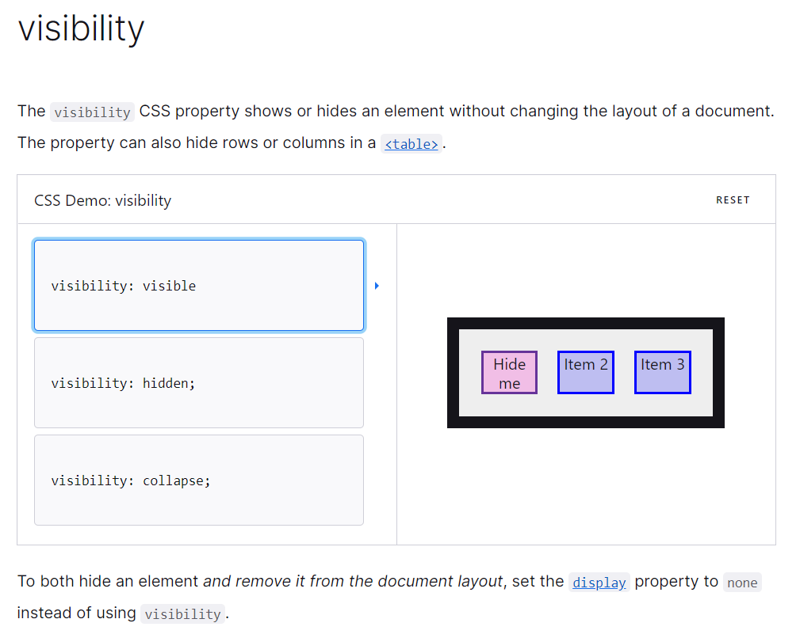


# display property

- display: block;

 

일반적으로 설정하지 않아도 div가 갖게되는 기본값입니다. (태그에 따라 기본값이 다를 수 있습니다.)

기본적으로 width 가 자신의 컨테이너의 100% 가 되게끔 합니다. 쉽게 말하자면, 가로 한 줄을 다 차지하게 됩니다.

 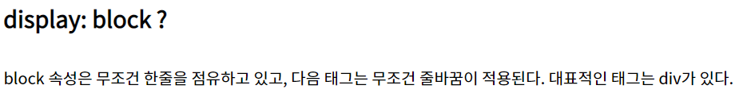


- display: inline;

 

컨텐츠를 딱 감쌀정도의 크기만 갖게됩니다. block태그와 다르게 줄바꿈이 되지 않고, 반드시 컨텐츠를 감싸게 되고, 크기를 변화시킬 수 없습니다. 예시 css에서도 width를 임의로 500px 로 바꾸어줬지만 크기는 여전히 글의 길이 만큼입니다.

 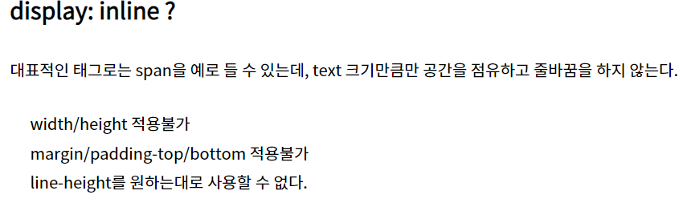

- display: inline-block;

 

inline과 block의 특성을 합쳐놓은 속성입니다. 

**기본적으로는 inline의 속성을 지니고 있지만, 임의로 크기를 바꿔줄 수 있습니다. ** 

참고로 Explorer 7 이하에서는 사용할 수 없습니다. block의 속성을 지녔으므로 width, height 변경이 가능하게 만듭니다.

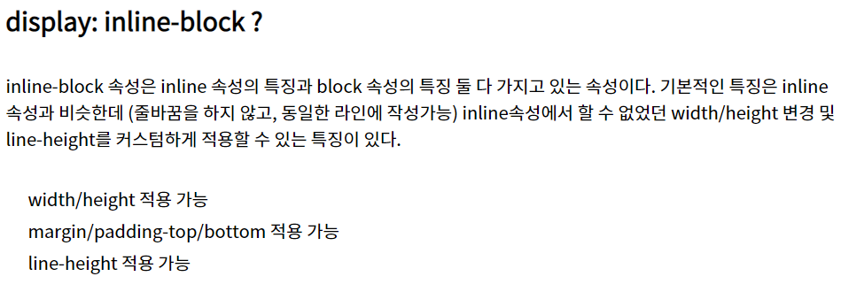


# list-style: none

리스트로 감쌌지만 리스트 스타일은 사용하지 않겠다.


# 이미지 다루기 참고

이미지 크기는 고유값이 정해져 있지만(replaced elem) 컨테이너 박스에 받아온 뒤 내가 설정 할 수 있는 것임 (width, Height)

https://ko.javascript.info/task/carousel

- 참고 코드

  ``` css
  .carousel img {
    width: 130px;
    height: 130px;
    /* make it block to remove space around images */
    display: block;
  }
  ```

  ```javascript
    <div id="carousel" class="carousel">
      <button class="arrow prev">⇦</button>
      <div class="gallery">
        <ul class="images">
          <li></li>
  ```

img를 불러와서 block 속성을 가진 태그의 width와 height를 통해 이미지 크기를 조절하는 모습이다.


# 태그안의 태그 

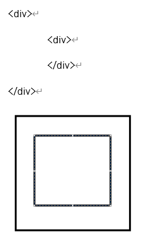

자식 안의 요소는 부모 안에 그려짐.


# Pseudo-classes

셀렉터의 특정한 상태를 구체화할 수 있게끔 만든 클래스.


# border-collapse

사용가능한 property 속성값 : **collapse, separate**

각 table의 cell이 격자로 나눠지는가, 안나눠지는가 그 차이이다.

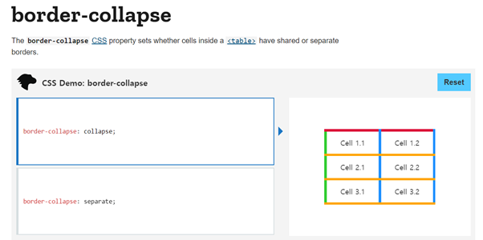

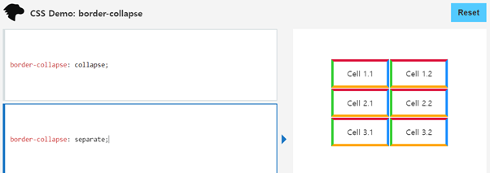


# box-shadow

링크 참조 : https://developer.mozilla.org/en-US/docs/Web/CSS/box-shadow

The **`box-shadow`** [CSS](https://developer.mozilla.org/en-US/docs/Web/CSS) property adds shadow effects around an element's frame. You can set multiple effects separated by commas. A box shadow is described by X and Y offsets relative to the element, blur and spread radius, and color.

```css
/* offset-x | offset-y | color */
box-shadow: 60px -16px teal;
```


# 블록 및 인라인 요소

블록 레벨 요소로는 < div >, < form >, < h1 > 계열, < header >, < hr >, < li >, < nav >, < ol >, < p >, < pre >, < table >, < ul > 등이 있습니다.

인라인 요소로는 < b >, < i >, < a >, br 태그, < img >, < span > < input > 등이 있습니다.


# 기초: 사각형 그리기

div로 만약 사각형을 그려주기 위해서는 html DOM에 선언만 해서는 끝나지 않는다.

기본적으로 div안의 요소가 없다면 display: block / width: 부모요소px / height: 0px / background: white로 지정되기 때문에 출력되지 않는다. 

**background: white인 것을 유의. 왜냐? 글자 출력 및 사진 출력은 흰색 배경위에 들어가야 하기때문이다. 본질적으로 div는 container 역할을 하기 때문이라고 엮어 생각하라.** 

고로 Width, height를 조정하고 background 색상 지정 아니면,  border-style: solid; 를 주고 외곽을 그려라.


# Float 

CSS float

The float CSS property **places an element on the left or right side of its container**, allowing text and inline elements to wrap around it. 


# background-position

The `**background-position**` [CSS](https://developer.mozilla.org/en-US/docs/Web/CSS) property sets the initial position for each background image. The position is relative to the position layer set by [`background-origin`](https://developer.mozilla.org/en-US/docs/Web/CSS/background-origin).

백그라운드 포지션 설명.

값 0에는 px 붙이지 않음.


- 참조 문제 : https://ko.javascript.info/task/drag-heroes

```html
<html>

<head>
    <style>
        .hero {
            background: url(https://js.cx/drag-heroes/heroes.png);
            width: 130px;
            height: 128px;
        }

        .hero2 {
            background: url(https://js.cx/drag-heroes/heroes.png);
        }

        #superhero {
            background-position: 0 -128px;     
        }   

        #hulk {
            background-position: -250px 0;     
        }   

    </style>
</head>

<body>
    <div class="hero">

    </div>

    

    <div id="superhero" class="hero">

    </div>

    <div id="hulk" class="hero">

    </div>
</body>

</html>

```

기본적으로 url 'https://js.cx/drag-heroes/heroes.png' 링크를 통해 불러오게 되면 히어로 **여러명**이 존재하는 사진이 추출된다. 그것을 div 컨테이너의 background(배경)으로 설정해주고 한 명의 히어로만이 노출될 수 있는 컨테이너의 크기(width, height)를 임의로 설정해준다. 

background-position: 0 -128px; 이런 방법으로 X축 Y축을 조정하게 되면 div 컨테이너는 가만히 있지만 사진만 뒤에서 움직이게 되는 효과를 만들어 각 컨테이너에 여러명의 히어로를 하나씩 배치할 수 있는 것이다.

div는 그냥 틀임. 사각형 보여줄 틀이라고 생각하면 됨.

------------------------------------------------------------------------

Background-position으로 X축 Y축 배경 이미지를 움직일 수 있음.

(물론, Background가 설정되어야 함.)


Width: 130, height:128을 통하여 틀과 배경이미지를 설정함.

 거기서 이미지를 움직이면서 보여줄 “히어로”만 틀에 맞춘 방식.

 ㅁㅁㅁㅁ
 ㅁㅁㅁ

궁극적으로, 각 히어로들은 div 틀로 되어 있어 개별적으로 이용 가능하게됨.


# ::before (:before)

In CSS, **`::before`** creates a [pseudo-element](https://developer.mozilla.org/en-US/docs/Web/CSS/Pseudo-elements) that is the first child of the selected element. It is often used to add cosmetic content to an element with the [`content`](https://developer.mozilla.org/en-US/docs/Web/CSS/content) property. It is inline by default.

A CSS pseudo-element is **a keyword added to a selector that lets you style a specific part of the selected element(s)**.

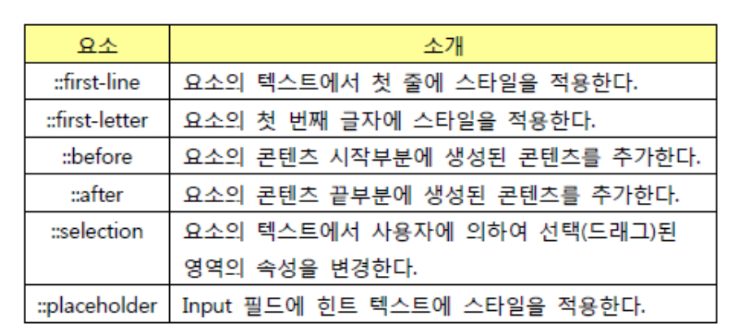

```react
h1::after {
  content: url(smiley.gif);
}
```

컨텐츠에는 DOM은 안된다.


# text-align

`text-align` 속성은 텍스트의 정렬 방향을 의미합니다.

- `left`: 왼쪽 정렬
- `right`: 오른쪽 정렬
- `center`: 중앙 정렬
- `justify`: 양쪽 정렬 (자동 줄바꿈시 오른쪽 경계선 부분 정리)


# CSS 다중 선택자

**css 다중 선택자로 여러 요소를 동시에 선택해서 적용 할수 있다.**

 

**1.공백없이 클래스끼리 붙어있는 경우**

**.class1.class2{}** ex)-.name1.name2

클래스 속성 내에 name1과 name2가 모두 설정된 모든 요소를 선택합니다.

 

**2.쉼표가 있는 경우**

element, element, element { style properties }

css **선택자 목록**(,)은 일치하는 모든 요소를 선택합니다.

쉼표로 구분한 목록을 한 줄에 배치할 수 있습니다.

```
h1, h2, h3, h4, h5, h6 { font-family: helvetica; }
```

 

**3.공백으로 연결해서 사용 하면 하위 개체로 지정합니다**

.a .b .c

a클래스 내부의 b클래스 내부 c클래스요소에만 스타일 적용합니다.

 

특정 요소의 앞, 뒤 혹은 내부에 있는 것을 선택하는 법 A > B

부모가 A이고 아래 단계인 b요소들만 선택한다.


# border vs outline

**border는 옵션의 두께만큼 박스의 전체 크기도 늘어나게 하는 반면 outline은 박스의 크기를 늘리는 게 아니라 단지 테두리만 생기는 것뿐**이랍니다. 만약, 여러 개의 박스를 가로로 정렬하고 싶은데 border값을 주면 그 두께만큼 간격이 벌어지지만 outline은 간격이 벌어지지 않고 현재 위치에서 테두리만 생기게 하는 겁니다. **즉 레이아웃에 영향을 끼치지 않죠.**


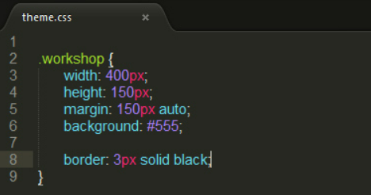

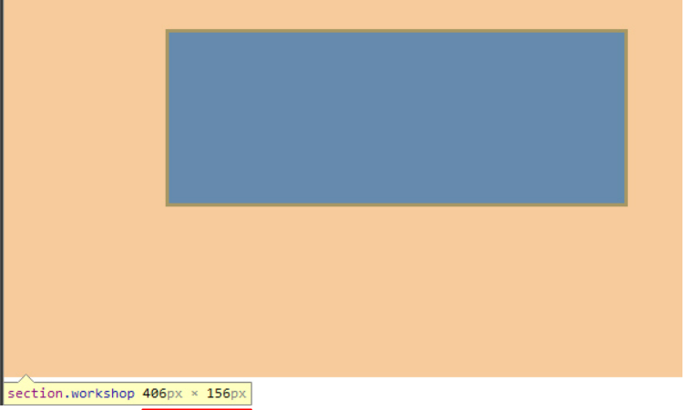

### width 400px, height 150px, border 3px

border의 top, bottom / left, right +3px 증가되는 것을 볼 수 있다. 이 경우에는 outline을 사용함.


# margin-top

The **`margin-top`** [CSS](https://developer.mozilla.org/en-US/docs/Web/CSS) property sets the [margin area](https://developer.mozilla.org/en-US/docs/Web/CSS/CSS_Box_Model/Introduction_to_the_CSS_box_model#margin_area) on the top of an element. A positive value places it farther from its neighbors, while a negative value places it closer.

**인라인 요소에는 적용되지 않는다.**


```css
/* 네 면 모두 적용 */
margin: 1em;
margin: -3px;

/* 세로방향 | 가로방향 */
margin: 5% auto;

/* 위 | 가로방향 | 아래 */
margin: 1em auto 2em;

/* 위 | 오른쪽 | 아래 | 왼쪽 */
margin: 2px 1em 0 auto;
```

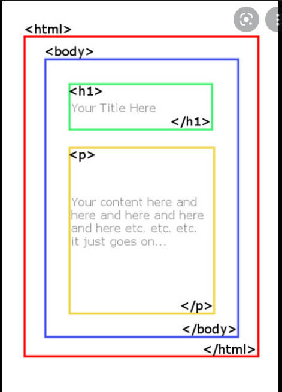

# margin 0 auto

So in margin: 0 auto, **the top/bottom margin is** 0, and the left/right margin is auto, Where auto means that the left and right margin are automatically set by the browser based on the container, to make element centered.


# relative 상세 설명

```
relative
```

The element is positioned according to the normal flow of the document, and then offset *relative to itself* based on the values of `top`, `right`, `bottom`, and `left`. The offset does not affect the position of any other elements; thus, the space given for the element in the page layout is the same as if position were `static`.

말하자면 현재 document의 flow에서 위치가 정해진 다음 거기서 top,right,bottom,left를 사용할 수 있는 것이다.

위치 = static의 위치.


# vertical-align 속성과 Inline-block레벨 요소의 baseline

> vertical-align은 inline요소 또는 inline-block요소들끼리 수직 정렬을 어떻게 할지 지정하는 속성이다.

(block레벨 요소에는 적용되지 않는 속성이다)


The `vertical-align` property in CSS controls how elements set next to each other on a line are lined up.

```css
img {
  vertical-align: middle;
}
```

In order for this to work, the elements need to be set along a baseline. As in, `inline` (e.g. `<span>`, ``) or `inline-block` (e.g. as set by the [`display`](https://css-tricks.com/almanac/properties/d/display/) property) elements.

The valid values are:

- `baseline` – This is the default value.
- `top` – Align the top of the element and its descendants with the top of the entire line.
- `bottom` – Align the bottom of the element and its descendants with the bottom of the entire line.
- `middle` – Aligns the middle of the element with the middle of lowercase letters in the parent.
- `text-top` – Aligns the top of the element with the top of the parent element’s font
- `text-bottom` – Aligns the bottom of the element with the bottom of the parent element’s font.
- `sub` – Aligns the baseline of the element with the subscript-baseline of its parent. Like where a `<sub>` would sit.
- `super` – Aligns the baseline of the element with the superscript-baseline of its parent. Like where a `<sup>` would sit.
- `length` – Aligns the baseline of the element at the given length above the baseline of its parent. (e.g. px, %, em, rem, etc.)

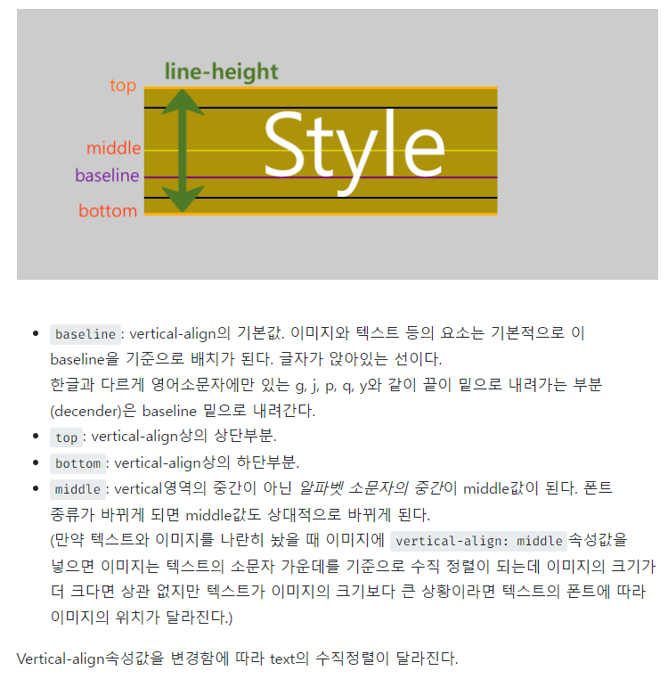

line-box 높이 !=  content-area 높이

인라인 요소 - 만약 `height` 값이 `auto`이면 `lihe-height`가 사용되고, `content-area`는 `line-height`와 정확히 동일해집니다.


```javascript
 <p>
    <span>Ba</span>
    <span>Ba</span>
</p>
p {
    font-family: Catamaran;
    font-size: 100px;
    line-height: 200px;
}
```

`font-family, font-size` 고정된 `line-height`를 상속한 2개의 형제 `<span>` 요소를 갖고 있는 `<p>` 태그가 있습니다. `Baseline`은 일치하고 있으며, `line-box`의 높이와 `line-height`값은 같습니다.
[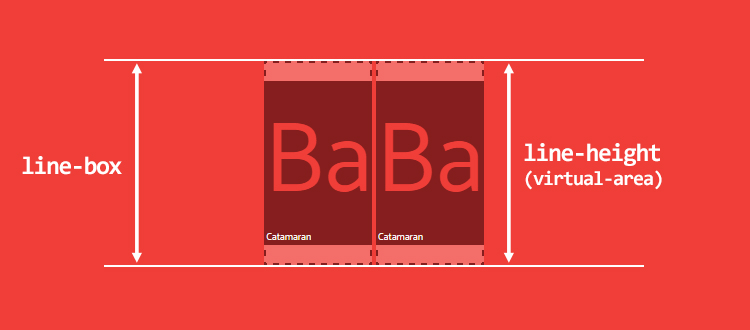
](http://wit.nts-corp.com/wp-content/uploads/2017/09/-11)그림 10. 동일한 폰트 값, 동일한 baseline 모든 것이 괜찮아 보입니다.
두 번째 요소의 폰트 크기가 더 작은 경우 어떻게 될까요?

```
span:last-child { font-size: 50px; }
```

이상하게 들리겠지만, **기본 baselines 정렬은** 아래 이미지에서 볼 수 있듯이 **더 높은(!) line-box를 만들 수 있습니다**.
line-box의 높이는 자식 요소의 가장 높은 지점에서 가장 낮은 지점까지를 계산한 값이라는 것을 기억합시다.
[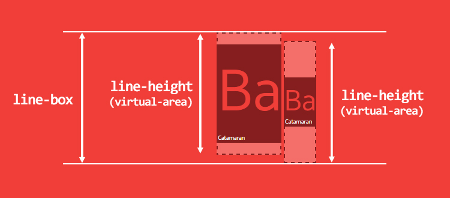](http://wit.nts-corp.com/wp-content/uploads/2017/09/-12)

그림 11. 더 작은 자식 요소는 line-box의 높이를 더 높일 수 있습니다.
[line-height에 단위 없는 값을 사용하는 것이 좋다](http://allthingssmitty.com/2017/01/30/nope-nope-nope-line-height-is-unitless/)라는 주장이 있을 수 있습니다. 하지만, [완벽한 수직 리듬을 만들기 위해서는](https://scotch.io/tutorials/aesthetic-sass-3-typography-and-vertical-rhythm#baseline-grids-and-vertical-rhythm) 고정된 값이 필요합니다. **솔직히 말하면,** **당신이 무엇을 선택하든 항상 인라인 정렬에 문제를 겪을 것입니다.**


```css
.container {
line-height: 300px;
/* 한 줄의 높이를 300px로 적용 */
}
```

이렇게 부모요소에 height의 크기만큼 line-hiehgt값을 적용해주면 box의 세로정렬 활동영역이 container의 height만큼 늘어나면서 그에 대한`vertical-align: middle;`이 적용되어 container의 세로 가운데로 위치할 수 있는 것이다.


Vertical align은 inline, inline-block, cell-block 요소들의 수직 정렬을 담당한다.


# rem, em css 요소

CSS의 길이 단위 중 em과 rem은 상대적으로 크기를 정합니다.

### em - 상위 요소 기준

em 단위는 상위 요소 크기의 몇 배인지로 크기를 정합니다. 예를 들어

```
font-size: 1.5em;
```

은 글자 크기를 상위 요소 크기의 1.5배로 하겠다는 뜻입니다.

간단한 예제를 만들어보겠습니다.


```html
<!doctype html>
<html lang="ko">
  <head>
    <meta charset="utf-8">
    <title>CSS</title>
    <style>
      html { font-size: 16px; }
      body { font-size: 1.5em; }
      .a { font-size: 2.0em; }
    </style>
  </head>
  <body>
    <p class="a">Lorem Ipsum Dolor</p>
  </body>
</html>
```

html 요소의 크기는 16px, body 요소의 크기는 상위 요소인 html 요소의 크기의 1.5배인 24px, 문단 요소의 크기는 상위 요소인 body 요소의 크기의 2배인 48px가 됩니다.

16 × 1.5 × 2 = 48

크기는 요소 검사로 확인할 수 있습니다.


### rem - html 요소 기준

rem 단위는 문서의 최상위 요소, 즉 html 요소의 크기의 몇 배인지로 크기를 정합니다. 위 예제에서

```
.a { font-size: 2.0em; }
```

에서 단위를 rem으로 바꾸면

```
.a { font-size: 2.0rem; }
```

글자 크기가 32px가 됩니다.

html 요소의 크기가 16px이므로, 그것의 두 배인 32px가 되는 것입니다.

16 × 2 = 32

html 요소와 문단 요소 사이에 있는 body 요소의 크기는 영향을 미치지 않습니다.

### 참고

- html 요소 크기의 기본값은 웹브라우저 설정에서 정한 글자 크기입니다. 보통 16px입니다.


# elem의 name css select


You can use the attribute selector,


```css
input[name="goButton"] {
  background: red;
}
<input name="goButton">
```


# monospace


```
monospace
```

All glyphs have the same fixed width.

For example: Fira Mono, DejaVu Sans Mono, Menlo, Consolas, Liberation Mono, Monaco, Lucida Console, monospace.


# text-indent

Definition and Usage

The `text-indent` property specifies the indentation of the first line in a text-block.

**Note:** Negative values are allowed. The first line will be indented to the left if the value is negative.

```css
div.a {
  text-indent: 50px;
}

div.b {
  text-indent: -2em;
}

div.c {
  text-indent: 30%;
}
```


# 텍스트 드래그 멈추기

```css
style="user-select: none;"
```


# css 적용 우선 순위

## 개요

`CSS`의 특성상 어떤 태그에 속성이 중복되어 설정될 수 있는데요,
`CSS`는 어떤 속성이 우선되어 적용되는지 미리 명시하고 있습니다.

우선순위는 아래와 같습니다.

1. 속성 값 뒤에 `!important` 를 붙인 속성
2. `HTML`에서 [`style`](https://ofcourse.kr/html-course/태그의-속성#style-속성)을 직접 지정한 속성
3. `#id` 로 지정한 속성
4. `.클래스`, `:추상클래스` 로 지정한 속성
5. `태그이름` 으로 지정한 속성
6. 상위 객체에 의해 **상속**된 속성

같은 우선 순위에 있는 경우, 부모-자식 관계가 많은 경우가 우선되며, 모든 설정이 같은 경우 **나중**에 선언한 것이 우선되어 적용됩니다.


# user-drag

- user-drag: none;

user의 text 드래그를 막는 css.


[User Drag](http://css-infos.net/property/-webkit-user-drag) is generic


# user-select

The **`user-select`** [CSS](https://developer.mozilla.org/en-US/docs/Web/CSS) property controls whether the user can select text. This doesn't have any effect on content loaded as part of a browser's user interface (its [chrome](https://developer.mozilla.org/en-US/docs/Glossary/Chrome)), except in textboxes.

```
none
```

The text of the element and its sub-elements is not selectable. Note that the [`Selection`](https://developer.mozilla.org/en-US/docs/Web/API/Selection) object can contain these elements.


User select is specific to `text`

[User Drag](http://css-infos.net/property/-webkit-user-drag) is generic, that can be applied to `div, image, p, etc.,`
