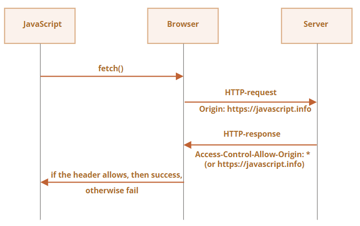
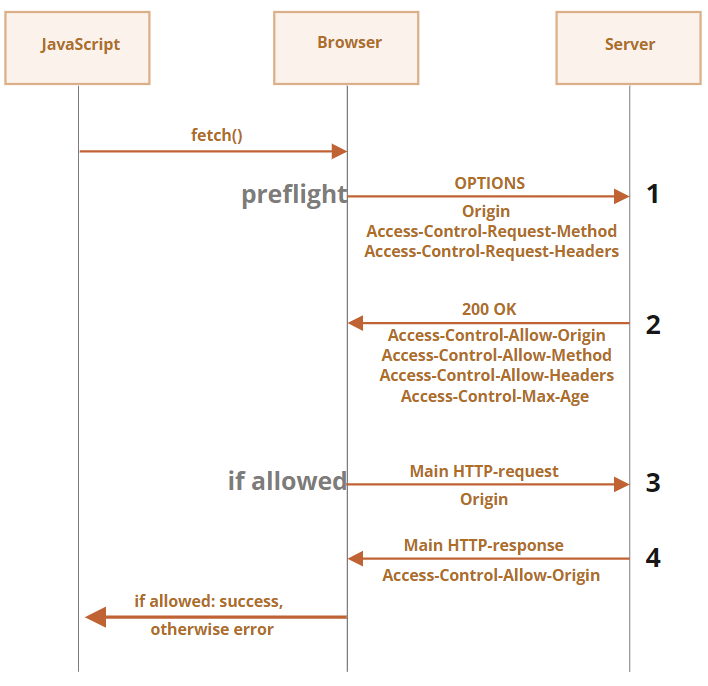

# CORS

`fetch`로 요청을 보내게 될 사이트가 현재 접속 사이트와 다르다면 요청이 실패할 수 있습니다.

직접 `http://example.com`라는 사이트에 요청을 보내봅시다.

```javascript
try {
  await fetch('http://example.com');
} catch(err) {
  alert(err); // TypeError: Failed to fetch
}
```

요청이 실패한 것을 확인할 수 있네요.

왜 요청이 실패하는지 알기 위해선 도메인·프로토콜·포트 세 가지에 의해 결정되는 *오리진(origin)* 이라는 핵심 개념을 알아야 합니다.

도메인이나 서브도메인, 프로토콜, 포트가 다른 곳에 요청을 보내는 것을 Cross-Origin Request(크로스 오리진 요청)라고 합니다. 크로스 오리진 요청을 보내려면 리모트 오리진에서 전송받은 특별한 헤더가 필요합니다.

이러한 정책을 'CORS(Cross-Origin Resource Sharing, 크로스 오리진 리소스 공유)'라고 부릅니다.


## [안전한 요청](https://ko.javascript.info/fetch-crossorigin#ref-225)

크로스 오리진 요청은 크게 두 가지 종류로 구분됩니다.

1. 안전한 요청(safe request)
2. 그 외의 요청(안전한 요청이 아닌 요청)

안전한 요청은 그 외의 요청 대비 만들기 쉽습니다. 그러니 먼저 안전한 요청부터 살펴보도록 합시다.

안전한 요청은 다음과 같은 두 가지 조건 모두를 충족하는 말 그대로 안전한 요청입니다.

1. [안전한 메서드(safe method)](https://fetch.spec.whatwg.org/#cors-safelisted-method) – GET이나 POST, HEAD를 사용한 요청

2. 안전한 헤더(safe header)

    

   – 다음 목록에 속하는 헤더

   - `Accept`
   - `Accept-Language`
   - `Content-Language`
   - 값이 `application/x-www-form-urlencoded`이나 `multipart/form-data`, `text/plain`인 `Content-Type`

두 조건을 모두 충족하지 않는 요청은 '안전하지 않은(unsafe) 요청’으로 취급됩니다. `PUT` 메서드를 사용하거나 헤더에 `API-Key`가 명시된 요청의 경우같이 말이죠.

안전한 요청과 그렇지 않은 요청의 근본적인 차이는 **특별한 방법을 사용하지 않고도 `<form>`이나 `<script>`를 사용해 요청을 만들 수 있다는 점**에 있습니다.

아주 오래된 웹 서버라도 안전한 요청은 당연히 처리할 수 있어야 하는 것이죠.

표준이 아닌 헤더가 들어있거나 안전하지 않은 메서드(`DELETE` 등)를 사용한 요청은 안전한 요청이 될 수 없습니다. 아주 오래전에는 자바스크립트를 사용해 이런 요청을 보내는 것이 불가능 했습니다. 따라서 연식이 오래된 서버는 이런 요청을 받으면 ‘웹 페이지는 이런 요청을 보낼 수 없었기 때문에’ 뭔가 특별한 곳에서 요청이 왔을거라 해석했었습니다.

그런데 시간이 지나고 개발자가 자바스크립트를 사용해 안전하지 않은 요청을 보낼 수 있게되자, 브라우저는 안전하지 않은 요청을 서버에 전송하기 전에 ‘preflight’ 요청을 먼저 전송해 '서버가 크로스 오리진 요청을 받을 준비가 되어있는지를 확인’합니다.

이때 서버에서 크로스 오리진 요청은 허용하지 않는다는 정보를 담은 헤더를 브라우저에 응답하면 안전하지 않은 요청은 서버로 전송되지 않습니다.

이제 개괄적인 설명이 끝났으니 CORS에 대해 좀 더 자세히 알아봅시다.

## [CORS와 안전한 요청](https://ko.javascript.info/fetch-crossorigin#ref-226)

크로스 오리진 요청을 보낼 경우 브라우저는 항상 `Origin`이라는 헤더를 요청에 추가합니다.

`https://javascript.info/page`에서 `https://anywhere.com/request`에 요청을 보낸다고 가정해 봅시다. 헤더는 다음과 같은 형태가 됩니다.

```http
GET /request
Host: anywhere.com
Origin: https://javascript.info
...
```

보시다시피 `Origin` 헤더엔 요청이 이뤄지는 페이지 경로(/page)가 아닌 오리진(도메인·프로토콜·포트) 정보가 담기게 됩니다.

서버는 요청 헤더에 있는 `Origin`를 검사하고, 요청을 받아들이기로 동의한 상태라면 특별한 헤더 `Access-Control-Allow-Origin`를 응답에 추가합니다. 이 헤더엔 허가된 오리진(위 예시에선 `https://javascript.info`)에 대한 정보나 `*`이 명시됩니다. 이때 응답 헤더 `Access-Control-Allow-Origin`에 오리진 정보나 `*`이 들어있으면 응답은 성공하고 그렇지 않으면 응답이 실패하게 됩니다.

이 과정에서 브라우저는 중재인의 역할을 합니다.

1. 브라우저는 크로스 오리진 요청 시 `Origin`에 값이 제대로 설정, 전송되었는지 확인합니다.
2. 브라우저는 서버로부터 받은 응답에 `Access-Control-Allow-Origin`이 있는지를 확인해서 서버가 크로스 오리진 요청을 허용하는지 아닌지를 확인합니다. 응답 헤더에 `Access-Control-Allow-Origin`이 있다면 자바스크립트를 사용해 응답에 접근할 수 있고 아니라면 에러가 발생합니다.




서버에서 크로스 오리진 요청을 허용한 경우, preflight 요청에 대한 응답은 다음과 같은 형태를 띕니다.

```http
200 OK
Content-Type:text/html; charset=UTF-8
Access-Control-Allow-Origin: https://javascript.info
```

## [응답 헤더](https://ko.javascript.info/fetch-crossorigin#ref-227)

크로스 오리진 요청이 이뤄진 경우, 자바스크립트는 기본적으로 ‘안전한’ 응답 헤더로 분류되는 헤더에만 접속할 수 있습니다. ‘안전한’ 응답 헤더는 다음과 같습니다.

- `Cache-Control`
- `Content-Language`
- `Content-Type`
- `Expires`
- `Last-Modified`
- `Pragma`

이 외의 응답 헤더에 접근하면 에러가 발생합니다.


**주의:**

위 리스트에 `Content-Length` 헤더는 없습니다!

`Content-Length`는 응답 본문 크기 정보를 담고 있는 헤더입니다. 무언가를 다운로드하는데, 다운로드가 몇 퍼센트나 진행되었는지 확인하려면 이 헤더에 접근할 수 있어야 합니다. 그런데 이 헤더에 접근하려면 특별한 권한이 필요합니다. 자세한 내용은 아래에서 다루겠습니다.


자바스크립트를 사용해 안전하지 않은 응답 헤더에 접근하려면 서버에서 `Access-Control-Expose-Headers`라는 헤더를 보내줘야만 합니다. `Access-Control-Expose-Headers`엔 자바스크립트 접근을 허용하는 안전하지 않은 헤더 목록이 담겨있습니다. 각 헤더는 콤마로 구분됩니다.

예시:

```http
200 OK
Content-Type:text/html; charset=UTF-8
Content-Length: 12345
API-Key: 2c9de507f2c54aa1
Access-Control-Allow-Origin: https://javascript.info
Access-Control-Expose-Headers: Content-Length,API-Key
```

이렇게 `Access-Control-Expose-Headers` 헤더가 응답 헤더에 있어야만 자바스크립트로 응답 헤더의 `Content-Length`와 `API-Key`를 읽을 수 있습니다.


## [안전하지 않은 요청](https://ko.javascript.info/fetch-crossorigin#ref-228)

요즘엔 요청에 `GET`, `POST` 뿐만 아니라 `PATCH`, `DELETE` 등 어떤 메서드도 사용할 수 있습니다.

그런데 과거엔 웹페이지에서 `GET`, `POST` 이외의 HTTP 메서드를 사용해 요청을 보낼 수 있을거란 상상조차 할 수 없었습니다. 아직까지도 이런 메서드를 다룰 수 없는 웹서버도 꽤 있죠. 이런 서버들은 `GET`, `POST` 이외의 메서드를 사용한 요청이 오면 '이건 브라우저가 보낸 요청이 아니야’라고 판단하고 접근 권한을 확인합니다.

이런 혼란스러운 상황을 피하고자 브라우저는 ‘안전하지 않은’ 요청이 이뤄지는 경우, 서버에 바로 요청을 보내지 않고 ‘preflight’ 요청이라는 사전 요청을 서버에 보내 권한이 있는지를 확인합니다.

preflight 요청은 `OPTIONS` 메서드를 사용하고 두 헤더가 함께 들어가며, 본문은 비어있습니다.

- `Access-Control-Request-Method` 헤더 – 안전하지 않은 요청에서 사용하는 메서드 정보가 담겨있습니다.
- `Access-Control-Request-Headers` 헤더 – 안전하지 않은 요청에서 사용하는 헤더 목록이 담겨있습니다. 각 헤더는 쉼표로 구분됩니다.

안전하지 않은 요청을 허용하기로 협의하였다면 서버는 본문이 비어있고 상태 코드가 200인 응답을 다음과 같은 헤더와 함께 브라우저로 보냅니다.

- `Access-Control-Allow-Origin` – `*`이나 요청을 보낸 오리진 이어야 합니다(예: https://javascript.info)
- `Access-Control-Allow-Methods` – 허용된 메서드 정보가 담겨있습니다.
- `Access-Control-Allow-Headers` – 허용된 헤더 목록이 담겨있습니다.
- `Access-Control-Max-Age` – 퍼미션 체크 여부를 몇 초간 캐싱해 놓을지를 명시합니다. 이렇게 퍼미션 정보를 캐싱해 놓으면 브라우저는 일정 기간 동안 preflight 요청을 생략하고 안전하지 않은 요청을 보낼 수 있습니다.



필요한 개념은 충분히 다뤘으니 이제 실제 안전하지 않은 크로스 오리진 요청이 어떻게 이뤄지는지 예시를 통해 살펴봅시다. 예시에선 `PATCH` 메서드를 사용해 요청을 보내겠습니다. 참고로 `PATCH` 메서드는 데이터를 갱신할 때 자주 쓰입니다.

```javascript
let response = await fetch('https://site.com/service.json', {
  method: 'PATCH',
  headers: {
    'Content-Type': 'application/json',
    'API-Key': 'secret'
  }
});
```

참고로 위 요청이 안전하지 않은 요청으로 분류되는 데는 세 가지 이유가 있습니다.

- `PATCH` 메서드를 사용하고 있습니다.
- `Content-Type`이 `application/x-www-form-urlencoded`나 `multipart/form-data`, `text/plain`가 아닙니다.
- 비표준 헤더 `API-Key`를 사용합니다.

## [자격 증명](https://ko.javascript.info/fetch-crossorigin#ref-233)

자바스크립트로 크로스 오리진 요청을 보내는 경우, 기본적으로 쿠키나 HTTP 인증 같은 자격 증명(credential)이 함께 전송되지 않습니다.

HTTP 요청의 경우 대개 쿠키가 함께 전송되는데, 자바스크립트를 사용해 만든 크로스 오리진 요청은 예외이죠.

따라서 `fetch('http://another.com')`를 사용해 요청을 보내도 `another.com` 관련 쿠키가 함께 전송되지 않습니다.

왜 그럴까요?

이런 예외가 생긴 이유는 자격 증명과 함께 전송되는 요청의 경우 영향력이 강하기 때문입니다. 크로스 오리진 요청 시 자격 증명을 함께 전송할 수 있으면 사용자 동의 없이 자바스크립트로 민감한 정보에 접근할 수 있게 됩니다.

그럼에도 불구하고 서버에서 이를 허용하고 싶다면, 자격 증명이 담긴 헤더를 명시적으로 허용하겠다는 세팅을 서버에 해줘야 합니다.

`fetch` 메서드에 자격 증명 정보를 함께 전송하려면 다음과 같이 `credentials: "include"` 옵션을 추가하면 됩니다.

```javascript
fetch('http://another.com', {
  credentials: "include"
});
```

이렇게 옵션을 추가하면 `fetch`로 요청을 보낼 때 `another.com`에 대응하는 쿠키가 함께 전송됩니다.

*자격 증명 정보가 담긴* 요청을 서버에서 받아들이기로 동의했다면 서버는 응답에 `Access-Control-Allow-Origin` 헤더와 함께 `Access-Control-Allow-Credentials: true` 헤더를 추가해서 보냅니다.

예시:

```http
200 OK
Access-Control-Allow-Origin: https://javascript.info
Access-Control-Allow-Credentials: true
```

자격 증명이 함께 전송되는 요청을 보낼 땐 `Access-Control-Allow-Origin`에 `*`을 쓸 수 없습니다. 위 예시에서처럼 `Access-Control-Allow-Origin`엔 정확한 오리진 정보만 명시되어야 합니다. 이런 제약이 있어야 어떤 오리진에서 요청이 왔는지에 대한 정보를 서버가 신뢰할 수 있기 때문입니다.