# Window.innerWidth

The read-only [`Window`](https://developer.mozilla.org/en-US/docs/Web/API/Window) property **`innerWidth`** returns the interior width of the window in pixels. This includes the width of the vertical scroll bar, if one is present.

More precisely, `innerWidth` returns the width of the window's [layout viewport](https://developer.mozilla.org/en-US/docs/Glossary/Layout_viewport). The interior height of the window—the height of the layout viewport—can be obtained from the [`innerHeight`](https://developer.mozilla.org/en-US/docs/Web/API/Window/innerHeight) property.

세로 스크롤 넓이까지 포함하여 Viewport(사용자가 보고 있는 창)의 넓이를 반환한다.


# Window.innerHeight

The read-only **`innerHeight`** property of the [`Window`](https://developer.mozilla.org/en-US/docs/Web/API/Window) interface returns the interior height of the window in pixels, including the height of the horizontal scroll bar, if present.

The value of `innerHeight` is taken from the height of the window's [layout viewport](https://developer.mozilla.org/en-US/docs/Glossary/Layout_viewport).

가로 스크롤 높이까지 포함하여 Viewport(사용자가 보고 있는 창)의 높이를 반환한다.

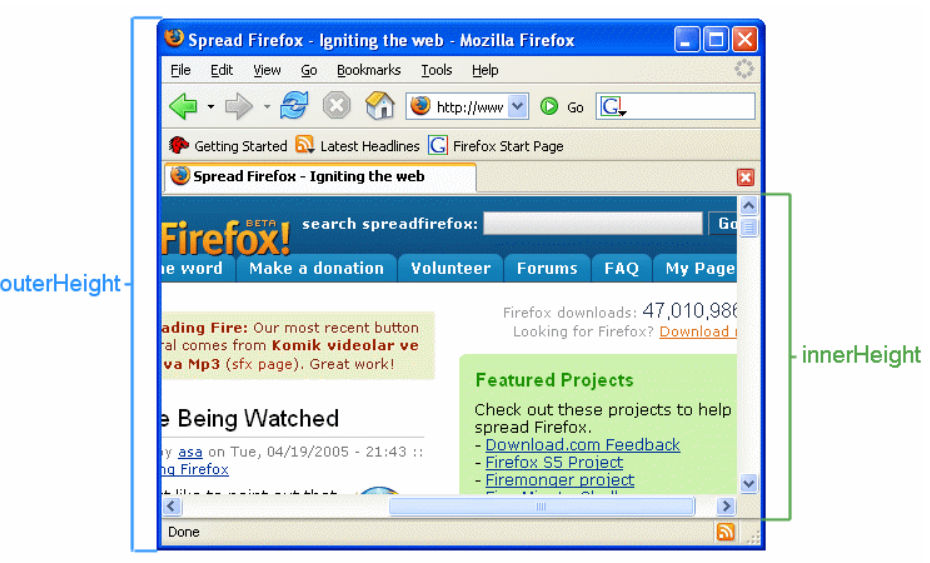

# html.clientWidth

If you need to obtain the width of the window minus the scrollbar and borders, use the root <html> element's clientWidth property instead.

Viewport(사용자가 보고 있는 창)의 스크롤넓이를 제외한 길이를 반환 받을 수 있는 메소드.

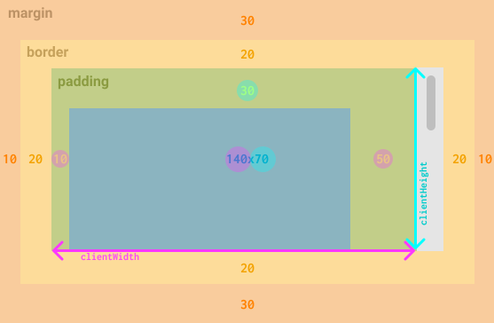

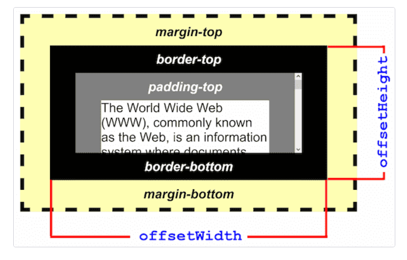

# html.clientHeight

Viewport(사용자가 보고 있는 창)의 스크롤높이를 제외한 길이를 반환 받을 수 있는 메소드.


# element.clientTop

getBoundingClientRect() **필요 없이** 사용할 수 있는 메소드로 elem의 top border 값을 얻을 수 있다.

As it happens, all that lies between the two locations (`offsetTop` and client area top) is the element's border.

offsetTop과 Client area Top 사이의 길이.

- 참고 코드

  https://ko.javascript.info/introduction-browser-events


``` javascript
      let ballCoords = {
        top: event.clientY - fieldCoords.top - field.clientTop - ball.clientHeight / 2,
        left: event.clientX - fieldCoords.left - field.clientLeft - ball.clientWidth / 2
      };
```


# Element.clientLeft

**The width of the left border of an element in pixels.** It includes the width of the vertical scrollbar if the text direction of the element is right-to-left and if there is an overflow causing a left vertical scrollbar to be rendered. `clientLeft` does not include the left margin or the left padding. `clientLeft` is read-only.


# Elem's position(relatively pivoted by viewport)

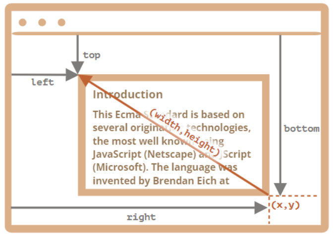

주의해야할 점은 top,left... 값 읽을 시 Viewport 기준, 적용 시 Page기준이 된다는것이다.
getBoundingClientRect()를 통해서 받아온 값은 Viewport기준이 되고 만약 Y축 스크롤이 적용된 상태에서 elem.style.top을 Viewport 기준으로 적용하게 되면 위로 조금 움직이는 현상이 발생하게 된다.
고로, Page 기준으로 생각해서 적용해야한다.

https://ko.javascript.info/task/drag-heroes

- 참고 코드

```javascript
'use strict';

document.onmousedown = function(event){
    event.preventDefault();

    if(event.target.classList.contains('draggable')){
        let elem = event.target;
        let shiftX = event.clientX - elem.getBoundingClientRect().left;
        let shiftY = event.clientY - elem.getBoundingClientRect().top;

        let Cord = [elem.getBoundingClientRect().left, elem.getBoundingClientRect().top];
        elem.style.position = "absolute";
        elem.style.left = Cord[0] + "px";
        elem.style.top = Cord[1] + window.scrollY + "px";                
        document.addEventListener('mousemove', OnMouseMove);
        document.addEventListener('mouseup', OnMouseUp);
        
        function OnMouseMove(event){
            let X;
            let Y;
            let htmlview = document.querySelector('html');
            Cord = [event.clientX - shiftX, event.clientY - shiftY]; //마우스 좌표 기준.

            if(Cord[0] <= 0){
                X=0;
            }
            else if(Cord[0] >= (htmlview.clientWidth-elem.offsetWidth)){
                X=htmlview.clientWidth-elem.offsetWidth;
            }
            else{
                X=event.clientX - shiftX;
            }

            if(Cord[1] <= 0){
                if(window.scrollY){
                    window.scrollBy(0,-10);
                    Y = 0;
                }
            }
            else if(Cord[1] + elem.offsetHeight >= htmlview.clientHeight){
                if(htmlview.scrollHeight-window.scrollY-htmlview.clientHeight > 0){
                    window.scrollBy(0,10);
                    Y = htmlview.clientHeight-elem.offsetHeight;
                }
            }
            else{
                Y=event.pageY - shiftY;
            } //이 부분이 오류였음.

            elem.style.left = X + "px";
            elem.style.top = Y + "px"; //top을 적용할땐 page 기준으로 주나봄?

            console.log(`${X} : ${Y}`);
        }

        function OnMouseUp(){
            document.removeEventListener('mouseup',OnMouseUp);
            document.removeEventListener('mousemove',OnMouseMove);           
        }
    }
}

document.ondragstart = function () {
    return false;
}
```


The **`Element.scrollHeight`** read-only property is a measurement of the height of an element's content, including content not visible on the screen due to overflow.


### 부가 설명들


**relative 상태 하고 absolute 상태 하고 움직이는 기준이 다르다!** 

- TOP

 

The effect of top depends on how the element is positioned (i.e., the value of the position property):

 

When position is set to absolute or fixed, the top property specifies the distance between the element's outer margin of top edge and the inner border of the top edge of its containing block.

==> 결국 '기준'이 있다는 말임.


When position is set to relative, the top property specifies the distance the element's top edge is moved below its normal position.

When position is set to sticky, the top property is used to compute the sticky-constraint rectangle.

When position is set to static, the top property has no effect.

 

 

- BOTTOM **(Element 하단 between Viewport 하단 거리)** **적용시.**

 

The effect of bottom depends on how the element is positioned (i.e., the value of the position property):

 

When position is set to absolute or fixed, the bottom property specifies the distance between the element's bottom edge and the bottom edge of its containing block.

When position is set to relative, the bottom property specifies the distance the element's bottom edge is moved above its normal position.

When position is set to sticky, the bottom property is used to compute the sticky-constraint rectangle.

When position is set to static, the bottom property has no effect.

 

 

- RIGHT **(Element 우측 끝 between Viewport 우측 끝 거리)**

 

The effect of right depends on how the element is positioned (i.e., the value of the position property):

 

When position is set to absolute or fixed, the right property specifies the distance between the element's right edge and the right edge of its containing block.

When position is set to relative, the right property specifies the distance the element's right edge is moved to the left from its normal position.

When position is set to sticky, the right property is used to compute the sticky-constraint rectangle.

When position is set to static, the right property has no effect.

 

 

- LEFT

 

The effect of left depends on how the element is positioned (i.e., the value of the position property):

 

When position is set to absolute or fixed, the left property specifies the distance between the element's left edge and the left edge of its containing block. (The containing block is the ancestor to which the element is relatively positioned.)

When position is set to relative, the left property specifies the distance the element's left edge is moved to the right from its normal position.

When position is set to sticky, the left property is used to compute the sticky-constraint rectangle.

When position is set to static, the left property has no effect.


# position property

> 요소를 옮기려면 일단 위치를 옮길 기준점을 잡는다.

| 값           | 의미                                 |
| ------------ | ------------------------------------ |
| **static**   | 기준 없음 (배치 불가능 / **기본값**) |
| **relative** | 요소 자기 자신을 기준으로 배치       |
| **absolute** | 부모(조상) 요소를 기준으로 배치      |
| **fixed**    | 뷰포트 기준으로 배치                 |
| **stickey**  | 스크롤 영역 기준으로 배치            |

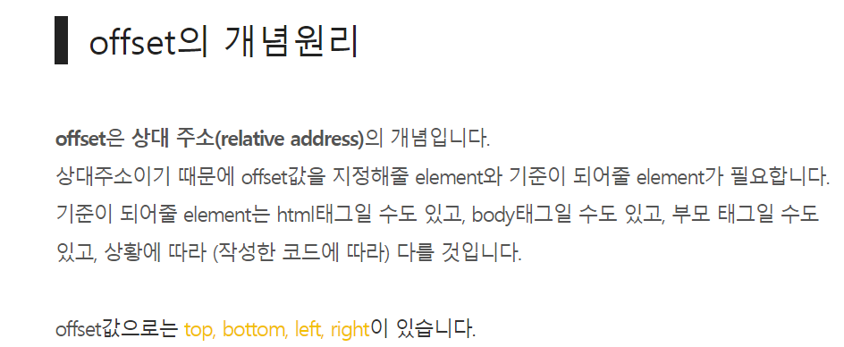

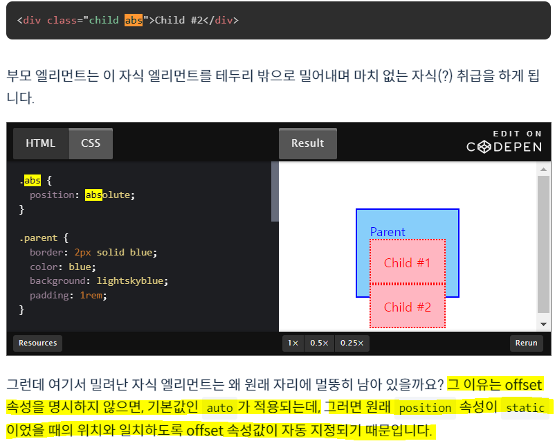


## Relative

> 요소를 일반적인 문서 흐름에 따라 배치한다.
>
> **요소 자기 자신의 원래 위치(static일 때의 위치)를 기준으로 배치**한다.
>
> - 원래 위치를 기준으로 위쪽(top), 아래쪽(bottom), 왼쪽(left), 오른쪽(right)에서 얼마만큼 떨어질 지 결정한다.
> - 위치를 이동하면서 다른 요소에 영향을 주지 않는다.
> - 문서 상 원래 위치가 그대로 유지된다.


## Absolute

> 요소를 일반적인 문서 흐름에서 제거한다.
>
> **가장 가까운 위치에 있는 조상 요소를 기준으로 배치**한다.
>
> - 조상 요소 위치를 기준으로 위쪽(top), 아래쪽(bottom), 왼쪽(left), 오른쪽(right)에서 얼마만큼 떨어질 지 결정한다.
> - 조상 중 Position을 가진 요소가 없다면 초기 컨테이닝 블록(`<body>`요소)를 기준으로 삼는다. (static을 제외한 값)
> - 문서 상 원래 위치를 잃어버린다. (아래에 있는 div가 해당 자리를 차지한다)

-absolute, fixed, float: 자신이 가진 컨텐츠 길이 만큼 auto로 삼음

-flexbox: center로 설정했을 경우 자신이 가진 컨텐츠 길이 만큼 auto로 삼는다.


## Fixed

> **뷰포트를 기준**으로 삼고 싶은 경우?
>
> `absolute`를 사용해서 똑같이 구현할 수 있지만, `absolute`는 조상 요소의 위치를 기준점으로 삼는 개념이므로, 뷰포트를 기준으점으로 삼으려면 `fixed`를 사용한다.

- 요소를 일반적인 문서 흐름에서 제거한다.
  페이지 레이아웃에 어떠한 공간도 배정하지 않는다.
- 뷰포트를 기준점으로 붙어있다 (== 화면에 붙어있다.)


# Window.scrollY

The read-only `**scrollY**` property of the [`Window`](https://developer.mozilla.org/en-US/docs/Web/API/Window) interface returns the number of pixels that the document is currently scrolled vertically.

전체 document 기준으로 Y축 스크롤이 얼마나 됬는지를 반환함. (Y축 스크롤 된 영역을 알아낼 수 있음.)


# z-index

The `**z-index**` CSS property sets the z-order of a [positioned](https://developer.mozilla.org/en-US/docs/Web/CSS/position) element and its descendants or flex items. Overlapping elements with a larger z-index cover those with a smaller one.


z축을 조정하면 Coord의 위치에서 가장 높이 띄어진 elem을 만들 수 있다.


z인덱스 0을 설정하여 디폴트 레이어로 설정할 수 있다.

z-index:0 is always **the "default layer"** (the layer in which all elements without an explicit z-index reside), 


# element 영역 Map

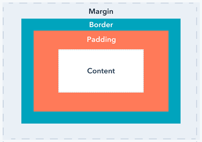


# Element.scrollTop

The **`Element.scrollTop`** property gets or sets the number of pixels that an element's content is scrolled vertically.
css의 overflow: scroll; 된다면 챙길 수 있는 값으로,

- If the element can't be scrolled (e.g. it has no     overflow or if the element has a property of "**non-scrollable**"), scrollTop is 0.
- scrollTop doesn't     respond to negative values; instead, it sets itself back to 0.
- If set to a value greater than the maximum available     for the element, scrollTop settles     itself to the maximum value.

**Scroll이 없을 경우 항상 0을 반환**
**elem.scrollTop 값에 음수 값을 입력하게된다면 자동으로 0으로 치환된다.**

**elem.scrollTop 값이 Maximum을 넘은 값을 입력하게 된다면, 자동적으로 최대값으로 치환된다.**


# Element.getBoundingClientRect()

뷰포트(윈도우) 기준으로 요소의 top,left,right,bottom을 반환한다.

If you need the bounding rectangle relative to the top-left corner of the document, just add the current scrolling position to the `top` and `left` properties (these can be obtained using [`window.scrollX`](https://developer.mozilla.org/en-US/docs/Web/API/Window/scrollX) and [`window.scrollY`](https://developer.mozilla.org/en-US/docs/Web/API/Window/scrollY)) to get a bounding rectangle which is independent from the current scrolling position.

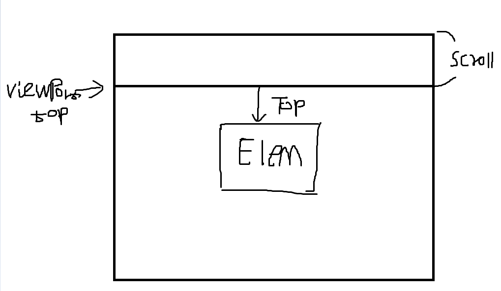


만약 문서 기준으로 구하고 싶다면 스크롤된 포지션을 더하여 구할 수 있다.

mouse.style.top <= 이런 식으로 값을 구할 수 없다. (undefined)     이건 입력값을 넣을 때 사용.

# Element.scrollHeight

The **`Element.scrollHeight`** read-only property is a measurement of the height of an element's content, including content not visible on the screen due to overflow.

 The height is measured in the same way as [`clientHeight`](https://developer.mozilla.org/en-US/docs/Web/API/Element/clientHeight): it includes the element's padding, but not its border, margin or horizontal scrollbar (if present).

scroll로 가져진 부분까지 포함하여 height를 반환한다.(궁극적으로 바닥까지 내리게 되면 clientHeight만 남게되는 현상.)

# Element.clientHeight

The **`Element.clientHeight`** read-only property is zero for elements with no CSS or inline layout boxes; otherwise, it's the inner height of an element in pixels. It includes padding but excludes borders, margins, and horizontal scrollbars (if present).


# document의 표현 기준

The document is represented (and contained) within `<html>` tag, that is `document.documentElement`.

document의 표현 기준은 html태그를 통해서 시작된다.


# Viewport의 역설

``` javascript
console.log("width : " + `${one.right-one.left}` + " html.clientWidth :" + `${document.querySelector('html').clientWidth}`
            +" window.innerWidth: " + `${window.innerWidth}`);
```

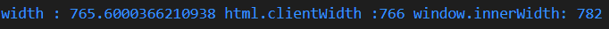

**document.documentElement.getBoundingClientRect()에서 값을 얻어와  right-left를 뺀값과,
뷰포트의 스크롤 넓이를 제외하고 반환하는 메소드의 길이가 같지 않다!** **(가능함.)**


``` javascript
container.scrollHeight >= container.scrollTop + container.clientHeight
```

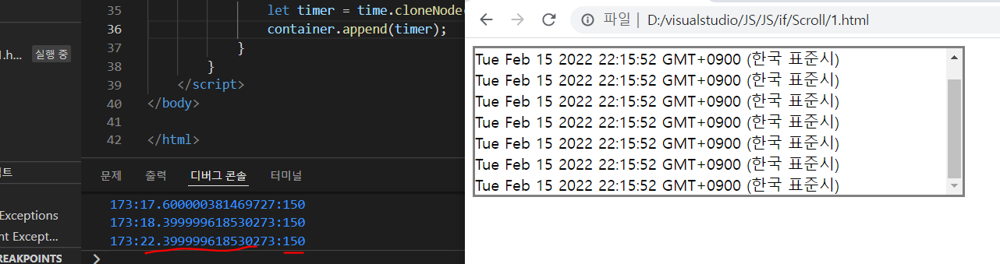

**한 컨테이너의 scrollHeight와 scrollTop + clientHeight의 값이 같지 않다!** **(당연함)**


## What `width: 100%` Really Means

When you give an element a width of 100% in CSS, you’re basically saying “Make this element’s content area exactly equal to the explicit width of its parent — but only if its parent has an explicit width.” So, if you have a parent container that’s 400px wide, a child element given a width of 100% will also be 400px wide, and will still be subject to margins, paddings, and borders — ***on top of the 100% width setting\***. The image below attempts to illustrate this:


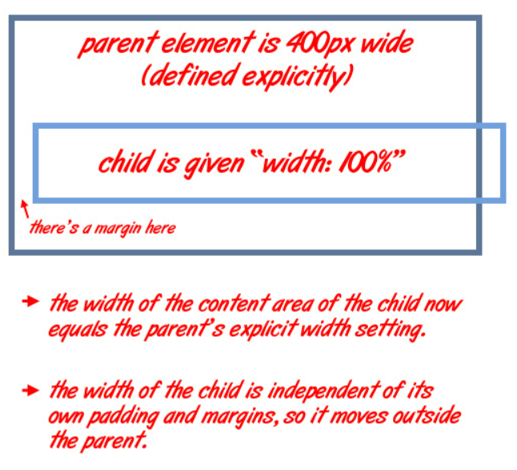

# fixed

fixed 뷰포트 기준으로 top,left,bottom,right 조정하여 고정시킬 수 있음.
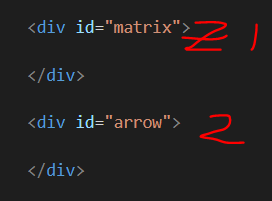

absolute,fixed상태에서 DOM 기준으로 상위에 존재할 수록 z축 순위가 더 큰듯함.
