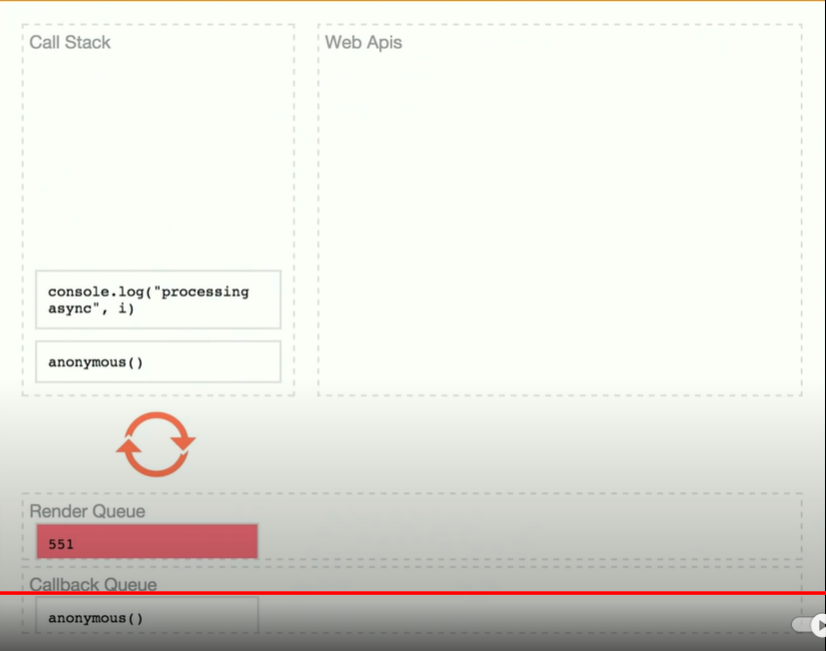

Settimeout is a API provided to us by a browser.

Browser can't do render when it actually has something run in the call stack.

render is given a higher priority than your callback.

16 milliseconds, it's going to queue a rend, wait till the stack is clear.

Render Queue의 task와 Callback Queue의 task는 비동기적으로 call stack에 옮겨진다.

