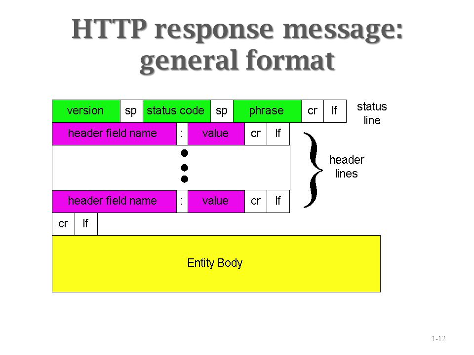
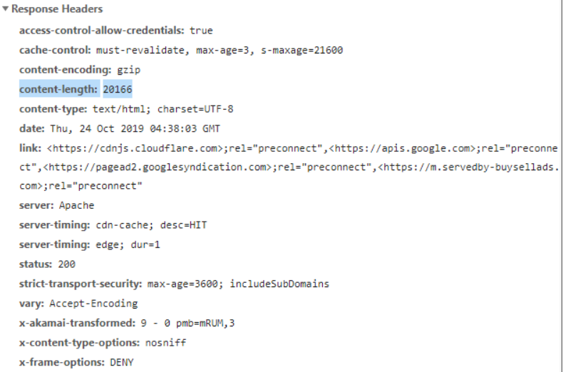

# Fetch Download progress

To track download progress, we can use `response.body` property. It’s a `ReadableStream` – a special object that provides body chunk-by-chunk, as it comes. Readable streams are described in the [Streams API](https://streams.spec.whatwg.org/#rs-class) specification.

Unlike `response.text()`, `response.json()` and other methods, `response.body` gives full control over the reading process, and we can count how much is consumed at any moment.

Here’s the sketch of code that reads the response from `response.body`:


The result of `await reader.read()` call is an object with two properties:

- **`done`** – `true` when the reading is complete, otherwise `false`.
- **`value`** – a typed array of bytes: `Uint8Array`.

```javascript
// instead of response.json() and other methods
const reader = response.body.getReader();

// infinite loop while the body is downloading
while(true) {
  // done is true for the last chunk
  // value is Uint8Array of the chunk bytes
  const {done, value} = await reader.read();

  if (done) {
    break;
  }

  console.log(`Received ${value.length} bytes`)
}
```


Let’s explain that step-by-step:

1. We perform `fetch` as usual, but instead of calling `response.json()`, we obtain a stream reader `response.body.getReader()`.

   Please note, we can’t use both these methods to read the same response: either use a reader or a response method to get the result.

2. Prior to reading, we can figure out the full response length from the `Content-Length` header.

   It may be absent for cross-origin requests (see chapter [Fetch: Cross-Origin Requests](https://javascript.info/fetch-crossorigin)) and, well, technically a server doesn’t have to set it. But usually it’s at place.

3. Call `await reader.read()` until it’s done.

   We gather response chunks in the array `chunks`. That’s important, because after the response is consumed, we won’t be able to “re-read” it using `response.json()` or another way (you can try, there’ll be an error).

4. At the end, we have `chunks` – an array of `Uint8Array` byte chunks. We need to join them into a single result. Unfortunately, there’s no single method that concatenates those, so there’s some code to do that:

   1. We create `chunksAll = new Uint8Array(receivedLength)` – a same-typed array with the combined length.
   2. Then use `.set(chunk, position)` method to copy each `chunk` one after another in it.

5. We have the result in `chunksAll`. It’s a byte array though, not a string.

   To create a string, we need to interpret these bytes. The built-in [TextDecoder](https://javascript.info/text-decoder) does exactly that. Then we can `JSON.parse` it, if necessary.

   What if we need **binary content** instead of a string? That’s even simpler. Replace steps 4 and 5 with a single line that creates a `Blob` from all chunks:

   ```javascript
   let blob = new Blob(chunks);
   ```


# Headers.get()

The **`get()`** method of the [`Headers`](https://developer.mozilla.org/en-US/docs/Web/API/Headers) interface returns a byte string of all the values of a header within a `Headers` object with a given name. If the requested header doesn't exist in the `Headers` object, it returns `null`.

For security reasons, some headers can only be controlled by the user agent. These headers include the [forbidden header names](https://developer.mozilla.org/en-US/docs/Glossary/Forbidden_header_name) and [forbidden response header names](https://developer.mozilla.org/en-US/docs/Glossary/Forbidden_response_header_name).





```
CR             = <US-ASCII CR, carriage return (13)>
LF             = <US-ASCII LF, linefeed (10)>
SP             = <US-ASCII SP, space (32)>
```

헤더 슬롯에 대한 정보를 String으로 얻는 방식이다.
