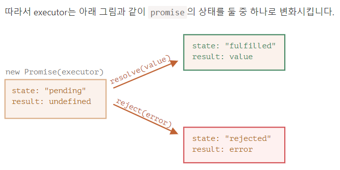
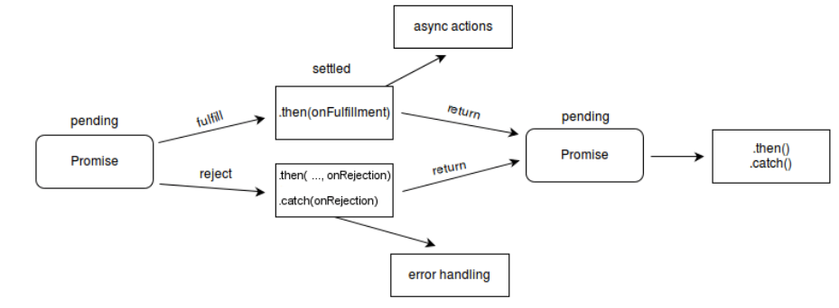
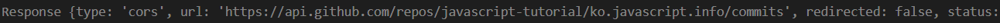
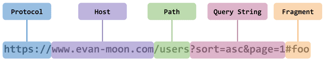

# fetch






The `fetch()` method takes one mandatory argument, the path to the resource you want to fetch. It returns a [`Promise`](https://developer.mozilla.org/en-US/docs/Web/JavaScript/Reference/Global_Objects/Promise) that resolves to the [`Response`](https://developer.mozilla.org/en-US/docs/Web/API/Response) to that request — as soon as the server responds with headers — **even if the server response is an HTTP error status**. You can also optionally pass in an `init` options object as the second argument (see [`Request`](https://developer.mozilla.org/en-US/docs/Web/API/Request)).

Once a [`Response`](https://developer.mozilla.org/en-US/docs/Web/API/Response) is retrieved, there are a number of methods available to define what the body content is and how it should be handled.


```javascript
async function one() {
            let url = 'https://api.github.com/repos/javascripttutorial/ko.javascript.info/commits';
            let response = await fetch(url);
            console.log(response);
        }

        one();
```




**중요:**

본문을 읽을 때 사용되는 메서드는 딱 하나만 사용할 수 있습니다.

`response.text()`를 사용해 응답을 얻었다면 본문의 콘텐츠는 모두 처리 된 상태이기 때문에 `response.json()`은 동작하지 않습니다.

```javascript
let text = await response.text(); // 응답 본문이 소비됩니다.
let parsed = await response.json(); // 실패
```


## 응답 헤더

응답 헤더는 `response.headers`에 맵과 유사한 형태로 저장됩니다.

맵은 아닙니다. 하지만 맵과 유사한 메서드를 지원하죠. 이 메서드들을 사용하면 헤더 일부만 추출하거나 헤더 전체를 순회할 수 있습니다.

```javascript
let response = await fetch('https://api.github.com/repos/javascript-tutorial/en.javascript.info/commits');

// 헤더 일부를 추출
alert(response.headers.get('Content-Type')); // application/json; charset=utf-8

// 헤더 전체를 순회
for (let [key, value] of response.headers) {
  alert(`${key} = ${value}`);
}
```


## POST 요청

`GET` 이외의 요청을 보내려면 추가 옵션을 사용해야 합니다.

- **`method`** – HTTP 메서드(예: `POST`)

- `body`

  – 요청 본문으로 다음 항목 중 하나이어야 합니다.

  - 문자열(예: JSON 문자열)
  - `FormData`객체 – `form/multipart` 형태로 데이터를 전송하기 위해 쓰입니다.
  - `Blob`나 `BufferSource` – 바이너리 데이터 전송을 위해 쓰입니다.
  - [URLSearchParams](https://ko.javascript.info/url) – 데이터를 `x-www-form-urlencoded` 형태로 보내기 위해 쓰이는데, 요즘엔 잘 사용하지 않습니다.

대부분은 JSON을 요청 본문에 실어 보내게 됩니다.

`user` 객체를 본문에 실어 보내는 예시를 살펴봅시다.

```javascript
let user = {
  name: 'John',
  surname: 'Smith'
};

let response = await fetch('/article/fetch/post/user', {
  method: 'POST',
  headers: {
    'Content-Type': 'application/json;charset=utf-8'
  },
  body: JSON.stringify(user)
});

let result = await response.json();
alert(result.message);
```

`POST` 요청을 보낼 때 주의할 점은 요청 `본문`이 문자열일 때 `Content-Type` 헤더가 `text/plain;charset=UTF-8`로 기본 설정된다는 점입니다.

하지만 위 예시에선 JSON을 전송하고 있기 때문에 `headers`에 제대로 된 `Content-Type`인 `application/json`을 설정해 주었습니다.


# JSON.stringify()

The **`JSON.stringify()`** method converts a JavaScript object or value to a JSON string, optionally replacing values if a replacer function is specified or optionally including only the specified properties if a replacer array is specified.


## [Syntax](https://developer.mozilla.org/en-US/docs/Web/JavaScript/Reference/Global_Objects/JSON/stringify#syntax)

```
JSON.stringify(value)
JSON.stringify(value, replacer)
JSON.stringify(value, replacer, space)
```


### [Parameters](https://developer.mozilla.org/en-US/docs/Web/JavaScript/Reference/Global_Objects/JSON/stringify#parameters)

- `value`

  The value to convert to a JSON string.

- `replacer` Optional

  A function that alters the behavior of the stringification process, or an array of strings or numbers naming properties of `value` that should be included in the output. If `replacer` is [`null`](https://developer.mozilla.org/en-US/docs/Web/JavaScript/Reference/Global_Objects/null) or not provided, all properties of the object are included in the resulting JSON string.

- `space` Optional

  A [`String`](https://developer.mozilla.org/en-US/docs/Web/JavaScript/Reference/Global_Objects/String) or [`Number`](https://developer.mozilla.org/en-US/docs/Web/JavaScript/Reference/Global_Objects/Number) object that's used to insert white space (including indentation, line break characters, etc.) into the output JSON string for readability purposes.If this is a `Number`, it indicates the number of space characters to use as white space for indenting purposes; this number is capped at 10 (if it is greater, the value is just `10`). Values less than 1 indicate that no space should be used.If this is a `String`, the string (or the first 10 characters of the string, if it's longer than that) is used as white space.If this parameter is not provided (or is [`null`](https://developer.mozilla.org/en-US/docs/Web/JavaScript/Reference/Global_Objects/null)), no white space is used.


# Response.ok

The **`ok`** read-only property of the [`Response`](https://developer.mozilla.org/en-US/docs/Web/API/Response) interface contains a Boolean stating whether the response was successful (status in the range 200-299) or not.

## [Value](https://developer.mozilla.org/en-US/docs/Web/API/Response/ok#value)

A boolean value.


# Response.json()

The **`json()`** method of the [`Response`](https://developer.mozilla.org/en-US/docs/Web/API/Response) interface takes a [`Response`](https://developer.mozilla.org/en-US/docs/Web/API/Response) stream and reads it to completion. 

It returns a promise which resolves with the result of parsing the body text as [`JSON`](https://developer.mozilla.org/en-US/docs/Web/JavaScript/Reference/Global_Objects/JSON).

Note that despite the method being named `json()`, the result is not JSON but is instead the result of taking JSON as input and parsing it **to produce a JavaScript object**.

## [Syntax](https://developer.mozilla.org/en-US/docs/Web/API/Response/json#syntax)

```
response.json().then(data => {
  // do something with your data
});
```

Copy to Clipboard

### [Parameters](https://developer.mozilla.org/en-US/docs/Web/API/Response/json#parameters)

None.

### [Return value](https://developer.mozilla.org/en-US/docs/Web/API/Response/json#return_value)

**A [`Promise`](https://developer.mozilla.org/en-US/docs/Web/JavaScript/Reference/Global_Objects/Promise) that resolves to a JavaScript object.** This object could be anything that can be represented by JSON — an object, an array, a string, a number...


# HTML.Status

[`200 OK`](https://developer.mozilla.org/en-US/docs/Web/HTTP/Status/200)

The request succeeded. The result meaning of "success" depends on the HTTP method:

- `GET`: The resource has been fetched and transmitted in the message body.
- `HEAD`: The representation headers are included in the response without any message body.
- `PUT` or `POST`: The resource describing the result of the action is transmitted in the message body.
- `TRACE`: The message body contains the request message as received by the server.

 

Here’s the full list of all possible `fetch` options with their default values (alternatives in comments):

```javascript
let promise = fetch(url, {
  method: "GET", // POST, PUT, DELETE, etc.
  headers: {
    // the content type header value is usually auto-set
    // depending on the request body
    "Content-Type": "text/plain;charset=UTF-8"
  },
  body: undefined // string, FormData, Blob, BufferSource, or URLSearchParams
  referrer: "about:client", // or "" to send no Referer header,
  // or an url from the current origin
  referrerPolicy: "no-referrer-when-downgrade", // no-referrer, origin, same-origin...
  mode: "cors", // same-origin, no-cors
  credentials: "same-origin", // omit, include
  cache: "default", // no-store, reload, no-cache, force-cache, or only-if-cached
  redirect: "follow", // manual, error
  integrity: "", // a hash, like "sha256-abcdef1234567890"
  keepalive: false, // true
  signal: undefined, // AbortController to abort request
  window: window // null
});
```

An impressive list, right?

We fully covered `method`, `headers` and `body` in the chapter [Fetch](https://javascript.info/fetch).

The `signal` option is covered in [Fetch: Abort](https://javascript.info/fetch-abort).

Now let’s explore the remaining capabilities.


**HTTP 리퍼러(HTTP Referer)는 웹 브라우저로 월드 와이드 웹을 서핑할 때, 하이퍼링크를 통해서 각각의 사이트로 방문시 남는 흔적**


In [HTTP](https://en.wikipedia.org/wiki/Hypertext_Transfer_Protocol), "**Referer**" (a misspelling of **Referrer**[[1\]](https://en.wikipedia.org/wiki/HTTP_referer#cite_note-s3T5A-1)) is the name of an optional [HTTP header field](https://en.wikipedia.org/wiki/List_of_HTTP_header_fields) that identifies the address of the [web page](https://en.wikipedia.org/wiki/Web_page) (i.e., the [URI](https://en.wikipedia.org/wiki/Uniform_Resource_Identifier) or [IRI](https://en.wikipedia.org/wiki/Internationalized_Resource_Identifier)), from which the resource has been requested. By checking the referrer, the server providing the new web page can see where the request originated.

In the most common situation, this means that when a user clicks a [hyperlink](https://en.wikipedia.org/wiki/Hyperlink) in a [web browser](https://en.wikipedia.org/wiki/Web_browser), causing the browser to send a request to the server holding the destination web page, the request may include the Referer field, which indicates the last page the user was on (the one where they clicked the link).

[Web sites](https://en.wikipedia.org/wiki/Website) and [web servers](https://en.wikipedia.org/wiki/Web_server) [log](https://en.wikipedia.org/wiki/Server_log) the content of the received Referer field to identify the web page from which the user followed a link, for promotional or statistical purposes.[[2\]](https://en.wikipedia.org/wiki/HTTP_referer#cite_note-gjEm8-2) This entails a loss of [privacy](https://en.wikipedia.org/wiki/Information_privacy) for the user and may introduce a [security](https://en.wikipedia.org/wiki/Security) risk.


### 출처(Origin)가 무엇인가요?

서버의 위치를 의미하는 `https://google.com`과 같은 URL들은 마치 하나의 문자열 같아 보여도, 사실은 여러 개의 구성 요소로 이루어져있다.



이때 출처는 `Protocol`과 `Host`, 그리고 위 그림에는 나와있지 않지만 `:80`, `:443`과 같은 포트 번호까지 모두 합친 것을 의미한다. 즉, 서버의 위치를 찾아가기 위해 필요한 가장 기본적인 것들을 합쳐놓은 것이다.

또한 출처 내의 포트 번호는 생략이 가능한데, 이는 각 웹에서 사용하는 `HTTP`, `HTTPS` 프로토콜의 기본 포트 번호가 정해져있기 때문이다. HTTP가 정의된 [RFC 2616](https://tools.ietf.org/html/rfc2616#section-3.2.2) 문서를 보면 다음과 같이 기본 포트 번호가 함께 정의되어있는 것을 볼 수 있다.


## [keepalive](https://javascript.info/fetch-api#keepalive)

The `keepalive` option indicates that the request may “outlive” the webpage that initiated it.

For example, we gather statistics on how the current visitor uses our page (mouse clicks, page fragments he views), to analyze and improve the user experience.

When the visitor leaves our page – we’d like to save the data to our server.

We can use the `window.onunload` event for that:

```javascript
window.onunload = function() {
  fetch('/analytics', {
    method: 'POST',
    body: "statistics",
    keepalive: true
  });
};
```

Normally, when a document is unloaded, all associated network requests are aborted. But the `keepalive` option tells the browser to perform the request in the background, even after it leaves the page. So this option is essential for our request to succeed.


It has a few limitations:

- We can’t send megabytes: the body limit for

   

  ```
  keepalive
  ```

   

  requests is 64KB.

  - If we need to gather a lot of statistics about the visit, we should send it out regularly in packets, so that there won’t be a lot left for the last `onunload` request.
  - This limit applies to all `keepalive` requests together. In other words, we can perform multiple `keepalive` requests in parallel, but the sum of their body lengths should not exceed 64KB.

- We can’t handle the server response if the document is unloaded. So in our example

   

  ```
  fetch
  ```

   

  will succeed due to

   

  ```
  keepalive
  ```

  , but subsequent functions won’t work.

  - In most cases, such as sending out statistics, it’s not a problem, as the server just accepts the data and usually sends an empty response to such requests.
