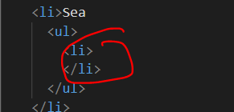
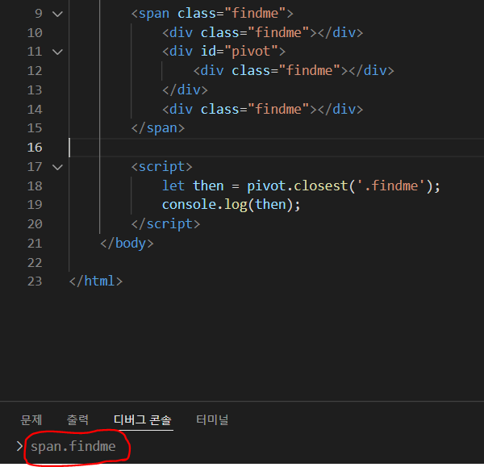
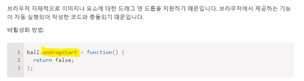
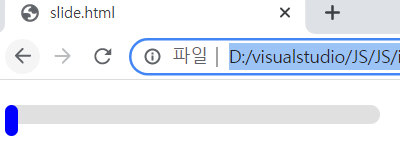
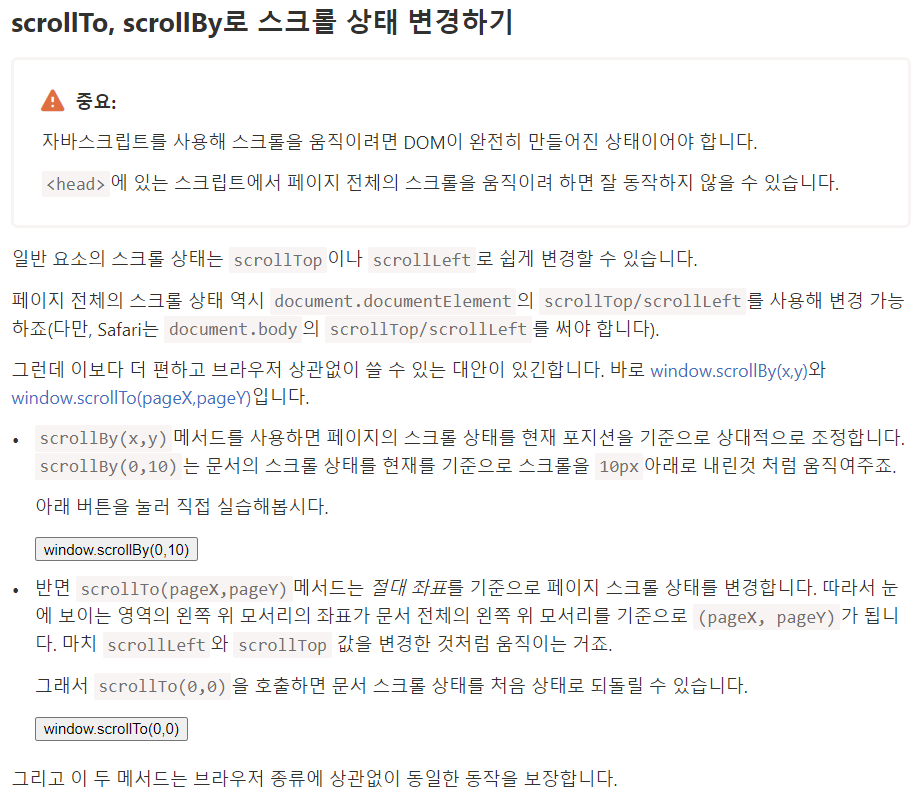
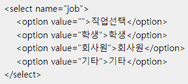
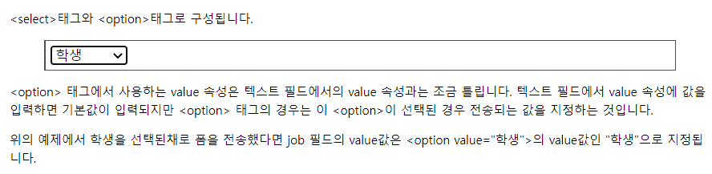
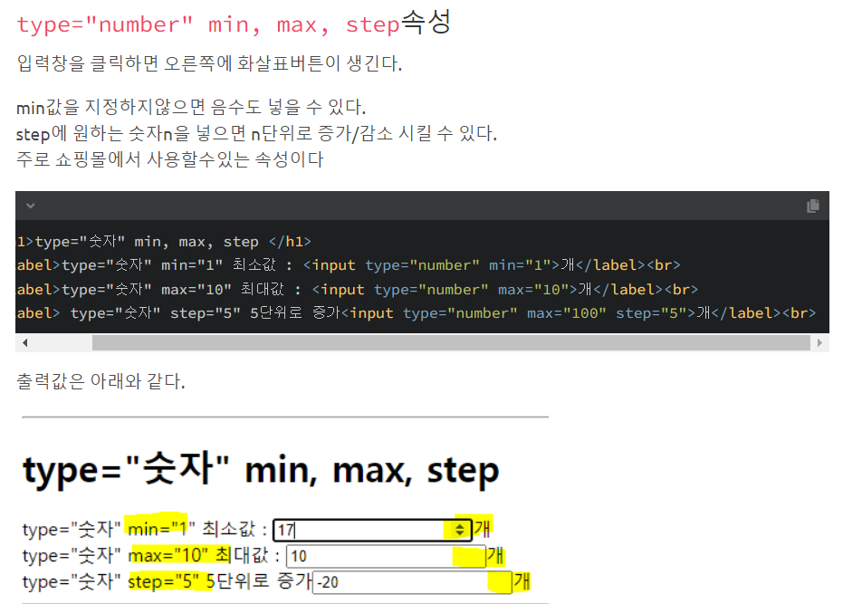
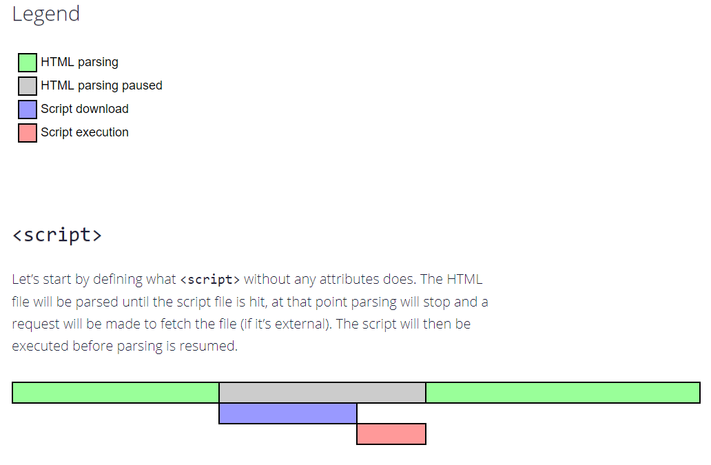

# dataset


**’data-'**로 **시작하는** **속성** **전체는** **개발자가** **용도에** **맞게** **사용하도록** **별도로** **예약됩니다**

**dataset** **프로퍼티를** **사용하면** **이** **속성에** **접근할** **수** **있습니다**.

요소 elem에 이름이 "data-about"인 속성이 있다면 elem.dataset.about을 사용해 그 값을 얻을 수 있죠.

예시:

```javascript
<body data-about="Elephants">

<script>

 alert(document.body.dataset.about); // Elephants

</script>
```

data-order-state 같이 여러 단어로 구성된 속성은 카멜 표기법(camel-cased)을 사용해 dataset.orderState으로 변환됩니다.


# String.prototype.charCodeAt()

The `**charCodeAt()**` method returns an integer between `0` and `65535` representing the UTF-16 code unit at the given index.

스트링의 지정된 index 위치의 char code를 알아낼 수 있는 메소드.


# HTML 요소 확인



<li> 요소 옆에 아무것도 없을 경우(Enter를 눌러서 줄바꿈 할경우)에는 undefined가 정의됨.


# Style 위치

```javascript
<head>
  <style>
    .tree span:hover {
      font-weight: bold;
    }

    .tree span {
      cursor: pointer;
    }
  </style>
  <meta charset="utf-8">
</head>
```

스타일을 집어넣는 요소 위치는, <head> </head> 사이이다.


# Window.confirm()

A boolean indicating whether OK (`true`) or Cancel (`false`) was selected. If a browser is ignoring in-page dialogs, then the returned value is always `false`.

사용자에게 질문창을 띄어준 후,
ok를 누르면 : true
cancel을 누르면 : false
를 반환하게 된다.


# Element.closest()

The `**closest()**` method traverses the [`Element`](https://developer.mozilla.org/en-US/docs/Web/API/Element) and its parents (heading toward the document root) until it finds a node that matches the provided selector string. Will return itself or the matching ancestor. If no such element exists, it returns `null`.

document root를 향해 나아가면서 현재 기준 Element에서 ancestor만을 거쳐가며 Input(Selector)와 일치하는 elem를 반환한다.
셀렉터와 일치하는 요소가 없다면 null을 반환한다.




# **Element.contains(otherNode)** **Method**

The contains() method returns a Boolean value indicating whether a node is a descendant of a specified node.

A descendant can be a child, grandchild, great-grandchild, and so on.

Elem을 기준으로 하위 요소들 중에 Input(Node)
존재하면: True

존재하지않으면: False를 반환한다.


# Event handler 설명

**핸들러에서** **false를** 반환하는 **것은** **예외** **상황입니다**.

이벤트 핸들러에서 반환된 값은 대개 무시됩니다.

하나의 예외사항이 있는데 바로 on<event>를 사용해 할당한 핸들러에서 false를 반환하는 것입니다.

이 외의 값들은 return 되어도 무시됩니다. true 역시 무시되죠.


# Event.preventDefault()

The **`preventDefault()`** method of the [`Event`](https://developer.mozilla.org/en-US/docs/Web/API/Event) interface tells the [user agent](https://developer.mozilla.org/en-US/docs/Glossary/User_agent) that if the event does not get explicitly handled, its default action should not be taken as it normally would be.

preventDefault() 메소드를 사용하여 기본 브라우저 이벤트가 document에 도착했을 때, event.defaultPrevented 플래그가 켜져있는지를 확인하여 기본동작을 취소시킨다.

```javascript
document.querySelector("#id-checkbox").addEventListener("click", function(event) {
         document.getElementById("output-box").innerHTML += "Sorry! <code>preventDefault()</code> won't let you check this!<br>";
         event.preventDefault();
}, false);
```


```html
<p>Please click on the checkbox control.</p>

<form>
  <label for="id-checkbox">Checkbox:</label>
  <input type="checkbox" id="id-checkbox"/>
</form>

<div id="output-box"></div>
```


# Element.tagName

The `**tagName**` read-only property of the [`Element`](https://developer.mozilla.org/en-US/docs/Web/API/Element) interface returns the tag name of the element on which it's called.

현재 내가 가져온 element의 태그 이름을 반환한다. 예시) IMG

### **대문자 반환 주의!!**


# Element.className

elem.className에 무언가를 대입하면 클래스 문자열 전체가 바뀝니다. 그런데 이렇게 속성값 전체를 바꾸는 게 아니고 클래스 하나만 추가하거나 제거하고 싶은 경우도 있기 마련입니다.

이럴 때 elem.classList라는 프로퍼티를 사용할 수 있습니다.

elem.classList엔 클래스 하나만 조작하게 해주는 메서드인 add/remove/toggle가 구현되어 있습니다.

이렇게 클래스 속성값 전체를 바꾸고 싶을 때는 className으로, 개별 클래스를 조작하고 싶을 때는 classList를 사용하면 됩니다. 필요에 따라 취사선택하면 되죠.

classList에 구현된 메서드는 다음과 같습니다.

- elem.classList.add/remove("class") – class를 추가하거나 제거
- elem.classList.toggle("class") – class가 존재할 경우 class를 제거하고, 그렇지 않은 경우엔 추가
- elem.classList.contains("class") – class 존재 여부에 따라 true/false를 반환

**이 외에 classList는 이터러블 객체이기 때문에 아래 예시와 같이 for..of를 사용해 클래스를 나열할 수 있다는 특징이 있습니다.**


# mouseover와 mouseout의 필연적 관계

**If** **mouseover** **triggered, there must be** **mouseout**

In case of fast mouse movements, intermediate elements may be ignored, but one thing we know for sure: if the pointer “officially” entered an element (mouseover event generated), then upon leaving it we always get mouseout. **!!!(descendants까지 Count하고 버블링되는 이벤트임.)**


mouseover 이벤트가 trigger된다면 필연적으로 mouseout 이벤트 또한 trigger된다.

- `event.target` – is the element where the mouse came over.
- `event.relatedTarget` – is the element from which the mouse came (`relatedTarget` → `target`).

# mouseenter와 mouseleave 설명

Events `mouseenter/mouseleave` are like `mouseover/mouseout`. They trigger when the mouse pointer enters/leaves the element.

But there are two important differences:

1. Transitions     inside the element, to/from descendants, are not counted.
2. **Events `mouseenter/mouseleave` do not bubble.**

**!!2가지 중요점이 있다.**

1. event가 일어난 element의 자손 요소를 Count하여 event가 일어나지 않는다.
2. 버블링이 없다.


# Node.parentNode

The read-only `**parentNode**` property of the [`Node`](https://developer.mozilla.org/en-US/docs/Web/API/Node) interface returns the parent of the specified node in the DOM tree.

`Document` and `DocumentFragment` [nodes](https://developer.mozilla.org/en-US/docs/DOM/Node/nodeType) can never have a parent, so `parentNode` will always return `null`. It also returns `null` if the node has just been created and is not yet attached to the tree.

Document node와 같은 경우는, Parentnode가 없으니 null을 반환하게 된다.

DOM트리를 탐색하게 되는 메소드인데 Call한 노드를 기준으로 parent elem을 찾게된다.

**만약 While을 통한 반복을 수행하게 되면 결국 document까지 가게 되어 null을 반환하게 된다.**


# Dragevent 취소하기



브라우저 기본 drag 이벤트 ondragstart


# 문제 풀다 깨닫기(div 요소 컨트롤)



``` html
        <div id="slider" class="slider"> 
            <div class="handle"></div>
        </div>
```

전체적으로 handle이 바 안에 들어 있다 보니 margin-top 조정해봤자 같이 움직인다.


# mouseup 부가이벤트 설명

Just attach the mouseup event to the document itself. Release the mouse button outside of the browser window will still trigger the event.

마우스를 클릭했을때 발생하는 이벤트

마우스 업 이벤트 브라우저를 넘어갔을 때도 실행된다.


# keyboard 이벤트 참조

So, `event.code` may match a wrong character for unexpected layout. Same letters in different layouts may map to different physical keys, leading to different codes. Luckily, that happens only with several codes, e.g. `keyA`, `keyQ`, `keyZ` (as we’ve seen), and doesn’t happen with special keys such as `Shift`. You can find the list in the

영어 사용국가 키보드와 독일의 키보드의 레이아웃이 다르기 때문에 event.code값은 같아도 event.key값은 다른 현상이 발생함.


Preventing the default action on `keydown` can cancel most of them, with the exception of OS-based special keys. For instance, on Windows Alt+F4 closes the current browser window. And there’s no way to stop it by preventing the default action in JavaScript.

OS-based 키 다운 이벤트는 event.preventDefault()로 막을 수 없다.


# addEventListener without Target

Global functions are attached to the global object, `window`.

```js
addEventListener("load", run);
```

Is the same as

```js
window.addEventListener("load", run);
```

Just like `alert` is the same as `window.alert`


# code

Define some text as computer code in a document:


# figure

**HTML `<figure>` 요소**는 독립적인 콘텐츠를 표현합니다. 사진, 도표, 삽화, 오디오, 비디오 등을 담는 컨테이너 역할을 한다.


# scrollTo, scrollBy




# Element.setAttribute()

Sets the value of an attribute on the specified element. If the attribute already exists, the value is updated; otherwise a new attribute is added with the specified name and value.

To get the current value of an attribute, use [`getAttribute()`](https://developer.mozilla.org/en-US/docs/Web/API/Element/getAttribute); to remove an attribute, call [`removeAttribute()`](https://developer.mozilla.org/en-US/docs/Web/API/Element/removeAttribute).

```javascript
var b = document.querySelector("button");

b.setAttribute("name", "helloButton");
b.setAttribute("disabled", "");
```


# 탐색 프로퍼티

탐색 프로퍼티를 사용하면 이웃 노드로 바로 이동할 수 있습니다.

탐색 프로퍼티는 크게 두 개의 집합으로 나뉩니다.

- 모든 노드에 적용 가능한 `parentNode`, `childNodes`, `firstChild`, `lastChild`, `previousSibling`, `nextSibling`
- 요소 노드에만 적용 가능한 `parentElement`, `children`, `firstElementChild`, `lastElementChild`, `previousElementSibling`, `nextElementSibling`


# Fieldset 태그

As the example above shows, the `<fieldset>` element provides a grouping for a part of an HTML form.
HTML form 태그의 그룹핑을 지원해주는 태그이다.


# Textarea 주의할 점

**`textarea.innerHTML` 말고 `textarea.value`를 사용하세요.**

`<textarea>...</textarea>`안의 값이 HTML이더라도 값을 얻을 때 `textarea.innerHTML`을 사용하지 말아야 합니다.

`textarea.innerHTML`엔 페이지를 처음 열 당시의 HTML만 저장되어 최신 값을 구할 수 없기 때문입니다.


# Select 태그

**HTML `<select>` 요소**는 옵션 메뉴를 제공하는 컨트롤을 나타냅니다.





Select안의 option태그를 제외한 태그들 무시됨.


# option 태그

option = new Option(text, value, defaultSelected, selected);

- `text` – option 내부의 텍스트
- `value` – option의 값
- `defaultSelected` – `true`이면 HTML 속성 `selected`가 생성됨
- `selected` – `true`이면 해당 option이 선택됨

```javascript
<option value="3 (최단 예치기간)">!!</option>
```

Value는 JS로 컨트롤 할 수 있는 값임. '!!' 가 위치한 곳에 text를 입력해주어야 사용자에게 노출된다.


# blur 이벤트

A focus loss can occur for many reasons.

One of them is when the visitor clicks somewhere else. But also JavaScript itself may cause it, for instance:

- An `alert` moves focus to itself, so it causes the focus loss at the element (`blur` event), and when the `alert` is dismissed, the focus comes back (`focus` event).
- If an element is removed from DOM, then it also causes the focus loss. If it is reinserted later, then the focus doesn’t return.

These features sometimes cause `focus/blur` handlers to misbehave – to trigger when they are not needed.

The best recipe is to be careful when using these events. If we want to track user-initiated focus-loss, then we should avoid causing it ourselves.


alert 창 노출될 경우 **focus loss** / alert 창이 꺼질경우 **focus on**

### element 삭제되면 **focus loss** / element가 다시 삽입된다해도 **focus loss**

```javascript
        let text_input = document.getElementsByName('TextFocusStart');
        
        for(obj of text_input){
            obj.addEventListener('focus',text_focused);
            obj.addEventListener('blur',text_focused_out);
        }

        function text_focused(event){
            console.log(event.target)
            event.target.hidden = true;
            textarea.hidden = false;
        }

        function text_focused_out(event){
            console.log(event.target)
            event.target.hidden = false;
            textarea.hidden = true;
        }
```

현재 DOM에 element가 다시 hidden으로 삭제되거나 붙을 경우 focus가 해제됨으로써 blur도 동시에 일어나는 것을 알 수 있다.


# focus, blur 이벤트 설명

focus, blur 이벤트 같은 경우 버블링은 되지 않지만 캡처링은 가능한 상황이다.


만약 버블링을 사용하고 싶다면 `focusin`과 `focusout`을 이용해도 됩니다. 두 이벤트는 `focus`, `blur`와 동일하지만 버블링이 된다는 점에서 차이가 있습니다.

`focusin`과 `focusout`을 사용할 때 주의할 점은 `on<event>` 방식으로 핸들러를 추가하면 안 되고 `elem.addEventListener` 방식으로 핸들러를 추가해야 한다는 점입니다.

**현재 포커스된 요소는 `document.activeElement`를 통해 확인할 수 있습니다.**


# textarea 태그 주의할 점

The value property sets or returns the contents of a text area.

**Note:** The value of a text area is the text between the <textarea> and </textarea> tags.

textarea 태그 내부 값을 얻고 싶다면 textarea.textcontent가 아닌, textarea.value 값을 얻어야된다.


Value를 input값으로 넣게 되면 tag가 사라지는 현상 발생.

text_input[index].textContent = event.target.textContent;


# EventTarget.dispatchEvent()

**Note:** When calling this method, the [`Event.target`](https://developer.mozilla.org/en-US/docs/Web/API/Event/target) property is initialized to the current `EventTarget`.


# HTMLElement.blur()

The **`HTMLElement.blur()`** method removes keyboard focus from the current element.

```javascript
element.blur();
```


# br tag : The Line Break element

The **`<br>`** [HTML](https://developer.mozilla.org/en-US/docs/Web/HTML) element produces a line break in text (carriage-return). It is useful for writing a poem or an address, where the division of lines is significant.


# tabindex

- `tabindex`가 `0`인 요소 – 이 요소는 `tabindex` 속성이 없는것처럼 동작합니다. 따라서 포커스를 이동시킬 때 `tabindex`가 `0`인 요소는 `tabindex`가 1보다 크거나 같은 요소보다 나중에 포커스를 받습니다.

  `tabindex="0"`은 요소를 포커스 가능하게 만들지만 포커스 순서는 기본 순서 그대로 유지하고 싶을 때 사용합니다. 요소의 포커스 우선 순위를 일반 `<input>`과 같아지도록 하죠.

- `tabindex`가 `-1`인 요소 – 스크립트로만 포커스 하고 싶은 요소에 사용합니다. Tab키를 사용하면 이 요소는 무시되지만 `elem.focus()` 메서드를 사용하면 잘 포커싱 됩니다.

**주의할점!!!**

javascript로 컨트롤 할때는 tabIndex, css 프로퍼티로 컨트롤할때는 tabindex 이다.
i의 소문자 대문자 차이.


# Span

span 태그도 border를 설정하면 사각형으로 노출된다. 안에 글씨를 써야만 노출됨!!


# EventTarget.removeEventListener()

The **`removeEventListener()`** method of the [`EventTarget`](https://developer.mozilla.org/en-US/docs/Web/API/EventTarget) interface removes an event listener previously registered with [`EventTarget.addEventListener()`](https://developer.mozilla.org/en-US/docs/Web/API/EventTarget/addEventListener) from the target. The event listener to be removed is identified using a combination of the event type, the event listener function itself, and various optional options that may affect the matching process; see [Matching event listeners for removal](https://developer.mozilla.org/en-US/docs/Web/API/EventTarget/removeEventListener#matching_event_listeners_for_removal).


# pre

pre 요소 내의 텍스트는 고정폭 글꼴(fixed-width font)을 사용하여 표현되며 사용된 띄어쓰기와 줄바꿈이 모두 그대로 브라우저 화면에 나타납니다.


# event.key 예시

```javascript
switch (event.key) {
    case "Down": // IE/Edge specific value
    case "ArrowDown":
      // Do something for "down arrow" key press.
      break;
    case "Up": // IE/Edge specific value
    case "ArrowUp":
      // Do something for "up arrow" key press.
      break;
    case "Left": // IE/Edge specific value
    case "ArrowLeft":
      // Do something for "left arrow" key press.
      break;
    case "Right": // IE/Edge specific value
    case "ArrowRight":
      // Do something for "right arrow" key press.
      break;
    case "Enter":
      // Do something for "enter" or "return" key press.
      break;
    case "Esc": // IE/Edge specific value
    case "Escape":
      // Do something for "esc" key press.
      break;
    default:
      return; // Quit when this doesn't handle the key event.
  }
```


# ClipboardEvent.clipboardData


# < input > : 입력 요소

**HTML `<input>` 요소**는 웹 기반 양식에서 사용자의 데이터를 받을 수 있는 대화형 컨트롤을 생성합니다. [사용자 에이전트](https://developer.mozilla.org/ko/docs/Glossary/User_agent)에 따라서 다양한 종류의 입력 데이터 유형과 컨트롤 위젯이 존재합니다. 입력 유형과 특성의 다양한 조합 가능성으로 인해, `<input>` 요소는 HTML에서 제일 강력하고 복잡한 요소 중 하나입니다.

MDN 참조 : https://developer.mozilla.org/ko/docs/Web/HTML/Element/Input

**required**  속성을 사용하여 submit전에 절대적으로 입력하게 만들 수 있다.




# Window.getComputedStyle(elem)

elem의 cssStyleDeclaration의 속성값들을 **단위값**을 붙여서 반환해준다.


# Strong 태그 vs em 태그 

<em> 요소는 구어체 강조와 같이 문장의 의미를 변경하는데 사용되지만("I *love* cat." vs. "I love *cat*."), 

<strong> 요소는 문장의 일부분에 중요성을 추가하는데 사용됩니다.("**Warning!** This is **very dangerous**.") 

<strong> 요소와 <em> 요소는 각각 중첩해서 사용함으로써 중요성이나 강조의 상대적인 정도를 증가시킬 수도 있습니다.


# img 태그

 태그는 이미지를 삽입하는 태그로, src 속성을 통해 이미지 경로를 지정합니다.

이미지 파일이 `src` 속성에서 지정한 경로에 없을시, 이미지는 출력되지 않거나 엑스박스가 뜨게 됩니다.

### 속성

- **`src`**: 이미지의 경로
- `width`: 이미지 가로 크기
- `height`: 이미지 세로 크기


# HTMLElement.focus() 상세

The **`HTMLElement.focus()`** method sets focus on the specified element, if it can be focused. The focused element is the element which will receive keyboard and similar events by default.


focus 가능한 Class 파생들

There isn't a definite list, it's up to the browser. The only standard we have is [DOM Level 2 HTML](http://www.w3.org/TR/DOM-Level-2-HTML/html.html), according to which the only elements that have a `focus()` method are `HTMLInputElement`, `HTMLSelectElement`, `HTMLTextAreaElement` and `HTMLAnchorElement`. This notably omits `HTMLButtonElement` and `HTMLAreaElement`.


Try to add the javascript code soon after the input element, so it will execute before the page load complete. In your case `autofocus` attribute is set to the element but focusing the element which has `autofocus` by browser is already done. so you setting the value after browser set the focus. when browser trying to set it no attribute is there. try like following code

```xml
<input type="text">
<script>
    document.querySelector('input').setAttribute('autofocus', 'autofocus');
</script>
```

http://jsbin.com/yatugaxe/1/

If you need to do it on button click or something, you need to do it in JavaScript. setting an attribute doesn't mean browser is going to execute it at anytime.

**<span style="color:red">!!중요한건 페이지 로드가 되기도 전에 후에 작성된 자바스크립트가 먼저 실행되기 때문에 input.focus()가 표현되지 않았던 것이다!! 이 부분은 추후 집중해서 공부해보도록 할 것.</span>**


# DOMContentLoaded 설명

DOM 객체가 완성되고 나면 실행되는 이벤트를 의미한다. 브라우저가 script를 만나게 되면 DOM 객체 생성을 중단 그리고 script 실행을 끝마친 후에 다시 제작을 연계하기 시작한다.


브라우저가 HTML을 전부 읽고 DOM 트리를 완성하는 즉시 발생합니다. 이미지 파일(``)이나 스타일시트 등의 기타 자원은 기다리지 않습니다.


**DOMContentLoaded를 막지 않는 스크립트**

위와 같은 규칙엔 두 가지 예외사항이 있습니다.

1. `async` 속성이 있는 스크립트는 `DOMContentLoaded`를 막지 않습니다. [`async` 속성](https://ko.javascript.info/script-async-defer)에 대해선 곧 학습할 예정입니다.
2. `document.createElement('script')`로 동적으로 생성되고 웹페이지에 추가된 스크립트는 `DOMContentLoaded`를 막지 않습니다.

외부 스타일시트는 DOM에 영향을 주지 않기 때문에 `DOMContentLoaded`는 외부 스타일시트가 로드되기를 기다리지 않습니다.

그런데 한 가지 예외가 있습니다. 스타일시트를 불러오는 태그 바로 다음에 스크립트가 위치하면 이 스크립트는 스타일시트가 로드되기 전까지 실행되지 않습니다.

```markup
<link type="text/css" rel="stylesheet" href="style.css">
<script>
  // 이 스크립트는 위 스타일시트가 로드될 때까지 실행되지 않습니다.
  alert(getComputedStyle(document.body).marginTop);
</script>
```

이런 예외는 스크립트에서 스타일에 영향을 받는 요소의 프로퍼티를 사용할 가능성이 있기 때문에 만들어졌습니다. 위 예시에선 스크립트에서 요소의 좌표 정보를 사용하고 있네요. 스타일이 로드되고, 적용되고 난 다음에야 좌표 정보가 확정되기 때문에 자연스레 이런 제약이 생겼습니다.

`DOMContentLoaded`는 스크립트가 로드되길 기다립니다. 위의 경우라면 당연히 스타일시트 역시 기다리게 됩니다.


# window.onload 설명

`window` 객체의 `load` 이벤트는 스타일, 이미지 등의 리소스들이 모두 로드되었을 때 실행됩니다. `load` 이벤트는 `onload` 프로퍼티를 통해서도 사용할 수 있습니다.

아래 예시에서 `window.onload`는 이미지가 모두 로드되고 난 후 실행되기 때문에 이미지 사이즈가 제대로 출력되는 것을 확인할 수 있습니다.


# window.onunload 설명

`window` 객체의 `unload` 이벤트는 사용자가 페이지를 떠날 때, 즉 문서를 완전히 닫을 때 실행됩니다. `unload` 이벤트에선 팝업창을 닫는 것과 같은 딜레이가 없는 작업을 수행할 수 있습니다.

그런데 분석 정보를 보내는 것은 예외사항에 속합니다.

사용자가 웹사이트에서 어떤 행동을 하는지에 대한 분석 정보를 모으고 있다고 가정해봅시다.

`unload` 이벤트는 사용자가 페이지를 떠날 때 발생하므로 자연스럽게 `unload` 이벤트에서 분석 정보를 서버로 보내는 게 어떨까 하는 생각이 드네요.

메서드 `navigator.sendBeacon(url, data)`은 바로 이런 용도를 위해 만들어졌습니다. 메서드에 대한 자세한 설명은 https://w3c.github.io/beacon/에서 찾아볼 수 있습니다.

`sendBeacon`는 데이터를 백그라운드에서 전송합니다. 다른 페이지로 전환시 분석 정보는 제대로 서버에 전송되지만, 딜레이가 없는 것은 바로 이 때문입니다.

`sendBeacon`은 다음과 같이 사용할 수 있습니다.

```javascript
let analyticsData = { /* 분석 정보가 담긴 객체 */ };

window.addEventListener("unload", function() {
  navigator.sendBeacon("/analytics", JSON.stringify(analyticsData));
};
```

- 요청은 POST 메서드로 전송됩니다.
- 요청 시 문자열뿐만 아니라 폼이나 [fetch](https://ko.javascript.info/fetch)에서 설명하는 기타 포맷들도 보낼 수 있습니다. 대개는 문자열 형태의 객체가 전송됩니다.
- 전송 데이터는 64kb를 넘을 수 없습니다.


# window.onbeforeunload

사용자가 현재 페이지를 떠나 다른 페이지로 이동하려 할 때나 창을 닫으려고 할 때 `beforeunload` 핸들러에서 추가 확인을 요청할 수 있습니다.

`beforeunload` 이벤트를 취소하려 하면 브라우저는 사용자에게 확인을 요청합니다.

아래 예시를 실행하고, 브라우저에서 새로 고침을 해 직접 확인해봅시다.

```javascript
window.onbeforeunload = function() {
  return false;
};
```

`false`말고도 **비어있지 않은 문자열**을 반환하면 이벤트를 취소한 것과 같은 효과를 볼 수 있는데, 이는 역사적인 이유 때문에 남아있는 기능입니다. 과거엔 문자열을 반환하면 브라우저에서 이 문자열을 보여줬었는데, [근래의 명세서](https://html.spec.whatwg.org/#unloading-documents)에선 이를 권장하지 않습니다.

예시를 살펴봅시다.

```javascript
window.onbeforeunload = function() {
  return "저장되지 않은 변경사항이 있습니다. 정말 페이지를 떠나실 건 가요?";
};
```

이렇게 문자열을 반환하도록 해도 얼럿창에 문자열이 보이지 않게 된 이유는 몇몇 사이트 관리자들이 오해가 생길 법하거나 성가신 메시지를 띄우면서 `beforeunload`를 남용했기 때문입니다. 오래된 브라우저에서 위 예시를 실행하고 새로 고침을 누르면 “저장되지 않은…” 메시지가 뜨긴 합니다. 하지만 모던 브라우저에선 `beforeunload` 이벤트를 취소할 때 보이는 메시지를 커스터마이징 할 수 없습니다.


# readyState

문서가 완전히 로드된 후에 `DOMContentLoaded` 핸들러를 설정하면 어떤 일이 발생할까요?

아마도 절대 실행되지 않을 겁니다.

그런데 가끔은 문서가 로드되었는지 아닌지를 판단할 수 없는 경우가 있습니다. DOM이 완전히 구성된 후에 특정 함수를 실행해야 할 때는 DOM 트리 완성 여부를 알 수 없어 조금 난감하죠.

이럴 때 현재 로딩 상태를 알려주는 `document.readyState` 프로퍼티를 사용할 수 있습니다.

프로퍼티의 값은 세 종류가 있습니다.

- `"loading"` – 문서를 불러오는 중일 때
- `"interactive"` – 문서가 완전히 불러와졌을 때
- `"complete"` – 문서를 비롯한 이미지 등의 리소스들도 모두 불러와졌을 때

우리는 `document.readyState`의 값을 확인하고 상황에 맞게 핸들러를 설정하거나 코드를 실행하면 됩니다.

예시:

```javascript
function work() { /*...*/ }

if (document.readyState == 'loading') {
  // 아직 로딩 중이므로 이벤트를 기다립니다.
  document.addEventListener('DOMContentLoaded', work);
} else {
  // DOM이 완성되었습니다!
  work();
}
```


## <실행 순서>

1. [1] initial readyState:loading
2. [2] readyState:interactive
3. [2] DOMContentLoaded
4. [3] iframe onload
5. [4] img onload
6. [4] readyState:complete
7. [4] window onload


- `document.readyState`는 `DOMContentLoaded`가 실행되기 바로 직전에 `interactive`가 됩니다. 따라서 `DOMContentLoaded`와 `interactive`는 같은 상태를 나타낸다고 볼 수 있습니다.
- `document.readyState`는 `iframe`, `img`를 비롯한 리소스 전부가 로드되었을 때 `complete`가 됩니다. 위 예시에서 우리는 `readyState`의 값이 `img.onload`와 `window.onload`가 실행된 시점과 거의 동일한 시점에 `complete`로 바뀌었다는 것을 확인할 수 있습니다. `readyState`의 값이 `complete`로 바뀐다는 것은 `window.onload`가 실행된다는 것과 동일한 의미입니다. 이 둘의 차이점은 `window.onload`는 다른 `load` 핸들러가 전부 실행된 후에야 동작한다는 것에 있습니다.


# defer

브라우저는 `defer` 속성이 있는 스크립트(이하 defer 스크립트 또는 지연 스크립트)를 '백그라운드’에서 다운로드 합니다. 따라서 지연 스크립트를 다운로드 하는 도중에도 HTML 파싱이 멈추지 않습니다. 그리고 `defer` 스크립트 실행은 페이지 구성이 끝날 때까지 *지연* 됩니다.

위쪽 예시와 동일한 코드인데 스크립트에 `defer`만 붙여보겠습니다.

```markup
<p>...스크립트 앞 콘텐츠...</p>

<script defer src="https://javascript.info/article/script-async-defer/long.js?speed=1"></script>

<!-- 바로 볼 수 있네요! -->
<p>...스크립트 뒤 콘텐츠...</p>
```

- 지연 스크립트는 페이지 생성을 절대 막지 않습니다.
- 지연 스크립트는 DOM이 준비된 후에 실행되긴 하지만 `DOMContentLoaded` 이벤트 발생 전에 실행됩니다.

예시를 통해 직접 살펴봅시다.

```html
<p>...스크립트 앞 콘텐츠...</p>

<script>
  document.addEventListener('DOMContentLoaded', () => alert("`defer` 스크립트가 실행된 후, DOM이 준비되었습니다!")); // (2)
</script>

<script defer src="https://javascript.info/article/script-async-defer/long.js?speed=1"></script>

<p>...스크립트 뒤 콘텐츠...</p>
```

1. 페이지 콘텐츠는 바로 출력됩니다.
2. `DOMContentLoaded` 이벤트는 지연 스크립트 실행을 기다립니다. 따라서 얼럿창은 DOM 트리가 완성되고 지연 스크립트가 실행된 후에 뜹니다.

지연 스크립트는 일반 스크립트와 마찬가지로 HTML에 추가된 순(상대순, 요소순)으로 실행됩니다.

따라서 길이가 긴 스크립트가 앞에, 길이가 짧은 스크립트가 뒤에 있어도 짧은 스크립트는 긴 스크립트가 실행될 때까지 기다립니다.

```html
<script defer src="https://javascript.info/article/script-async-defer/long.js"></script>
<script defer src="https://javascript.info/article/script-async-defer/small.js"></script>
```


```
**작은 스크립트는 먼저 다운되지만, 실행은 나중에 됩니다.**

브라우저는 성능을 위해 페이지에 어떤 스크립트들이 있는지 쭉 살펴본 후에야 스크립트를 병렬적으로 다운로드합니다. 위 예시에서도 스크립트 다운로드가 병렬적으로 진행되었습니다. 그런데 이 때 크기가 작은 `small.js`이 `long.js`보다 먼저 다운로드 될 수 있습니다.

하지만 명세서에서 스크립트를 문서에 추가한 순서대로 실행하라고 정의했기 때문에 `small.js`는 `long.js` 다음에 실행됩니다.
```

```
**`defer` 속성은 외부 스크립트에만 유효합니다.**
<script>에 src가 없으면 defer 속성은 무시됩니다.
```


# async

`async` 속성이 붙은 스크립트(이하 async 스크립트 또는 비동기 스크립트)는 페이지와 완전히 독립적으로 동작합니다.

- async 스크립트는 defer 스크립트와 마찬가지로 백그라운드에서 다운로드됩니다. 따라서 HTML 페이지는 async 스크립트 다운이 완료되길 기다리지 않고 페이지 내 콘텐츠를 처리, 출력합니다(하지만 async 스크립트 실행중에는 HTML 파싱이 멈춥니다 – 옮긴이).

- ```
  DOMContentLoaded
  ```

   

  이벤트와 async 스크립트는 서로를 기다리지 않습니다.

  - 페이지 구성이 끝난 후에 async 스크립트 다운로딩이 끝난 경우, `DOMContentLoaded`는 async 스크립트 실행 전에 발생할 수 있습니다,
  - async 스크립트가 짧아서 페이지 구성이 끝나기 전에 다운로드 되거나 스크립트가 캐싱처리 된 경우, `DOMContentLoaded`는 `async` 스크립트 실행 후에 발생할 수도 있습니다.

- 다른 스크립트들은 `async` 스크립트를 기다리지 않습니다. `async` 스크립트 역시 다른 스크립트들을 기다리지 않습니다.

이런 특징 때문에 페이지에 `async` 스크립트가 여러 개 있는 경우, 그 실행 순서가 제각각이 됩니다. 실행은 다운로드가 끝난 스크립트 순으로 진행됩니다.

```markup
<p>...스크립트 앞 콘텐츠...</p>

<script>
  document.addEventListener('DOMContentLoaded', () => alert("DOM이 준비 되었습니다!"));
</script>

<script async src="https://javascript.info/article/script-async-defer/long.js"></script>
<script async src="https://javascript.info/article/script-async-defer/small.js"></script>

<p>...스크립트 뒤 콘텐츠...</p>
```

1. 비동기 스크립트 다운로드는 페이지 로딩을 막지 않기 때문에 페이지 콘텐츠가 바로 출력됩니다.
2. `DOMContentLoaded` 이벤트는 상황에 따라 비동기 스크립트 전이나 후에 실행됩니다. 정확한 순서를 예측할 수 없습니다.
3. 비동기 스크립트는 서로를 기다리지 않습니다. 위치상으론 `small.js`가 아래이긴 하지만 `long.js`보다 먼저 다운로드되었기 때문에 먼저 실행됩니다. 이렇게 먼저 로드가 된 스크립트가 먼저 실행되는 것을 'load-first order’라고 부릅니다.

비동기 스크립트는 방문자 수 카운터나 광고 관련 스크립트처럼 각각 독립적인 역할을 하는 서드 파티 스크립트를 현재 개발 중인 스크립트에 통합하려 할 때 아주 유용합니다. async 스크립트는 개발 중인 스크립트에 의존하지 않고, 그 반대도 마찬가지이기 때문입니다.

```markup
<!-- Google Analytics는 일반적으로 다음과 같이 삽입합니다. -->
<script async src="https://google-analytics.com/analytics.js"></script>
```


# 동적 스크립트

자바스크립트를 사용하면 문서에 스크립트를 동적으로 추가할 수 있습니다. 이렇게 추가한 스크립트를 동적 스크립트(dynamic script)라고 부릅니다.

```javascript
let script = document.createElement('script');
script.src = "/article/script-async-defer/long.js";
document.body.append(script); // (*)
```

위 예시에서 외부 스크립트는 관련 요소가 문서에 추가되자 마자(`(*)`로 표시한 줄) 다운로드가 시작됩니다.

그런데 **동적 스크립트는 기본적으로 ‘async’ 스크립트처럼 행동합니다.**

따라서 다음과 같은 특징을 갖습니다.

- 동적 스크립트는 그 어떤 것도 기다리지 않습니다. 그리고 그 어떤 것도 동적 스크립트를 기다리지 않습니다.
- 먼저 다운로드된 스크립트가 먼저 실행됩니다(‘load-first’ order).

아래 예시에선 두 스크립트를 동적으로 문서에 추가합니다. 그런데 `script.async=false`가 없었다면 이 스크립트들은 'load-first order’로 실행됩니다. 그럼 크기가 작은 `small.js`가 먼저 실행되겠죠. 하지만 `script.async=false`가 있기 때문에 실행은 '문서에 추가된 순서’대로 됩니다.

```javascript
function loadScript(src) {
  let script = document.createElement('script');
  script.src = src;
  script.async = false;
  document.body.append(script);
}

// async=false이기 때문에 long.js가 먼저 실행됩니다.
loadScript("/article/script-async-defer/long.js");
loadScript("/article/script-async-defer/small.js");
```





# Iframe

An IFrame (Inline Frame) is **an HTML document embedded inside another HTML document on a website**

아이프레임 HTML안의 HTML.


# script.onload / script.onerror

**Important:**

Events `onload`/`onerror` track only the loading itself.

Errors that may occur during script processing and execution are out of scope for these events. That is: if a script loaded successfully, then `onload` triggers, even if it has programming errors in it. To track script errors, one can use `window.onerror` global handler.


# Other resources

The `load` and `error` events also work for other resources, basically for any resource that has an external `src`.

For example:

```javascript
let img = document.createElement('img');
img.src = "https://js.cx/clipart/train.gif"; // (*)

img.onload = function() {
  alert(`Image loaded, size ${img.width}x${img.height}`);
};

img.onerror = function() {
  alert("Error occurred while loading image");
};
```

There are some notes though:

- Most resources start loading when they are added to the document. But `` is an exception. It starts loading when it gets a src `(*)`.
- For `<iframe>`, the `iframe.onload` event triggers when the iframe loading finished, both for successful load and **in case of an error.**


# label

**HTML `<label>` 요소**는 사용자 인터페이스 항목의 설명을 나타냅니다.


`<label>` 을 [``](https://developer.mozilla.org/ko/docs/Web/HTML/Element/Input) 요소와 연결하면 몇 가지 이점이 있습니다:

- label 텍스트는 텍스트 입력과 시각적으로 관련이 있을뿐만 아니라 프로그래밍적으로도 관련이 있습니다. 예를 들어, 화면리더기(screenreader) 는 폼 입력(form input)에서 label 을 읽어서 보조기술(assistive technology) 사용자가 입력해야하는 텍스트가 무엇인지 더 쉽게 이해할 수 있게 합니다. 
- 관련 label 을 클릭해서 input 자체에 초점을 맞추거나 활성화를 시킬 수 있습니다. (활성되어서)늘어난 누를 수 있는 영역(hit area)은 터치스크린 사용자를 포함해 입력하려하는 모든 사람에게 이점을 줍니다.

`<label>` 을 `<input>` 요소와 연관시키려면, `<input>` 에 `id` 속성을 넣어야합니다. 그런 다음 `<label>` 에 `id` 와 같은 값의 `for` 속성을 넣어야합니다. 

또는, `<label>` 안에 `<input>` 을 중첩시킬 수 있습니다. 이 경우 연관이 암시적이므로 `for` 및 `id`속성이 필요없습니다.

```html
<label>Do you like peas?
  <input type="checkbox" name="peas">
</label>
```

자동 focus를 이뤄냄.
