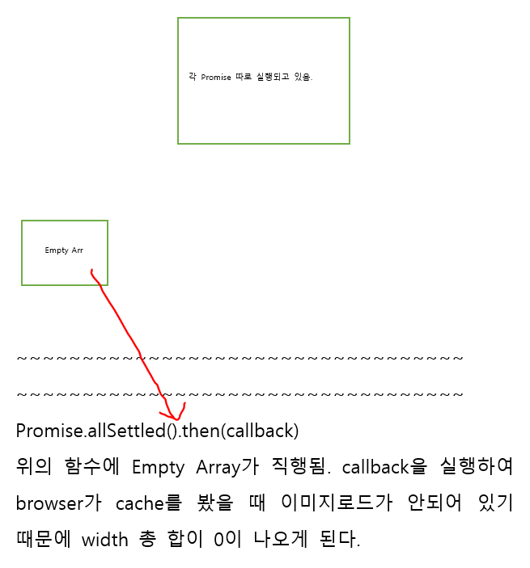

```html
<!DOCTYPE HTML>
<html>

<head>
    <meta charset="utf-8">
</head>

<body>

    <script>
        function preloadImages(sources, callback) {
            /* your code */
            let promise_arr = sources.map((value) => {
                return new Promise(function (resolve, reject) {
                    let img_cahce = document.createElement('img');
                    img_cahce.src = value;
                    img_cahce.onload = function () {
                        console.log('load_finish');
                        resolve(1);
                    }
                    img_cahce.onerror = function () {
                        resolve(1);
                    }
                }).then(value=>console.log(value));
            })//
            console.log(promise_arr);
            Promise.allSettled(promise_arr).then(()=>callback());
        }

        // ---------- The test ----------

        let sources = [
            "https://en.js.cx/images-load/1.jpg",
            "https://en.js.cx/images-load/2.jpg",
            "https://en.js.cx/images-load/3.jpg"
        ];

        // add random characters to prevent browser caching
        for (let i = 0; i < sources.length; i++) {
            sources[i] += '?' + Math.random();
        }

        // for each image,
        // let's create another img with the same src and check that we have its width immediately
        function testLoaded() {
            console.log('콜백 실행됨');
            let widthSum = 0;
            for (let i = 0; i < sources.length; i++) {
                let img = document.createElement('img');
                img.src = sources[i];
                widthSum += img.width;
            }
            alert(widthSum);
        }

        // every image is 100x100, the total width should be 300
        preloadImages(sources, testLoaded);
    </script>

</body>

</html>
```


Img를 preload시켜 Cache에 저장한다음 이후 Callback을 작동시키는 기본적인 예제이다.

**--Hardship--**

1. promise.then(  result => alert(result), error => alert(error) ) 구조임.

2. promise.then()은 return으로 아래와 같은 규칙으로 반환함. (no return이면 fulfilled / undefined 반환.)

### [Return value]

Once a [`Promise`](https://developer.mozilla.org/en-US/docs/Web/JavaScript/Reference/Global_Objects/Promise) is fulfilled or rejected, the respective handler function (`onFulfilled` or `onRejected`) will be called **asynchronously** (scheduled in the current thread loop). The behavior of the handler function follows a specific set of rules. If a handler function:

- returns a value, the promise returned by `then` gets resolved with the returned value as its value.
- doesn't return anything, the promise returned by `then` gets resolved with an `undefined` value.
- throws an error, the promise returned by `then` gets rejected with the thrown error as its value.
- returns an already fulfilled promise, the promise returned by `then` gets fulfilled with that promise's value as its value.
- returns an already rejected promise, the promise returned by `then` gets rejected with that promise's value as its value.
- returns another **pending** promise object, the resolution/rejection of the promise returned by `then` will be subsequent to the resolution/rejection of the promise returned by the handler. Also, the resolved value of the promise returned by `then` will be the same as the resolved value of the promise returned by the handler.

3. Promise.allSettled 반환 값 value(arr) => value.status / value.value로 구성됨

4. promise 값을 return하지 않고 지역 스코프에서 생성(동시에 프로미스 구문이 실행됨)만 하고 Promise 배열에 반환하지 않았으므로, 코드 실행은 계속 진행되고 [undefined,undefined,undefined] Empty 배열을 Promise.allSettled(arguments)에 전달하게 된다. 


   However, **if and only if** an empty iterable is passed as an argument, `Promise.allSettled()` returns a `Promise` object that has **already been resolved** as an empty array. 

   위와같이 Promise.allSettled() 세팅에 따라서 프로미스 체인의 then에 Callback으로 실행이 바로 넘어가게 되고 최종적으로 Status가 settled되고 값은 undefined된 empty array가 결과값으로 반환된다.

   

<확인 그림>

