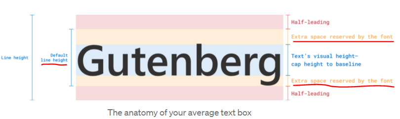

https://medium.com/microsoft-design/leading-trim-the-future-of-digital-typesetting-d082d84b202
https://www.w3.org/TR/css-inline-3/#root-inline-box
https://dbaron.org/css/2000/01/dibm

### <Inline layout 요소>


In inline layout, a mixed, recursive stream of text and [inline-level boxes](https://www.w3.org/TR/css-display-3/#inline-level-box) forming an inline formatting context within a [block container](https://www.w3.org/TR/css-display-3/#block-container) are laid out by [fragmenting](https://www.w3.org/TR/css-break-3/#fragment) them into a stack of [line boxes](https://www.w3.org/TR/css-inline-3/#line-box),


**By default, the height of a block element is the height of the content**


 The only child of each line box is an anonymous inline box called the root inline box (of the line). All of the inline boxes and text are placed within this root inline box. Note that the line box is often taller than the root inline box. If an inline element is split between lines, then more than one inline box is used to represent that element. (Note that horizontal box properties still only apply at the beginning and end of the element.)

**Anonymous inline boxes (which are all root inline boxes) are considered to have the `font-size` and `line-height` properties of their parent block-level element.**


root inline box안에 inline-box와 텍스트 요소가 들어가고 이 무명 인라인 박스(즉, 루트 인라인 박스)안에는 parent block요소에서 상속받은 font-size와 line-height를 가지고 있다.


블록 컨테이너에 인라인 요소(텍스트, inline 요소 ,replaced element(이미지,영상 document 외부에서 가져오는 고유값을 가진 요소들)를 배치하게 되면 기본적으로 html font-size 16px 기준을 연결한 1.2em의 line-height가 설정된 라인박스들이 배치되고 안에는 root inline box(non - stylish)또한 block element에서 generated 된다음 배치. 그 다음 각 요소들이 이 안에 fragment로 배치되는 형태이다.

배치된 형태에서 각 line-box의 style이 font 고유의 size에 의해서 line-heigth가 변경된다.


기본적으로 Line-box의 Logical-width (pysical width 랑 동일)을 벗어나게 되거나 line-break가 발생하면 inline-box요소들은 split되어 배치되어진다. 


A baseline is a line along the [inline axis](https://www.w3.org/TR/css-writing-modes-4/#inline-axis) of a line box along which individual glyphs of text are aligned.

UA따라 baseline의 기준이 달라진다. 위에서 base-line의 테이블을 보여줌.


A common problem is vertical centering. It’s easy to vertically center the text container to an icon, but because the visual boundaries of Latin text are the cap height and the alphabetic baseline, rather than the ascent and descent, this often doesn’t yield the intended visual effect.

![Consider some Latin text placed to the right of an image, 			          to be centered between its top and bottom. 			          Measuring from the top of the image to the top of the text box yields 13px; 			          likewise measuring from the bottom of the image to the bottom of the text box yields 13px, 			          theoretically perfectly centering the text. 			          However, measuring from the top of the image to the cap-height yields 21px; 			          and measuring from the bottom to the alphabetic baseline yields 19px, 			          showing that visually the text is not actually centered.](md-images/leading-trim-centering-fail.png)Measuring to the top/bottom of the text may yield equal results, but measuring to the visual bounds shows that it is not visually centered.

To center the text visually, it’s necessary to assume the cap height and alphabetic baseline as the top and bottom edges of the text, respectively.

Measuring to the cap height / alphabetic baseline instead of the ascent / descent and equalizing those distances visually centers the text.

By using [leading-trim](https://www.w3.org/TR/css-inline-3/#propdef-leading-trim) to strip out the spacing above the cap height and below the alphabetic baseline, centering the box actually centers the text; and does so reliably, regardless of what font is used to render it.


텍스트를 포함하고 있는 인라인 박스의 Top과 bottom을 제어보면 같은 값으로 중앙 정렬된 것 처럼 보이지만 사실 Visual부분 즉, 텍스트만이 노출되는 부분을 Line-box Top, Bottom 기준 에서 각각 측정하게 되면 값이 다르다.

이때 'leading-trim' property를 사용하여...


To ensure consistent spacing in the basic case of running text, CSS line layout introduces leading both above and below the text content of each line. In addition, the ascent and descent font metrics themselves include extra space above and below the most common glyph sizes in order to accommodate occasional characters and diacritics which ascend or descend beyond the typical bounds. This prevents subsequent lines of text from overlapping each other. However, all this extra spacing interferes with visual alignment and with control over effective (visually-apparent) spacing.




To make text more readable => leading-space가 본질적으로 포함되게 된 이유이다.

텍스트 인라인 박스는 기본적으로 상.하에 leading-space와 glyph의 우발적인 평균에서 벗어난 크기의 등장에 대비하여 ascend or descend 상.하에 공간(Extra-space)을 더 집어넣게 되서 문단의 사이가 멀게 느껴질 수 있는 것이다.


Other software made it a two-way street, where people could adjust the line height directly. But behind the scenes, bottom leading was always the part that was changing.


CSS1 decided to split leading in half and put it above and below each line. They called it “half-leading.” Their reason was simple: make text boxes looks even.


Css1이 등장하기전에는 bottom leading만을 Control하다가, Css1이 등장한 후에는 leading-space를 상.하로 균일하게 나누어 text box를 정렬되게 보이게끔 만들었다.


Each font size in a font family comes with a default line height.

각 폰트 패밀의 폰트사이즈는 각각의 디폴트 line-height를 가져오게 된다.


```css
h1 { 
 text-edge: cap alphabetic;
 leading-trim: both;
}
```

The example above first uses text-edge (also a new property) to tell the browser the desired edge of the text is the cap height and the alphabetic baseline. Then it uses leading-trim to trim it from both sides. Note that leading-trim only affects the text box; it doesn’t cut off the text within it.


The extra space reserved in the default line height causes text to not always be centered in the text box. With leading-trim, you can reliably vertically center your text.


default-line-height의 reserved font space와 line-height의 leading-space를 제거하여 깔끔하고 더 정확한 중앙정렬을 가능하게 만드는 것이다!