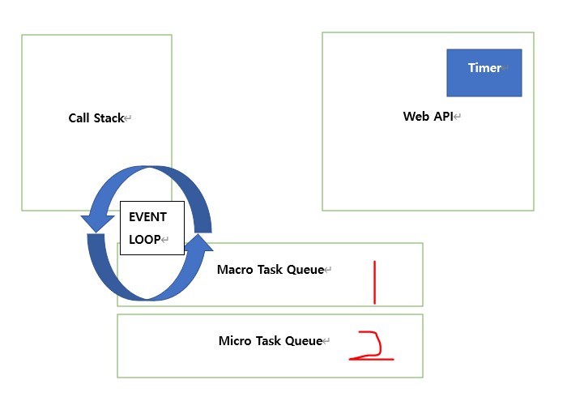
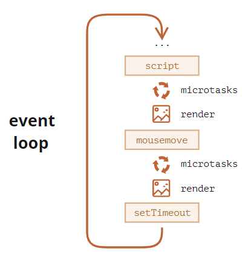

# Macrotask / Microtask

------------------------------------

https://meetup.toast.com/posts/89

https://dev.to/lydiahallie/javascript-visualized-event-loop-3dif

https://stackoverflow.com/questions/25915634/difference-between-microtask-and-macrotask-within-an-event-loop-context

## **Event loop 상세 설명 사항**

One go-around of the event loop will have **exactly one** task being processed from the **macrotask queue** (this queue is simply called the *task queue* in the [WHATWG specification](https://html.spec.whatwg.org/multipage/webappapis.html#task-queue)). After this macrotask has finished, all available **microtasks** will be processed, namely within the same go-around cycle. While these microtasks are processed, they can queue even more microtasks, which will all be run one by one, until the microtask queue is exhausted.

## What are the practical consequences of this?

If a **microtask** recursively queues other microtasks, it might take a long time until the next macrotask is processed. This means, you could end up with a blocked UI, or some finished I/O idling in your application.   ==> Macrotask에서는 rendering을 관할한다는말.

However, at least concerning Node.js's process.nextTick function (which queues **microtasks**), there is an inbuilt protection against such blocking by means of process.maxTickDepth. This value is set to a default of 1000, cutting down further processing of **microtasks** after this limit is reached which allows the next **macrotask** to be processed)

## So when to use what?

Basically, use **microtasks** when you need to do stuff asynchronously in a synchronous way (i.e. when you would say *perform this (micro-)task in the most immediate future*). Otherwise, stick to **macrotasks**.

## Examples

**macrotasks:** [setTimeout](https://developer.mozilla.org/docs/Web/API/WindowTimers/setTimeout), [setInterval](https://developer.mozilla.org/docs/Web/API/WindowTimers/setInterval), [setImmediate](https://developer.mozilla.org/docs/Web/API/Window/setImmediate), [requestAnimationFrame](https://developer.mozilla.org/docs/Web/API/window/requestAnimationFrame), [I/O](https://developer.mozilla.org/docs/Mozilla/Projects/NSPR/Reference/I_O_Functions), UI rendering, event
**microtasks:** [process.nextTick](https://nodejs.org/uk/docs/guides/event-loop-timers-and-nexttick/), [Promises](https://developer.mozilla.org/docs/Web/JavaScript/Reference/Global_Objects/Promise), [queueMicrotask](https://developer.mozilla.org/docs/Web/API/WindowOrWorkerGlobalScope/queueMicrotask), [MutationObserver](https://developer.mozilla.org/docs/Web/API/MutationObserver)

JS has three "stacks":

- standard stack for all synchronous calls (one function calls another, etc)
- microtask queue (or job queue or microtask stack) for all async operations with higher priority **(process.nextTick, Promises, Object.observe, MutationObserver)**
- macrotask queue (or event queue, task queue, macrotask queue) for all async operations with lower priority **(setTimeout, setInterval, setImmediate, requestAnimationFrame, I/O, UI rendering)**

And event loop works this way:

- **execute everything from bottom to top from the stack**, and ONLY when the stack is empty, check what is going on in queues above
- check micro stack and execute everything there (if required) with help of stack, one micro-task after another until the microtask queue is empty or don't require any execution and ONLY then check the macro stack
- check macro stack and execute everything there (if required) with help of the stack

Micro stack won't be touched if the stack isn't empty. The macro stack won't be touched if the micro stack isn't empty OR does not require any execution.

1. Callstack에 Task 가 들어옴

2. Task의 return 값이 반환 됨. macrotask 관련 작업 경우는 Wep API에서 Macrotask queue로 전달됨.
3. Event loop는 Callstack이 빈 순간 microtask를 Callstack에 올려서 execute.
4. 그 후 Microtask queue가 빌 때까지 모든 Task 실행.(1 Loop에서 실행될 수 있는 Microtasks의 개수는 정해져 있음.)
5. 그 다음 Callstack empty 확인 후 Macrotask queue의 다음 task 실행

