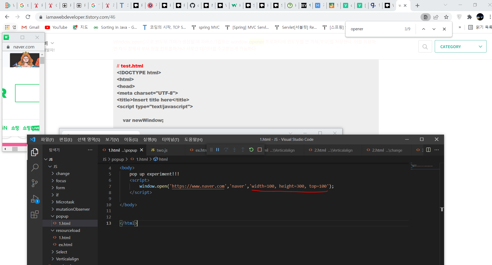

# Popups and window

The syntax to open a popup is: `window.open(url, name, params)`:

**url**

An URL to load into the new window.


**name**

A name of the new window. Each window has a `window.name`, and here we can specify which window to use for the popup. If there’s already a window with such name – the given URL opens in it, otherwise a new window is opened.


**params**

The configuration string for the new window. It contains settings, delimited by a comma. There must be no spaces in params, for instance: `width=200,height=100`.


- Position:
  - `left/top` (numeric) – coordinates of the window top-left corner on the screen. There is a limitation: a new window cannot be positioned offscreen.
  - `width/height` (numeric) – width and height of a new window. There is a limit on minimal width/height, so it’s impossible to create an invisible window.
- Window features:
  - `menubar` (yes/no) – shows or hides the browser menu on the new window.
  - `toolbar` (yes/no) – shows or hides the browser navigation bar (back, forward, reload etc) on the new window.
  - `location` (yes/no) – shows or hides the URL field in the new window. FF and IE don’t allow to hide it by default.
  - `status` (yes/no) – shows or hides the status bar. Again, most browsers force it to show.
  - `resizable` (yes/no) – allows to disable the resize for the new window. Not recommended.
  - `scrollbars` (yes/no) – allows to disable the scrollbars for the new window. Not recommended.

- If there is a string of params, but some `yes/no` features are omitted, then the omitted features assumed to have `no` value. So if you specify params, make sure you explicitly set all required features to yes.
- If there is no `left/top` in params, then the browser tries to open a new window near the last opened window.
- If there is no `width/height`, then the new window will be the same size as the last opened.

specific한 파라미터 입력이 존재하지 않는다면 기본 window 파라미터 value들은 'no'로 입력되고  left/top width/height와 같은 경우 전의 팝업 값을 계승하게 된다.


(예시)

```javascript
window.open('https://javascript.info/')
```

```javascript
let params = `scrollbars=no,resizable=no,status=no,location=no,toolbar=no,menubar=no,
width=0,height=0,left=-1000,top=-1000`;

open('/', 'test', params);
```



**Most browsers block popups if they are called outside of user-triggered event handlers like `onclick`.**

window.open 코드의 특징은 유저의 이벤트 핸들러에서만 실행된다는 것이다. 나머지 영역에서는 block 됨.


The difference is that Firefox treats a timeout of 2000ms or less are acceptable, but after it – removes the “trust”, assuming that now it’s “outside of the user action”. So the first one is blocked, and the second one is not.

**파이어 폭스 속도 제한 규정 setTimeout 2000ms**


**Same origin policy**

Windows may freely access content of each other only if they come from the same origin (the same protocol://domain:port).

Otherwise, e.g. if the main window is from `site.com`, and the popup from `gmail.com`, that’s impossible for user safety reasons. For the details, see chapter [Cross-window communication](https://ko.javascript.info/cross-window-communication).


DOM이 같은 origin에서 도출되어야만 서로의 컨텐츠에 자유롭게 접근할 수 있음.
기본적으로 origin에 대한 정의는 protocol://domain:port으로 정해짐.


### Window.opener()

Window.open()으로 원도우 객체가 생성될 때 자바스크립트는 window.opener 프로퍼티에 윈도우를 연 객체(부모)를 저장한다. 이를 이용하면 자식 창에서 부모 창을 컨트롤하거나 서로간 데이터를 주고받는게 가능하다.

팝업을 새롭게 오픈하게 되면 그 팝업에 연관된 window / document 객체 또한 생성된다. 이 팝업을 생성한 윈도우 객체는 window.opener()에 저장되게 되어 서로 간의 참조가 가능하게 된다.


To close a window: `win.close()`.

To check if a window is closed: `win.closed`.

팝업을 닫을 때 사용하는 메소드 win.close() / 팝업이 닫혔는지 안닫혔는지 확인할 수 있는 프로퍼티는 win.closed


```
win.moveBy(x,y)
```

Move the window relative to current position `x` pixels to the right and `y` pixels down. Negative values are allowed (to move left/up).

현재 포지션에서 x,y 얼마만큼 움직일건지 정함.

```
win.moveTo(x,y)
```

Move the window to coordinates `(x,y)` on the screen.

절대값으로 화면에서 x,y 포지션 이동함.

```
win.resizeBy(width,height)
```

Resize the window by given `width/height` relative to the current size. Negative values are allowed.

현재 크기에서 가로 세로 넓이 상대적으로 조절.

```
win.resizeTo(width,height)
```

Resize the window to the given size.

절대값으로 조절.


- If we want to track when a visitor actually uses our web-app, we can track `window.onfocus/onblur`. That allows us to suspend/resume in-page activities, animations etc. But please note that the `blur` event means that the visitor switched out from the window, but they still may observe it. The window is in the background, but still may be visible.


# Cross-window communication

These ones do not:

- `http://**www.**site.com` (another domain: `www.` matters)
- `http://**site.org**` (another domain: `.org` matters)
- `**https://**site.com` (another protocol: `https`)
- `http://site.com:**8080**` (another port: `8080`)

같은 origin에서 도출되었는가


The “Same Origin” policy states that:

- if we have a reference to another window, e.g. a popup created by `window.open` or a window inside `<iframe>`, and that window comes from the same origin, then we have full access to that window.
- otherwise, if it comes from another origin, then we can’t access the content of that window: variables, document, anything. The only exception is `location`: we can change it (thus redirecting the user). But we cannot *read* location (so we can’t see where the user is now, no information leak).

Location은 쓰기만 가능하지 읽기는 안됨.


An `<iframe>` tag hosts a separate embedded window, with its own separate `document` and `window` objects.

We can access them using properties:

- `iframe.contentWindow` to get the window inside the `<iframe>`.
- `iframe.contentDocument` to get the document inside the `<iframe>`, shorthand for `iframe.contentWindow.document`.


we can make the browser ignore that difference, so that they can be treated as coming from the “same origin” for the purposes of cross-window communication.

To make it work, each such window should run the code:

```javascript
document.domain = 'site.com';
```

That’s all. Now they can interact without limitations. Again, that’s only possible for pages with the same second-level domain.

