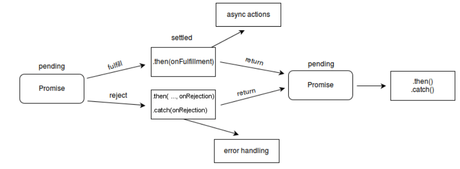
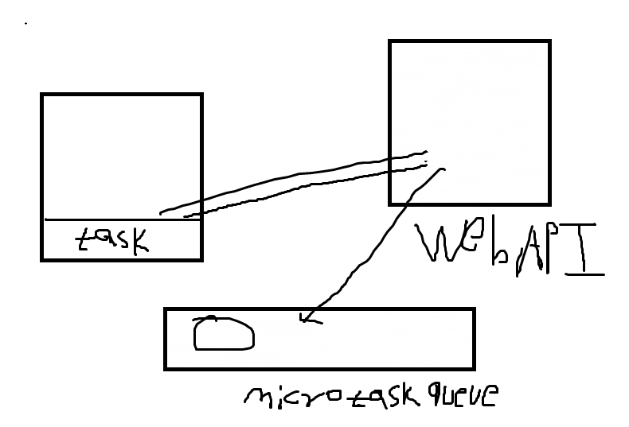
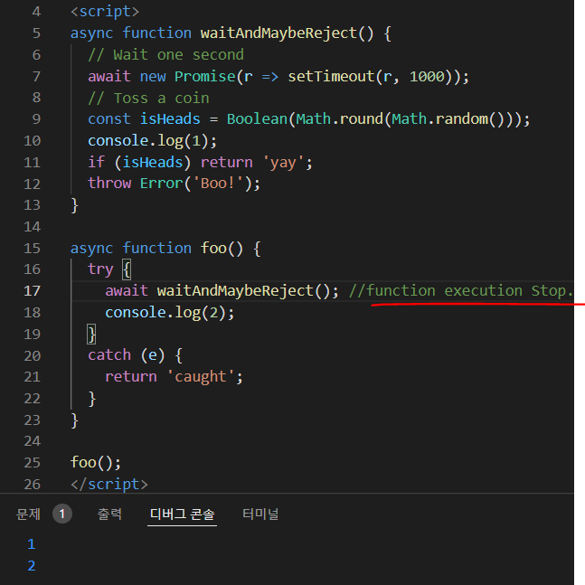

# Promise 관련 글.



> **Note**:
>
> This answer just covers the timing differences between `await` in series and `Promise.all`. Be sure to read [@mikep's comprehensive answer that also covers the more important differences in error handling](https://stackoverflow.com/a/54291660/497418).

------

For the purposes of this answer I will be using some example methods:

- `res(ms)` is a function that takes an integer of milliseconds and returns a promise that resolves after that many milliseconds.
- `rej(ms)` is a function that takes an integer of milliseconds and returns a promise that rejects after that many milliseconds.

Calling `res` starts the timer. Using `Promise.all` to wait for a handful of delays will resolve after all the delays have finished, but remember they execute at the same time:

Example #1

```js
const data = await Promise.all([res(3000), res(2000), res(1000)])
//                              ^^^^^^^^^  ^^^^^^^^^  ^^^^^^^^^
//                               delay 1    delay 2    delay 3
//
// ms ------1---------2---------3
// =============================O delay 1
// ===================O           delay 2
// =========O                     delay 3
//
// =============================O Promise.all
```


Show code snippet


This means that `Promise.all` will resolve with the data from the inner promises after 3 seconds.

But, [`Promise.all` has a "fail fast" behavior](https://developer.mozilla.org/en-US/docs/Web/JavaScript/Reference/Global_Objects/Promise/all#Promise.all_fail-fast_behaviour):

Example #2

```js
const data = await Promise.all([res(3000), res(2000), rej(1000)])
//                              ^^^^^^^^^  ^^^^^^^^^  ^^^^^^^^^
//                               delay 1    delay 2    delay 3
//
// ms ------1---------2---------3
// =============================O delay 1
// ===================O           delay 2
// =========X                     delay 3
//
// =========X                     Promise.all
```


Show code snippet


If you use `async-await` instead, you will have to wait for each promise to resolve sequentially, which may not be as efficient:

Example #3

```js
const delay1 = res(3000)
const delay2 = res(2000)
const delay3 = rej(1000)

const data1 = await delay1
const data2 = await delay2
const data3 = await delay3

// ms ------1---------2---------3
// =============================O delay 1
// ===================O           delay 2
// =========X                     delay 3
//
// =============================X await
```


# Promise.all()

The **`Promise.all()`** method takes an iterable of promises as an input, and returns a single [`Promise`](https://developer.mozilla.org/en-US/docs/Web/JavaScript/Reference/Global_Objects/Promise) that resolves to an array of the results of the input promises. This returned promise will resolve when all of the input's promises have resolved, or if the input iterable contains no promises. It rejects immediately upon any of the input promises rejecting or non-promises throwing an error, and will reject with this first rejection message / error.


```javascript
const promise1 = Promise.resolve(3);
const promise2 = 42;
const promise3 = new Promise((resolve, reject) => {
  setTimeout(resolve, 100, 'foo');
});

Promise.all([promise1, promise2, promise3]).then((values) => {
  console.log(values);
});
// expected output: Array [3, 42, "foo"]

// Promise { <state>: "fulfilled", <value>: Array[3] }
// Promise { <state>: "fulfilled", <value>: Array[4] }
// Promise { <state>: "rejected", <reason>: 555 }
```


```
Promise.all(iterable);
```


### [Parameters](https://developer.mozilla.org/en-US/docs/Web/JavaScript/Reference/Global_Objects/Promise/all#parameters)

- `iterable`

  An [iterable](https://developer.mozilla.org/en-US/docs/Web/JavaScript/Reference/Iteration_protocols#the_iterable_protocol) object such as an [`Array`](https://developer.mozilla.org/en-US/docs/Web/JavaScript/Reference/Global_Objects/Array).

### [Return value](https://developer.mozilla.org/en-US/docs/Web/JavaScript/Reference/Global_Objects/Promise/all#return_value)

- An **already resolved** [`Promise`](https://developer.mozilla.org/en-US/docs/Web/JavaScript/Reference/Global_Objects/Promise) if the *iterable* passed is empty.all
- An **asynchronously resolved** [`Promise`](https://developer.mozilla.org/en-US/docs/Web/JavaScript/Reference/Global_Objects/Promise) if the *iterable* passed contains no promises. Note, Google Chrome 58 returns an **already resolved** promise in this case.
- A **pending** [`Promise`](https://developer.mozilla.org/en-US/docs/Web/JavaScript/Reference/Global_Objects/Promise) in all other cases. This returned promise is then resolved/rejected **asynchronously** (as soon as the stack is empty) when all the promises in the given *iterable* have resolved, or if any of the promises reject. See the example about "Asynchronicity or synchronicity of Promise.all" below. Returned values will be in order of the Promises passed, regardless of completion order.

### [Fulfillment](https://developer.mozilla.org/en-US/docs/Web/JavaScript/Reference/Global_Objects/Promise/all#fulfillment)

The returned promise is fulfilled with an array containing **all** the resolved values (including non-promise values) in the *iterable* passed as the argument.


https://jakearchibald.com/2017/await-vs-return-vs-return-await/

https://eslint.org/docs/rules/no-return-await


### `Promise.all()`:

`Promise.all()` resolves only when all given promises resolve, and will reject immediately if *any* of the promises reject (or non-promises throw an error). It is useful in cases when you have interdependent tasks, where it makes sense to reject immediately upon any of them rejecting.

### `Promise.allSettled()`:

`Promise.allSettled()` resolves when all the given promises have either fulfilled or rejected. Unlike `Promise.all()`, it does not immediately reject upon any of the promises rejecting, instead it waits for all promises to complete, even if some of them fail. Therefore, it is useful in cases when you have multiple asynchronous tasks that are not interdependent, where you may want to know the result of each promise.

# no-return-await

Disallows unnecessary `return await`.

Using `return await` inside an `async function` keeps the current function in the call stack until the Promise that is being awaited has resolved, at the cost of an extra microtask before resolving the outer Promise. `return await` can also be used in a try/catch statement to catch errors from another function that returns a Promise.

You can avoid the extra microtask by not awaiting the return value, with the trade off of the function no longer being a part of the stack trace if an error is thrown asynchronously from the Promise being returned. This can make debugging more difficult.

## Rule Details

This rule aims to prevent a likely common performance hazard due to a lack of understanding of the semantics of `async function`.

Examples of **incorrect** code for this rule:

```
/*eslint no-return-await: "error"*/

async function foo() {
    return await bar();
}
```

Examples of **correct** code for this rule:

```
/*eslint no-return-await: "error"*/

async function foo() {
    return bar();
}

async function foo() {
    await bar();
    return;
}

// This is essentially the same as `return await bar();`, but the rule checks only `await` in `return` statements
async function foo() {
    const x = await bar();
    return x;
}

// In this example the `await` is necessary to be able to catch errors thrown from `bar()`
async function foo() {
    try {
        return await bar();
    } catch (error) {}
}
```

## When Not To Use It

There are a few reasons you might want to turn this rule off:

- If you want to use `await` to denote a value that is a thenable
- If you do not want the performance benefit of avoiding `return await`
- If you want the functions to show up in stack traces (useful for debugging purposes)




# await

The `await` operator is used to wait for a [`Promise`](https://developer.mozilla.org/en-US/docs/Web/JavaScript/Reference/Global_Objects/Promise). It can only be used inside an [`async function`](https://developer.mozilla.org/en-US/docs/Web/JavaScript/Reference/Statements/async_function) within regular JavaScript code; however it can be used on its own with [JavaScript modules.](https://developer.mozilla.org/en-US/docs/Web/JavaScript/Guide/Modules)

## [Syntax](https://developer.mozilla.org/en-US/docs/Web/JavaScript/Reference/Operators/await#syntax)

```
[rv] = await expression
```

Copy to Clipboard

- `expression`

  A [`Promise`](https://developer.mozilla.org/en-US/docs/Web/JavaScript/Reference/Global_Objects/Promise) or any value to wait for.

- `rv`

  Returns the fulfilled value of the promise, or the value itself if it's not a `Promise`.

## [Description](https://developer.mozilla.org/en-US/docs/Web/JavaScript/Reference/Operators/await#description)

The `await` expression causes `async` function execution to pause until a `Promise` is settled (that is, fulfilled or rejected), and to resume execution of the `async` function after fulfillment. When resumed, the value of the `await` expression is that of the fulfilled `Promise`.

If the `Promise` is rejected, the `await` expression throws the rejected value.

If the value of the *expression* following the `await` operator is not a `Promise`, it's converted to a [resolved Promise](https://developer.mozilla.org/en-US/docs/Web/JavaScript/Reference/Global_Objects/Promise/resolve).

An `await` splits execution flow, allowing the caller of the async function to resume execution. After the `await` defers the continuation of the async function, execution of subsequent statements ensues. If this `await` is the last expression executed by its function, execution continues by returning to the function's caller a pending `Promise` for completion of the `await`'s function and resuming execution of that caller.


# async function

An async function is a function declared with the `async` keyword, and the `await` keyword is permitted within it. The `async` and `await` keywords enable asynchronous, promise-based behavior to be written in a cleaner style, avoiding the need to explicitly configure promise chains.


### [Return value](https://developer.mozilla.org/en-US/docs/Web/JavaScript/Reference/Statements/async_function#return_value)

A [`Promise`](https://developer.mozilla.org/en-US/docs/Web/JavaScript/Reference/Global_Objects/Promise) which will be resolved with the value returned by the async function, or rejected with an exception thrown from, or uncaught within, the async function.


## [Description](https://developer.mozilla.org/en-US/docs/Web/JavaScript/Reference/Statements/async_function#description)

Async functions can contain zero or more [`await`](https://developer.mozilla.org/en-US/docs/Web/JavaScript/Reference/Operators/await) expressions. Await expressions make promise-returning functions behave as though they're synchronous by suspending execution until the returned promise is fulfilled or rejected. The resolved value of the promise is treated as the return value of the await expression. Use of `async` and `await` enables the use of ordinary `try` / `catch` blocks around asynchronous code.

**Note:** The `await` keyword is only valid inside async functions within regular JavaScript code. If you use it outside of an async function's body, you will get a [`SyntaxError`](https://developer.mozilla.org/en-US/docs/Web/JavaScript/Reference/Global_Objects/SyntaxError).

`await` can be used on its own with [JavaScript modules.](https://developer.mozilla.org/en-US/docs/Web/JavaScript/Guide/Modules)

**Note:** The purpose of `async`/`await` is to simplify the syntax necessary to consume promise-based APIs. The behavior of `async`/`await` is similar to combining [generators](https://developer.mozilla.org/en-US/docs/Web/JavaScript/Guide/Iterators_and_Generators) and promises.


Async functions always return a promise. If the return value of an async function is not explicitly a promise, it will be implicitly wrapped in a promise.


**Note:**

Even though the return value of an async function behaves as if it's wrapped in a `Promise.resolve`, they are not equivalent.

An async function will return a different *reference*, whereas `Promise.resolve` returns the same reference if the given value is a promise.

It can be a problem when you want to check the equality of a promise and a return value of an async function.

```javascript
const p = new Promise((res, rej) => {
  res(1);
})

async function asyncReturn() {
  return p;
}

function basicReturn() {
  return Promise.resolve(p);
}

console.log(p === basicReturn()); // true
console.log(p === asyncReturn()); // false
```


For example, the following:

```javascript
async function foo() {
   return 1
}
```

Copy to Clipboard

...is similar to:

```javascript
function foo() {
   return Promise.resolve(1)
}
```


The body of an async function can be thought of as being split by zero or more await expressions. Top-level code, up to and including the first await expression (if there is one), is run synchronously. In this way, an async function without an await expression will run synchronously. If there is an await expression inside the function body, however, the async function will always complete asynchronously.

For example:

```javascript
async function foo() {
   await 1
}
```

Copy to Clipboard

...is equivalent to:

```javascript
function foo() {
   return Promise.resolve(1).then(() => undefined)
}
```


https://ooeunz.tistory.com/47


비동기 함수를 작성할 때 **await**과 **return**을 하는 것 그리고 **return await**을 사용하는 것에는 실행에 차이가 있다. 이것을 올바르게 사용하지 않으면 우리는 예상치 못한 값을 반환받을 수 있다. 이 포스팅은 그러한 버그를 미리 방지하고 비동기에 대한 이해를 확장하고자 작성한다.

 

------

아래는 async함수이다.

```javascript
async function waitAndMaybeReject() {
  // Wait one second
  await new Promise(r => setTimeout(r, 1000));
  // Toss a coin
  const isHeads = Boolean(Math.round(Math.random()));

  if (isHeads) return 'yay';
  throw Error('Boo!');
}
```

이 함수는 setTimout으로 1초간 대기하는 promise를 비동기적으로 실행하고, 50/50의 확률로 'yay'를 return 하거나 에러를 발생시켜서 'Boo!'를 return 한다. 해당 함수를 이용해서 밑에서 비동기적으로 어떻게 실행결과가 다른지 확인해보도록 하겠다.

 

------

### **Just calling**

```javascript
async function foo() {
  try {
    waitAndMaybeReject();
  }
  catch (e) {
    return 'caught';
  }
}
```

만약 **foo()** 함수를 호출하게 된다면 어떤 값을 반환하게 될까?

만약 'yay' 또는 'Boo!' 값이 return 되길 기대했다면 아직 비동기에 대한 이해가 부족한 상태라고 할 수 있다. 이 함수를 실행하게 되면 Promise 값을 return 하게 된다.

왜냐하면 waitAndMaybeReject() 함수는 async를 이용해 비동기적으로 작성되었다. 그러므로 foo() 함수에서도waitAndMaybeReject() 함수는 비동기적으로 호출되는데, 그 결과 함수의 반환 값을 기다리지 않고(promise가 resolve되기 전에) 바로 다음 코드를 실행하기 때문에 catch블록에 잡힐 값이 없으므로 promise만이 return 된다.

 

------

### **Awaiting**

```javascript
async function foo() {
  try {
    await waitAndMaybeReject();
  }
  catch (e) {
    return 'caught';
  }
}
```

그렇다면 await를 붙여서 waitAndMaybeReject() 함수의 반환 값을 기다리게 한다면 어떻게 될까?

foo() 함수를 호출하게 되면 waitAndMaybeReject()가 비동기적으로 호출되며, promise는 setTimout으로 인해 1초를 기다리게 된다. 그리고 50/50 확률로 undefined가 실행되거나 'caught'가 실행될 것이다.

왜냐하면 만약 waitAndMaybeReject() 함수가 reject 된다면 catch 블록이 에러를 잡아서 'caught'를 return 할 것이고, 만약 문제없이 실행된다면 아무런 값도 반환되지 않을 것이기 때문이다.



 

------

### **Returning**

```javascript
async function foo() {
  try {
    return waitAndMaybeReject();
  }
  catch (e) {
    return 'caught';
  }
}
```

이번엔 await를 없애고 바로 return 시키는 형태의 함수이다. foo() 함수를 실행시키면 waitAndMaybeReject() 함수의 반환 값을 foo() 함수에서 반환하기 위해 함수가 실행 완료 될때까지 기다리게 된다.

그 결과 waitAndMaybeReject() 함수 내부에서는 1초를 기다리게 되고 return 값이 'yay'가 return 되거나, 50/50의 확률로 Error('Boo!')가 return 된다.

waitAndMaybeReject()을 return 하게 되면 결과 값이 바로 return 되기 때문에 catch 블록에서 에러가 잡히지 않는다.


비동기를 기다리겠다(Await) vs 기다리지 않겠다의 차이.

# return

The **`return`** statement ends function execution and specifies a value to be returned to the function caller.

 

------

### **Return-awaiting**

아마 이 형태의 함수가 우리가 본질적으로 가장 원하는 형태의 함수일 것이다.

```javascript
async function foo() {
  try {
    return await waitAndMaybeReject();
  }
  catch (e) {
    return 'caught';
  }
}
```

foo() 함수를 실행시키면 promise는 1초를 기다린다. 그리고 'yay'또는 catch블록의 'caught'를 return 하게 된다.

왜냐하면 우리는 await으로 인해서 waitAndMaybeReject() 함수를 기다리게 될 것이다. 그리고 만약 err가 throw 된다면 catch 블록에서 잡혀서 'caught'를 실행하게 될 것이다. 또한 에러 없이 실행이 된다면 'yay'라는 결과 값을 return 하게 될 것이다.

 

------

만약 위의 코드들이 헷갈린다면 아래의 두 가지 단계로 생각하면 이해하기 편리하다.

\1. waitAndMaybeReject()의 결과를 기다리고, fullfilledValue에 그 값을 초기화한다.
\2. 만약 결과 값이 reject라면 catch블록에 잡혀서 'caught'가 return 되고, resolve라면 fullfilledValue의 값이 return 된다.

```javascript
async function foo() {
  try {
    // Wait for the result of waitAndMaybeReject() to settle,
    // and assign the fulfilled value to fulfilledValue:
    const fulfilledValue = await waitAndMaybeReject();
    // If the result of waitAndMaybeReject() rejects, our code
    // throws, and we jump to the catch block.
    // Otherwise, this block continues to run:
    return fulfilledValue;
  }
  catch (e) {
    return 'caught';
  }
}
```

 

------

비동기는 결코 쉬운 개념이 아니다. 시간을 들여 이해해야 하는 영역이고, 필자 역시 비동기에 관한 100% 이해도를 가졌다고 말할 수 없다. 하지만 분명 비동기는 컴퓨팅 자원을 효율적으로 사용할 수 있고, 많은 부분에서 이득을 볼 수 있다. 그러므로 앞으로 동기적인 프로그래밍을 하게 될지라도 비동기적인 프로그래밍과 이에 대한 이해는 분명 좋은 개발자가 되는 데에 인사이트를 줄 것이다.


# Promise.prototype.then()

The **`then()`** method returns a [`Promise`](https://developer.mozilla.org/en-US/docs/Web/JavaScript/Reference/Global_Objects/Promise). It takes up to two arguments: callback functions for the success and failure cases of the `Promise`.

### [Return value](https://developer.mozilla.org/en-US/docs/Web/JavaScript/Reference/Global_Objects/Promise/then#return_value)

Once a [`Promise`](https://developer.mozilla.org/en-US/docs/Web/JavaScript/Reference/Global_Objects/Promise) is fulfilled or rejected, the respective handler function (`onFulfilled` or `onRejected`) will be called **asynchronously** (scheduled in the current thread loop). The behavior of the handler function follows a specific set of rules. If a handler function:

- returns a value, the promise returned by `then` gets resolved with the returned value as its value.
- doesn't return anything, the promise returned by `then` gets resolved with an `undefined` value.
- throws an error, the promise returned by `then` gets rejected with the thrown error as its value.
- returns an already fulfilled promise, the promise returned by `then` gets fulfilled with that promise's value as its value.
- returns an already rejected promise, the promise returned by `then` gets rejected with that promise's value as its value.
- returns another **pending** promise object, the resolution/rejection of the promise returned by `then` will be subsequent to the resolution/rejection of the promise returned by the handler. Also, the resolved value of the promise returned by `then` will be the same as the resolved value of the promise returned by the handler.


```javascript
async function waitAndMaybeReject() {
            // Wait one second
            await new Promise(r => setTimeout(r, 1000));
            // Toss a coin
            const isHeads = Boolean(Math.round(Math.random()));
            if (isHeads) return 'yay';
            throw Error('Boo!');
        }

        async function foo() {
            try {
                return await waitAndMaybeReject();
            }
            catch(e) {
                return e;
            }
        }

        async function exectue(){
            let result = await foo();
            console.log(result);
        }

        exectue();
```

async 함수는  return값이 promise면 promise를 반환하게 되고 아니라면 그 값을 promise화(wrapper, resolved)시켜 반환시키는 형태이다. await 메소드와 같은 경우는 promise's value 즉, 프로미스의 값을 반환하거나 만약 반환할 값이 promise가 아니라면 그 자체 값을 반환하게 된다.


만약 execute() 비동기 await foo(); 호출이 아닌 그냥 foo()를 호출하게 되면 최상위 waitAndMaybeReject() 함수의 반환될 promise 값은 await new Promise(r => setTimeout(r, 1000));로 현재 function은 call stack에서 중단상태. 결국 최종 받아온 리턴값은 promiseState : pending / promiseResult : undefined를 가지게 된다.


