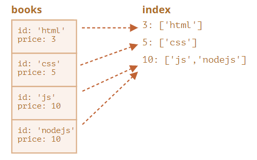

## [Transactions](https://javascript.info/indexeddb#transactions)

The term “transaction” is generic, used in many kinds of databases.

A transaction is a group of operations, that should either all succeed or all fail.

For instance, when a person buys something, we need to:

1. Subtract the money from their account.
2. Add the item to their inventory.

It would be pretty bad if we complete the 1st operation, and then something goes wrong, e.g. lights out, and we fail to do the 2nd. Both should either succeed (purchase complete, good!) or both fail (at least the person kept their money, so they can retry).

Transactions can guarantee that.

**All data operations must be made within a transaction in IndexedDB.**

To start a transaction:

```javascript
db.transaction(store[, type]);
```

- `store` is a store name that the transaction is going to access, e.g. `"books"`. Can be an array of store names if we’re going to access multiple stores.

- ```
  type
  ```

   

  – a transaction type, one of:

  - `readonly` – can only read, the default.
  - `readwrite` – can only read and write the data, but not create/remove/alter object stores.

There’s also `versionchange` transaction type: such transactions can do everything, but we can’t create them manually. IndexedDB automatically creates a `versionchange` transaction when opening the database, for `updateneeded` handler. That’s why it’s a single place where we can update the database structure, create/remove object stores.


```javascript
let openRequest = indexedDB.open("store", 2);

openRequest.onupgradeneeded = ...;
openRequest.onerror = ...;

openRequest.onsuccess = function() {
  let db = openRequest.result;

  db.onversionchange = function() {
    db.close();
    alert("Database is outdated, please reload the page.")
  };

  // ...the db is ready, use it...
};

openRequest.onblocked = function() {
  // this event shouldn't trigger if we handle onversionchange correctly

  // it means that there's another open connection to the same database
  // and it wasn't closed after db.onversionchange triggered for it
};
```

**Why are there different types of transactions?**

Performance is the reason why transactions need to be labeled either `readonly` and `readwrite`.

Many `readonly` transactions are able to access the same store concurrently, but `readwrite` transactions can’t. A `readwrite` transaction “locks” the store for writing. The next transaction must wait before the previous one finishes before accessing the same store.

After the transaction is created, we can add an item to the store, like this:

```javascript
let transaction = db.transaction("books", "readwrite"); // (1)

// get an object store to operate on it
let books = transaction.objectStore("books"); // (2)

let book = {
  id: 'js',
  price: 10,
  created: new Date()
};

let request = books.add(book); // (3)

request.onsuccess = function() { // (4)
  console.log("Book added to the store", request.result);
};

request.onerror = function() {
  console.log("Error", request.error);
};
```

There were basically four steps:

1. Create a transaction, mentioning all the stores it’s going to access, at `(1)`.
2. Get the store object using `transaction.objectStore(name)`, at `(2)`.
3. Perform the request to the object store `books.add(book)`, at `(3)`.
4. …Handle request success/error `(4)`, then we can make other requests if needed, etc.

Object stores support two methods to store a value:

- **put(value, [key])** Add the `value` to the store. The `key` is supplied only if the object store did not have `keyPath` or `autoIncrement` option. If there’s already a value with the same key, it will be replaced.
- **add(value, [key])** Same as `put`, but if there’s already a value with the same key, then the request fails, and an error with the name `"ConstraintError"` is generated.

Similar to opening a database, we can send a request: `books.add(book)`, and then wait for `success/error` events.

- The `request.result` for `add` is the key of the new object.
- The error is in `request.error` (if any).

## [Transactions’ autocommit](https://javascript.info/indexeddb#transactions-autocommit)

In the example above we started the transaction and made `add` request. But as we stated previously, a transaction may have multiple associated requests, that must either all succeed or all fail. How do we mark the transaction as finished, with no more requests to come?

The short answer is: we don’t.

In the next version 3.0 of the specification, there will probably be a manual way to finish the transaction, but right now in 2.0 there isn’t.

**When all transaction requests are finished, and the [microtasks queue](https://javascript.info/microtask-queue) is empty, it is committed automatically.**

Usually, we can assume that a transaction commits when all its requests are complete, and the current code finishes.

So, in the example above no special call is needed to finish the transaction.

Transactions auto-commit principle has an important side effect. We can’t insert an async operation like `fetch`, `setTimeout` in the middle of a transaction. IndexedDB will not keep the transaction waiting till these are done.

In the code below, `request2` in the line `(*)` fails, because the transaction is already committed, and can’t make any request in it:

```javascript
let request1 = books.add(book);

request1.onsuccess = function() {
  fetch('/').then(response => {
    let request2 = books.add(anotherBook); // (*)
    request2.onerror = function() {
      console.log(request2.error.name); // TransactionInactiveError
    };
  });
};
```

That’s because `fetch` is an asynchronous operation, a macrotask. Transactions are closed before the browser starts doing macrotasks.

Authors of IndexedDB spec believe that transactions should be short-lived. Mostly for performance reasons.

Notably, `readwrite` transactions “lock” the stores for writing. So if one part of the application initiated `readwrite` on `books` object store, then another part that wants to do the same has to wait: the new transaction “hangs” till the first one is done. That can lead to strange delays if transactions take a long time.

So, what to do?

In the example above we could make a new `db.transaction` right before the new request `(*)`.

But it will be even better, if we’d like to keep the operations together, in one transaction, to split apart IndexedDB transactions and “other” async stuff.

First, make `fetch`, prepare the data if needed, afterwards create a transaction and perform all the database requests, it’ll work then.

To detect the moment of successful completion, we can listen to `transaction.oncomplete` event:

```javascript
let transaction = db.transaction("books", "readwrite");

// ...perform operations...

transaction.oncomplete = function() {
  console.log("Transaction is complete");
};
```

Only `complete` guarantees that the transaction is saved as a whole. Individual requests may succeed, but the final write operation may go wrong (e.g. I/O error or something).

To manually abort the transaction, call:

```javascript
transaction.abort();
```

That cancels all modification made by the requests in it and triggers `transaction.onabort` event.


## [Searching](https://javascript.info/indexeddb#searching)

There are two main types of search in an object store:

1. By a key value or a key range. In our “books” storage that would be a value or range of values of `book.id`.
2. By another object field, e.g. `book.price`. This required an additional data structure, named “index”.

### [By key](https://javascript.info/indexeddb#by-key)

First let’s deal with the first type of search: by key.

Searching methods support both exact key values and so-called “ranges of values” – [IDBKeyRange](https://www.w3.org/TR/IndexedDB/#keyrange) objects that specify an acceptable “key range”.

`IDBKeyRange` objects are created using following calls:

- `IDBKeyRange.lowerBound(lower, [open])` means: `≥lower` (or `>lower` if `open` is true)
- `IDBKeyRange.upperBound(upper, [open])` means: `≤upper` (or `<upper` if `open` is true)
- `IDBKeyRange.bound(lower, upper, [lowerOpen], [upperOpen])` means: between `lower` and `upper`. If the open flags is true, the corresponding key is not included in the range.
- `IDBKeyRange.only(key)` – a range that consists of only one `key`, rarely used.

We’ll see practical examples of using them very soon.

To perform the actual search, there are following methods. They accept a `query` argument that can be either an exact key or a key range:

- `store.get(query)` – search for the first value by a key or a range.
- `store.getAll([query], [count])` – search for all values, limit by `count` if given.
- `store.getKey(query)` – search for the first key that satisfies the query, usually a range.
- `store.getAllKeys([query], [count])` – search for all keys that satisfy the query, usually a range, up to `count` if given.
- `store.count([query])` – get the total count of keys that satisfy the query, usually a range.

For instance, we have a lot of books in our store. Remember, the `id` field is the key, so all these methods can search by `id`.

Request examples:

```javascript
// get one book
books.get('js')

// get books with 'css' <= id <= 'html'
books.getAll(IDBKeyRange.bound('css', 'html'))

// get books with id < 'html'
books.getAll(IDBKeyRange.upperBound('html', true))

// get all books
books.getAll()

// get all keys, where id > 'js'
books.getAllKeys(IDBKeyRange.lowerBound('js', true))
```

**Object store is always sorted**

An object store sorts values by key internally.

So requests that return many values always return them in sorted by key order.


### [By a field using an index](https://javascript.info/indexeddb#by-a-field-using-an-index)

To search by other object fields, we need to create an additional data structure named “index”.

An index is an “add-on” to the store that tracks a given object field. For each value of that field, it stores a list of keys for objects that have that value. There will be a more detailed picture below.

The syntax:

```javascript
objectStore.createIndex(name, keyPath, [options]);
```

- **`name`** – index name,

- **`keyPath`** – path to the object field that the index should track (we’re going to search by that field),

- `option`

   

  – an optional object with properties:

  - **`unique`** – if true, then there may be only one object in the store with the given value at the `keyPath`. The index will enforce that by generating an error if we try to add a duplicate.
  - **`multiEntry`** – only used if the value on `keyPath` is an array. In that case, by default, the index will treat the whole array as the key. But if `multiEntry` is true, then the index will keep a list of store objects for each value in that array. So array members become index keys.

In our example, we store books keyed by `id`.

Let’s say we want to search by `price`.

First, we need to create an index. It must be done in `upgradeneeded`, just like an object store:

```javascript
openRequest.onupgradeneeded = function() {
  // we must create the index here, in versionchange transaction
  let books = db.createObjectStore('books', {keyPath: 'id'});
  let index = books.createIndex('price_idx', 'price');
};
```

- The index will track `price` field.
- The price is not unique, there may be multiple books with the same price, so we don’t set `unique` option.
- The price is not an array, so `multiEntry` flag is not applicable.

Imagine that our `inventory` has 4 books. Here’s the picture that shows exactly what the `index` is:




As said, the index for each value of `price` (second argument) keeps the list of keys that have that price.

The index keeps itself up to date automatically, we don’t have to care about it.

Now, when we want to search for a given price, we simply apply the same search methods to the index:

```javascript
let transaction = db.transaction("books"); // readonly
let books = transaction.objectStore("books");
let priceIndex = books.index("price_idx");

let request = priceIndex.getAll(10);

request.onsuccess = function() {
  if (request.result !== undefined) {
    console.log("Books", request.result); // array of books with price=10
  } else {
    console.log("No such books");
  }
};
```

We can also use `IDBKeyRange` to create ranges and looks for cheap/expensive books:

```javascript
// find books where price <= 5
let request = priceIndex.getAll(IDBKeyRange.upperBound(5));
```

Indexes are internally sorted by the tracked object field, `price` in our case. So when we do the search, the results are also sorted by `price`.


## [Cursors](https://javascript.info/indexeddb#cursors)

Methods like `getAll/getAllKeys` return an array of keys/values.

But an object storage can be huge, bigger than the available memory. Then `getAll` will fail to get all records as an array.

What to do?

Cursors provide the means to work around that.

**A \*cursor\* is a special object that traverses the object storage, given a query, and returns one key/value at a time, thus saving memory.**

As an object store is sorted internally by key, a cursor walks the store in key order (ascending by default).

The syntax:

```javascript
// like getAll, but with a cursor:
let request = store.openCursor(query, [direction]);

// to get keys, not values (like getAllKeys): store.openKeyCursor
```

- **`query`** is a key or a key range, same as for `getAll`.

- `direction`

   

  is an optional argument, which order to use:

  - `"next"` – the default, the cursor walks up from the record with the lowest key.
  - `"prev"` – the reverse order: down from the record with the biggest key.
  - `"nextunique"`, `"prevunique"` – same as above, but skip records with the same key (only for cursors over indexes, e.g. for multiple books with price=5 only the first one will be returned).

**The main difference of the cursor is that `request.onsuccess` triggers multiple times: once for each result.**

Here’s an example of how to use a cursor:

```javascript
let transaction = db.transaction("books");
let books = transaction.objectStore("books");

let request = books.openCursor();

// called for each book found by the cursor
request.onsuccess = function() {
  let cursor = request.result;
  if (cursor) {
    let key = cursor.key; // book key (id field)
    let value = cursor.value; // book object
    console.log(key, value);
    cursor.continue();
  } else {
    console.log("No more books");
  }
};
```

The main cursor methods are:

- `advance(count)` – advance the cursor `count` times, skipping values.
- `continue([key])` – advance the cursor to the next value in range matching (or immediately after `key` if given).

Whether there are more values matching the cursor or not – `onsuccess` gets called, and then in `result` we can get the cursor pointing to the next record, or `undefined`.

In the example above the cursor was made for the object store.

But we also can make a cursor over an index. As we remember, indexes allow to search by an object field. Cursors over indexes do precisely the same as over object stores – they save memory by returning one value at a time.

For cursors over indexes, `cursor.key` is the index key (e.g. price), and we should use `cursor.primaryKey` property for the object key:


### [“Inactive transaction” pitfall](https://javascript.info/indexeddb#inactive-transaction-pitfall)

As we already know, a transaction auto-commits as soon as the browser is done with the current code and microtasks. So if we put a *macrotask* like `fetch` in the middle of a transaction, then the transaction won’t wait for it to finish. It just auto-commits. So the next request in it would fail.

For a promise wrapper and `async/await` the situation is the same.

Here’s an example of `fetch` in the middle of the transaction:

```javascript
let transaction = db.transaction("inventory", "readwrite");
let inventory = transaction.objectStore("inventory");

await inventory.add({ id: 'js', price: 10, created: new Date() });

await fetch(...); // (*)

await inventory.add({ id: 'js', price: 10, created: new Date() }); // Error
```

The next `inventory.add` after `fetch` `(*)` fails with an “inactive transaction” error, because the transaction is already committed and closed at that time.

The workaround is the same as when working with native IndexedDB: either make a new transaction or just split things apart.

1. Prepare the data and fetch all that’s needed first.
2. Then save in the database.


## [Summary](https://javascript.info/indexeddb#summary)

IndexedDB can be thought of as a “localStorage on steroids”. It’s a simple key-value database, powerful enough for offline apps, yet simple to use.

The best manual is the specification, [the current one](https://www.w3.org/TR/IndexedDB-2/) is 2.0, but few methods from [3.0](https://w3c.github.io/IndexedDB/) (it’s not much different) are partially supported.

The basic usage can be described with a few phrases:

1. Get a promise wrapper like [idb](https://github.com/jakearchibald/idb).

2. Open a database:

    

   ```
   idb.openDb(name, version, onupgradeneeded)
   ```

   - Create object storages and indexes in `onupgradeneeded` handler or perform version update if needed.

3. For requests:

   - Create transaction `db.transaction('books')` (readwrite if needed).
   - Get the object store `transaction.objectStore('books')`.

4. Then, to search by a key, call methods on the object store directly.

   - To search by an object field, create an index.

5. If the data does not fit in memory, use a cursor.

Here’s a small demo app: