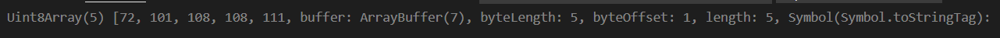

# arraybuffer

### out of bounds behavior 

What if we attempt to write an out-of-bounds value into a typed array? There will be no error. But extra bits are cut-off.

For instance, let’s try to put 256 into `Uint8Array`. In binary form, 256 is `100000000` (9 bits), but `Uint8Array` only provides 8 bits per value, that makes the available range from 0 to 255.

For bigger numbers, only the rightmost (less significant) 8 bits are stored, and the rest is cut off:

So we’ll get zero.

For 257, the binary form is `100000001` (9 bits), the rightmost 8 get stored, so we’ll have `1` in the array:


# Uint8ClampedArray

The **`Uint8ClampedArray`** typed array represents an array of 8-bit unsigned integers clamped to 0-255; if you specified a value that is out of the range of [0,255], 0 or 255 will be set instead; if you specify a non-integer, the nearest integer will be set. The contents are initialized to `0`. Once established, you can reference elements in the array using the object's methods, or using standard array index syntax (that is, using bracket notation).

## [Constructor](https://developer.mozilla.org/en-US/docs/Web/JavaScript/Reference/Global_Objects/Uint8ClampedArray#constructor)

- [`Uint8ClampedArray()`](https://developer.mozilla.org/en-US/docs/Web/JavaScript/Reference/Global_Objects/Uint8ClampedArray/Uint8ClampedArray)

  Creates a new `Uint8ClampedArray` object.


# Array.prototype.concat()

const array1 = ['a', 'b', 'c'];
const array2 = ['d', 'e', 'f'];
const array3 = array1.concat(array2);

console.log(array3);
// expected output: Array ["a", "b", "c", "d", "e", "f"]


```javascript
const array1 = ['a', 'b', 'c'];
const array2 = ['d', 'e', 'f'];
const array3 = array1.concat(array2);

console.log(array3);
// expected output: Array ["a", "b", "c", "d", "e", "f"]
```


- `arr.set(fromArr, [offset])` copies all elements from `fromArr` to the `arr`, starting at position `offset` (0 by default).
- `arr.subarray([begin, end])` creates a new view of the same type from `begin` to `end` (exclusive). That’s similar to `slice` method (that’s also supported), but doesn’t copy anything – just creates a new view, to operate on the given piece of data.

These methods allow us to copy typed arrays, mix them, create new arrays from existing ones, and so on.


```html
<html>

<body>

<script>
let uint8Array = new Uint8Array([0, 72, 101, 108, 108, 111, 0]);

// the string is in the middle
// create a new view over it, without copying anything
let binaryString = uint8Array.subarray(1, -1);
console.log(binaryString);
</script>

</body>


</html>
```

If either `begin` or `end` is negative, it refers to an index from the end of the array instead of from the beginning.




# TextEncoder

[TextEncoder](https://encoding.spec.whatwg.org/#interface-textencoder) does the reverse thing – converts a string into bytes.

The syntax is:

```javascript
let encoder = new TextEncoder();
```

The only encoding it supports is “utf-8”.

It has two methods:

- **`encode(str)`** – returns `Uint8Array` from a string.
- **`encodeInto(str, destination)`** – encodes `str` into `destination` that must be `Uint8Array`.

```javascript
let encoder = new TextEncoder();

let uint8Array = encoder.encode("Hello");
alert(uint8Array); // 72,101,108,108,111
```

