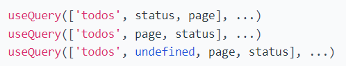
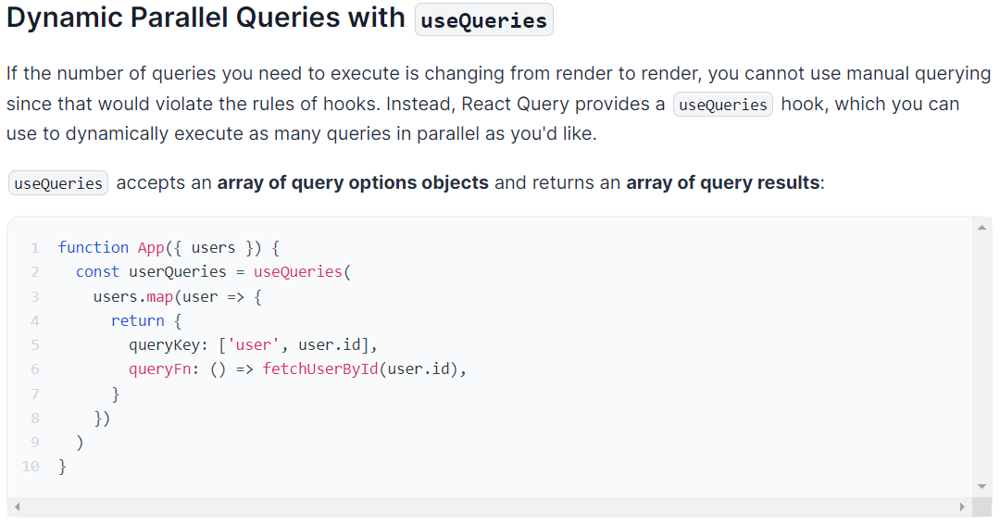
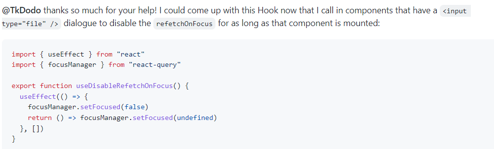

#### 누군가 효율적으로 Client Data를 수신을 위해 React Query를 만들었다.


# useQuery

```javascript
const {
2   data,
3   dataUpdatedAt,
4   error,
5   errorUpdatedAt,
6   failureCount,
7   isError,
8   isFetched,
9   isFetchedAfterMount,
10   isFetching,
11   isIdle,
12   isLoading,
13   isLoadingError,
14   isPlaceholderData,
15   isPreviousData,
16   isRefetchError,
17   isRefetching,
18   isStale,
19   isSuccess,
20   refetch,
21   remove,
22   status,
23 } = useQuery(queryKey, queryFn?, {
24   cacheTime,
25   enabled,
26   initialData,
27   initialDataUpdatedAt
28   isDataEqual,
29   keepPreviousData,
30   meta,
31   notifyOnChangeProps,
32   notifyOnChangePropsExclusions,
33   onError,
34   onSettled,
35   onSuccess,
36   placeholderData,
37   queryKeyHashFn,
38   refetchInterval,
39   refetchIntervalInBackground,
40   refetchOnMount,
41   refetchOnReconnect,
42   refetchOnWindowFocus,
43   retry,
44   retryOnMount,
45   retryDelay,
46   select,
47   staleTime,
48   structuralSharing,
49   suspense,
50   useErrorBoundary,
51 })
```


위가 useQuery 필수 형식이다.


# Query Keys

리액트 쿼리

=> 비동기적 수행 동작을 서버에 요청하는 라이브러리. (Loading 상태)


React Query manages query caching for you based on query keys

유니크한 쿼리 키를 통해서 서버에서 받은 데이터를 캐싱한다.


쿼리 키는 단일 스트링을 집어넣어도 결국 Array로 치환되어 Hash로 디펜던시 및 캐싱 관리요소로 쓰인다.


 

객체는 동일 취급(equals).





어떻게 보면 String 단일 문자는 사용자가 해당 쿼리 훅이 어떤 용도로 사용되는지에 대한 "지침"같다.
refetch 용도 같은 경우는 variable을 선언해줘야 할듯.


# Query Functions

A query function can be literally any function that **returns a promise**. The promise that is returned should either **resolve the data** or **throw an error**.


 key의 변경이나 요청사항에 서버에 요청 동작 구현부 (promise 반환 필수!)

- The function that the query will use to request data.

- Must return a promise that will either resolve data or throw an error.

 

```js
// Define a default query function that will receive the query key
2 // the queryKey is guaranteed to be an Array here
3 const defaultQueryFn = async ({ queryKey }) => {
4   const { data } = await axios.get(`https://jsonplaceholder.typicode.com${queryKey[0]}`);
5   return data;
6 };
7 
8 // provide the default query function to your app with defaultOptions
9 const queryClient = new QueryClient({
10   defaultOptions: {
11     queries: {
12       queryFn: defaultQueryFn, //defaultQuery를 설정함.
13     },
14   },
15 })
16 
17 function App() {
18   return (
19     <QueryClientProvider client={queryClient}>
20       <YourApp />
21     </QueryClientProvider>
22   )
23 }
24 
25 // All you have to do now is pass a key!
26 function Posts() {
27   const { status, data, error, isFetching } = useQuery('/posts')
28 
29   // ...
30 }
31 
32 // You can even leave out the queryFn and just go straight into options
33 function Post({ postId }) {
34   const { status, data, error, isFetching } = useQuery(`/posts/${postId}`, {
35     enabled: !!postId,
36   })
37 
38   // ...
39 }
```


# Parallel Queries




useQueries를 통해서 각각의 user의 정보가 담긴 데이터 users에서 각 user마다 똑같은 수행과정을 가진 useQuery를 사용 및 요청해 concurrently하게 fetch를 하는 과정을 보여준다.

결과값으로 query 결과 array가 반환됨. (위 상태의 객체가 user당 한개씩 담겨진 array 반환을 예상함.)


# Dependent Queries

```js
 // Get the user
2 const { data: user } = useQuery(['user', email], getUserByEmail)
3 
4 const userId = user?.id
5 
6 // Then get the user's projects
7 const { isIdle, data: projects } = useQuery(
8   ['projects', userId],
9   getProjectsByUser,
10   {
11     // The query will not execute until the userId exists
12     enabled: !!userId,
13   }
14 )
15 
16 // isIdle will be `true` until `enabled` is true and the query begins to fetch.
17 // It will then go to the `isLoading` stage and hopefully the `isSuccess` stage :)
```


useQuery fetch 성공하면 리렌더링이 일어나나봄. 안그러면 2차 useQuery에서 userId의 변경을 알 수 가 없음.


# Background Fetching Indicators

사실상 Loading하고 refetching하고 차이점을 모르겠긴함.

- ```
  isFetching: boolean
  ```

  - Is `true` whenever a request is in-flight, which includes initial `loading` as well as background refetches.
  - Will be `true` if the query is currently fetching, including background fetching.


Status value를 참조하지 않고 fetching중인 상태를 확인할때 사용하는 프로퍼티같음.


# Displaying Global Background Fetching Loading State

when **any** queries are fetching (including in the background), you can use the `useIsFetching` hook


아무 쿼리나 fetching하고 있는 상태를 추종하고 싶다면 "useIsFetching" 훅을 사용하라.


# Window Focus Refetching

react-query의 강력한 기능. 

해당 웹이 background에 있다가 front로 들어올시에 refetching을 자동 시도하게 된다.

```react
 //
 const queryClient = new QueryClient({
   defaultOptions: {
     queries: {
       refetchOnWindowFocus: false,
     },
   },
 })
 
 function App() {
   return <QueryClientProvider client={queryClient}>...</QueryClientProvider>
 }
```


# Custom Window Focus Event

```js
 focusManager.setEventListener(handleFocus => {
2   // Listen to visibilitychange and focus
3   if (typeof window !== 'undefined' && window.addEventListener) {
4     window.addEventListener('visibilitychange', handleFocus, false)
5     window.addEventListener('focus', handleFocus, false)
6   }
7 
8   return () => {
9     // Be sure to unsubscribe if a new handler is set
10     window.removeEventListener('visibilitychange', handleFocus)
11     window.removeEventListener('focus', handleFocus)
12   }
13 })
```

focusManager.setEventListener function을 활용한 윈도우 포커스 revalidate.
기본적으로 window.addEventListener('visibilitychange', fn)로 기능을 재현할 수 있지만 react-query에서는 비슷한 기능을 제공해줌.


## Pitfalls & Caveats

Some browser internal dialogue windows, such as spawned by `alert()` or file upload dialogues (as created by `<input type="file" />`) might also trigger focus refetching after they close. This can result in unwanted side effects, as the refetching might trigger component unmounts or remounts before your file upload handler is executed. See [this issue on GitHub](https://github.com/tannerlinsley/react-query/issues/2960) for background and possible workarounds.


다이얼로그 생성 함수 => alert / confirm 아니면 iframe 등은 refetching을 발현시킬 수 있는 요소이다.





# Disabling/Pausing Queries

```js
 function Todos() {
2   const {
3     isIdle,
4     isLoading,
5     isError,
6     data,
7     error,
8     refetch,
9     isFetching,
10   } = useQuery('todos', fetchTodoList, {
11     enabled: false,
12   })
13 
14   return (
15     <>
16       <button onClick={() => refetch()}>Fetch Todos</button>
17 
18       {isIdle ? (
19         'Not ready...'
20       ) : isLoading ? (
21         <span>Loading...</span>
22       ) : isError ? (
23         <span>Error: {error.message}</span>
24       ) : (
25         <>
26           <ul>
27             {data.map(todo => (
28               <li key={todo.id}>{todo.title}</li>
29             ))}
30           </ul>
31           <div>{isFetching ? 'Fetching...' : null}</div>
32         </>
33       )}
34     </>
35   )
36 }
```


쿼리 자동 refetch disable 모드 설명.


# Query Retries

- Setting `retry = false` will disable retries.
- Setting `retry = 6` will retry failing requests 6 times before showing the final error thrown by the function.
- Setting `retry = true` will infinitely retry failing requests.
- Setting `retry = (failureCount, error) => ...` allows for custom logic based on why the request failed.

```js
1 import { useQuery } from 'react-query'
2 
3 // Make a specific query retry a certain number of times
4 const result = useQuery(['todos', 1], fetchTodoListPage, {
5   retry: 10, // Will retry failed requests 10 times before displaying an error
6 })
```


Query 요청이 실패할 경우 얼마나 재시도를 할건지 횟수를 정함.

밑의 retryDelay 같은 경우는 재시도할 Query 요청이 얼만큼 delay를 가진 뒤 다시 재생될건지를 정함.

The default `retryDelay` is set to double (starting at `1000`ms) with each attempt, but not exceed 30 seconds:

```js
1 // Configure for all queries
2 import { QueryCache, QueryClient, QueryClientProvider } from 'react-query'
3 
4 const queryClient = new QueryClient({
5   defaultOptions: {
6     queries: {
7       retryDelay: attemptIndex => Math.min(1000 * 2 ** attemptIndex, 30000),
8     },
9   },
10 })
11 
12 function App() {
13   return <QueryClientProvider client={queryClient}>...</QueryClientProvider>
14 }
```


```js
 const result = useQuery('todos', fetchTodoList, {
   retryDelay: 1000, // Will always wait 1000ms to retry, regardless of how many retries
 })
```


# Paginated / Lagged Queries

내가 보기엔 isPreviousData가 Fetching 때만 true가 되는 거 같음.


- ```
  keepPreviousData: boolean
  ```

  - Optional
  - Defaults to `false`
  - If set, any previous `data` will be kept when fetching new data because the query key changed.


- ```
  isPreviousData: boolean
  ```

  - Will be `true` when `keepPreviousData` is set and data from the previous query is returned.


`keepPreviousData` to `true` we get a few new things:

- **The data from the last successful fetch available while new data is being requested, even though the query key has changed**.
- When the new data arrives, the previous `data` is seamlessly swapped to show the new data.
- `isPreviousData` is made available to know what data the query is currently providing you

```js
function Todos() {
2   const [page, setPage] = React.useState(0)
3 
4   const fetchProjects = (page = 0) => fetch('/api/projects?page=' + page).then((res) => res.json())
5 
6   const {
7     isLoading,
8     isError,
9     error,
10     data,
11     isFetching,
12     isPreviousData,
13   } = useQuery(['projects', page], () => fetchProjects(page), { keepPreviousData : true })
14 
15   return (
16     <div>
17       {isLoading ? (
18         <div>Loading...</div>
19       ) : isError ? (
20         <div>Error: {error.message}</div>
21       ) : (
22         <div>
23           {data.projects.map(project => (
24             <p key={project.id}>{project.name}</p>
25           ))}
26         </div>
27       )}
28       <span>Current Page: {page + 1}</span>
29       <button
30         onClick={() => setPage(old => Math.max(old - 1, 0))}
31         disabled={page === 0}
32       >
33         Previous Page
34       </button>{' '}
35       <button
36         onClick={() => {
37           if (!isPreviousData && data.hasMore) {
38             setPage(old => old + 1)
39           }
40         }}
41         // Disable the Next Page button until we know a next page is available
42         disabled={isPreviousData || !data?.hasMore}
43       >
44         Next Page
45       </button>
46       {isFetching ? <span> Loading...</span> : null}{' '}
47     </div>
48   )
49 }
```


# useInfiniteQuery

```js
 const {
2   fetchNextPage,
3   fetchPreviousPage,
4   hasNextPage,
5   hasPreviousPage,
6   isFetchingNextPage,
7   isFetchingPreviousPage,
8   ...result
9 } = useInfiniteQuery(queryKey, ({ pageParam = 1 }) => fetchPage(pageParam), {
10   ...options,
11   getNextPageParam: (lastPage, allPages) => lastPage.nextCursor,
12   getPreviousPageParam: (firstPage, allPages) => firstPage.prevCursor,
13 })
```


**Options**

The options for `useInfiniteQuery` are identical to the [`useQuery` hook](https://react-query-v3.tanstack.com/reference/useQuery) with the addition of the following:

- ```
  queryFn: (context: QueryFunctionContext) => Promise<TData>
  ```

  - **Required, but only if no default query function has been defined** [`defaultQueryFn`](https://react-query-v3.tanstack.com/guides/default-query-function)

  - The function that the query will use to request data.

  - Receives a

    ```
    QueryFunctionContext
    ```

    object with the following variables:

    - `queryKey: EnsuredQueryKey`: the queryKey, guaranteed to be an Array
    - `pageParam: unknown | undefined`

  - Must return a promise that will either resolve data or throw an error.

  - Make sure you return *the data *and* the `pageParam`* if needed for use in the props below.

- ```
  getNextPageParam: (lastPage, allPages) => unknown | undefined
  ```

  - When new data is received for this query, this function receives both *the last page of the infinite list of data* and the full array of all pages.
  - It should return a **single variable** that will be passed as the last optional parameter to your query function.
  - Return `undefined` to indicate there is no next page available.

- ```
  getPreviousPageParam: (firstPage, allPages) => unknown | undefined
  ```

  - When new data is received for this query, this function receives both the first page of the infinite list of data and the full array of all pages.
  - It should return a **single variable** that will be passed as the last optional parameter to your query function.
  - Return `undefined` to indicate there is no previous page available.


**Returns**

The returned properties for `useInfiniteQuery` are identical to the [`useQuery` hook](https://react-query-v3.tanstack.com/reference/useQuery), with the addition of the following:

- ```
  data.pages: TData[]
  ```

  - Array containing all pages.

- ```
  data.pageParams: unknown[]
  ```

  - Array containing all page params.

- ```
  isFetchingNextPage: boolean
  ```

  - Will be `true` while fetching the next page with `fetchNextPage`.

- ```
  isFetchingPreviousPage: boolean
  ```

  - Will be `true` while fetching the previous page with `fetchPreviousPage`.

- ```
  fetchNextPage: (options?: FetchNextPageOptions) => Promise<UseInfiniteQueryResult>
  ```

  - **This function allows you to fetch the next "page" of results.**
  - `options.pageParam: unknown` allows you to manually specify a page param instead of using `getNextPageParam`.
  - `options.cancelRefetch: boolean` if set to `true`, calling `fetchNextPage` repeatedly will invoke `fetchPage` every time, whether the previous invocation has resolved or not. Also, the result from previous invocations will be ignored. If set to `false`, calling `fetchNextPage` repeatedly won't have any effect until the first invocation has resolved. Default is `true`.

- ```
  fetchPreviousPage: (options?: FetchPreviousPageOptions) => Promise<UseInfiniteQueryResult>
  ```

  - This function allows you to fetch the previous "page" of results.
  - `options.pageParam: unknown` allows you to manually specify a page param instead of using `getPreviousPageParam`.
  - `options.cancelRefetch: boolean` same as for `fetchNextPage`.

- ```
  hasNextPage: boolean
  ```

  - This will be `true` if there is a next page to be fetched (known via the `getNextPageParam` option).

- ```
  hasPreviousPage: boolean
  ```

  - This will be `true` if there is a previous page to be fetched (known via the `getPreviousPageParam` option).


# Placeholder Query Data

```js
function Todos() {
2   const result = useQuery('todos', () => fetch('/todos'), {
3     placeholderData: placeholderTodos,
4   })
5 }
```


```js
 function Todo({ blogPostId }) {
2   const result = useQuery(['blogPost', blogPostId], () => fetch(`/blogPosts/${blogPostId}`), {
3     placeholderData: () => {
4       // Use the smaller/preview version of the blogPost from the 'blogPosts' query as the placeholder data for this blogPost query
5       return queryClient
6         .getQueryData('blogPosts')
7         ?.find(d => d.id === blogPostId)
8     },
9   })
10 }
```

쿼리에 제공하는 '초기 데이터' 이지만 캐쉬에는 저장되지 않는다.


# Initial Query Data

```js
function Todos() {
2   const result = useQuery('todos', () => fetch('/todos'), {
3     initialData: initialTodos,
4   })
5 }
```


쿼리에 제공되는 초기데이터를 제공 함. 캐시에도 저장된다.


First of all, `initialData` is persisted to the cache. It's one way of telling React Query: I have "good" data for my use-case already, data that is as good as if it were fetched from the backend. Because it works on cache level, there can only be one `initialData`, and that data will be put into the cache as soon as the cache entry is created (meaning when the first observer mounts). If you try to mount a second observer with different `initialData`, it won't do anything. 


### Background refetches

With `placeholderData`, you will always get a background refetch when you mount an observer for the first time. Because the data is "not real", React Query will get the real data for you. While this is happening, you will also get an `isPlaceholderData` flag returned from `useQuery`. You can use this flag to visually hint to your users that the data they are seeing is in fact just placeholderData. It will transition back to `false` as soon as the real data comes in.