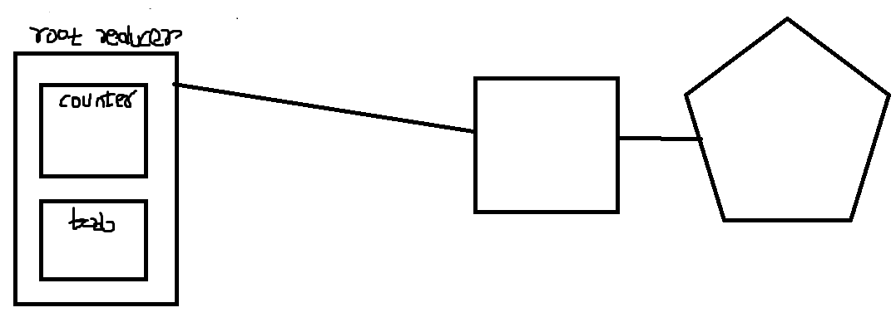
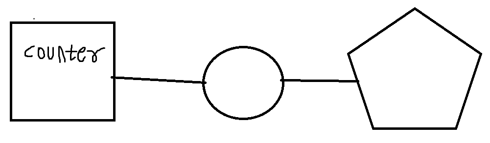
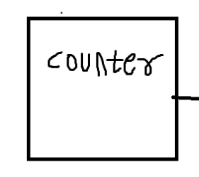
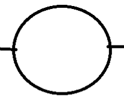
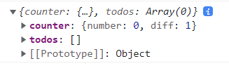
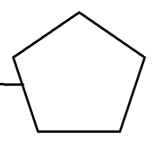
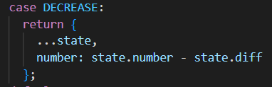

# Redux

```react
import { createStore } from 'redux';

// createStore는 스토어를 만들어주는 함수입니다.
// 리액트 프로젝트에서는 단 하나의 스토어를 만듭니다.

/* 리덕스에서 관리 할 상태 정의 */
const initialState = {
  counter: 0,
  text: '',
  list: []
};

/* 액션 타입 정의 */
// 액션 타입은 주로 대문자로 작성합니다.
const INCREASE = 'INCREASE';
const DECREASE = 'DECREASE';
const CHANGE_TEXT = 'CHANGE_TEXT';
const ADD_TO_LIST = 'ADD_TO_LIST';

/* 액션 생성함수 정의 */
// 액션 생성함수는 주로 camelCase 로 작성합니다.
function increase() {
  return {
    type: INCREASE // 액션 객체에는 type 값이 필수입니다.
  };
}

// 화살표 함수로 작성하는 것이 더욱 코드가 간단하기에,
// 이렇게 쓰는 것을 추천합니다.
const decrease = () => ({
  type: DECREASE
});

const changeText = text => ({
  type: CHANGE_TEXT,
  text // 액션안에는 type 외에 추가적인 필드를 마음대로 넣을 수 있습니다.
});

const addToList = item => ({
  type: ADD_TO_LIST,
  item
});

/* 리듀서 만들기 */
// 위 액션 생성함수들을 통해 만들어진 객체들을 참조하여
// 새로운 상태를 만드는 함수를 만들어봅시다.
// 주의: 리듀서에서는 불변성을 꼭 지켜줘야 합니다!

function reducer(state = initialState, action) {
  // state 의 초깃값을 initialState 로 지정했습니다.
  switch (action.type) {
    case INCREASE:
      return {
        ...state,
        counter: state.counter + 1
      };
    case DECREASE:
      return {
        ...state,
        counter: state.counter - 1
      };
    case CHANGE_TEXT:
      return {
        ...state,
        text: action.text
      };
    case ADD_TO_LIST:
      return {
        ...state,
        list: state.list.concat(action.item)
      };
    default:
      return state;
  }
}

/* 스토어 만들기 */
const store = createStore(reducer);

console.log(store.getState()); // 현재 store 안에 들어있는 상태를 조회합니다.

// 스토어안에 들어있는 상태가 바뀔 때 마다 호출되는 listener 함수
const listener = () => {
  const state = store.getState();
  console.log(state);
};

const unsubscribe = store.subscribe(listener);
// 구독을 해제하고 싶을 때는 unsubscribe() 를 호출하면 됩니다.

// 액션들을 디스패치 해봅시다.
store.dispatch(increase());
store.dispatch(decrease());
store.dispatch(changeText('안녕하세요'));
store.dispatch(addToList({ id: 1, text: '와우' }));
```

Redux라는 큰 상태 관리 box


InitialState => 초기 상태

액션 타입 정의 => 액션 타입 이름 스트링 정의.

액션 생성 함수 => 액션에 대한 객체를 선언해줌.  (action.type, action.**other_fields**)


reducer ( state / action)


const store = createStore(reducer);

=> box에 대한 handler를 받음.


store.dispatch => 액션 디스패치용. (액션 생성 함수 인풋용)

위의 객체가 reducer에 input되고  처리 되어야 함.

store.subscribe => 스토어안에 들어있는 상태가 바뀔 때 마다 호출될 함수 지정. return된 함수를 실행한다면 구독을 풀 수 있다.


# 스프레드 연산자


```null
var objectOne = {one:1, two:2, other:0};
var objectTwo = {three:3, four:4, other:-1};
var combined = {...objectOne, ...objectTwo};
// combined = {one:1, two:2, three:3, four:4, other:-1}
```

- 중복되는 키 값들은 마지막에 사용된 객체의 값으로 덮어씌어진다.


# 프리젠테이셔널 컴포넌트

1. 리덕스 스토어에 직접 접근하지 않음

2. 컨테이너 컴포넌트에서 사용할 UI 껍데기 부분

# 컨테이너 컴포넌트

1. 리덕스 스토어에 직접 접근 가능함
2. 액션을 디스패치 가능함
3. 프리젠테이셔널 컴포넌트의 동작을 작성



오각형 : 프리젠테이셔널 컴포넌트
사각형 : 컨테이너 컴포넌트


루트 리듀서(합성) => counter + todo

각 모듈 한개에 state, action, reducer 존재.


### **루트 리듀서(내부)** => 컨테이너 컴포넌트(중간부) => 프리젠테이셔널 컴포넌트(외부)

(**루트 리듀서(내부)** ===> createStore로 생성되고 provider로 하위 컴포넌트에게 전송됨.)

중간부에서 액션 디스패치 및 상태를 가져옴.
위의 상태와 액션을 외부 즉. 프리젠테이셔널 컴포넌트에 연결해줌.


useDispatch()는 store의 dispatch를 가져온다.


# Break down

```react
import React from 'react';
import ReactDOM from 'react-dom/client';
import './index.css';
import App from './App';
import reportWebVitals from './reportWebVitals';
import './exercise';
import { createStore } from 'redux';
import { Provider } from 'react-redux';
import rootReducer from './modules';
import { composeWithDevTools } from 'redux-devtools-extension'; // 리덕스 개발자 도구

const root = ReactDOM.createRoot(document.getElementById('root'));
const store = createStore(rootReducer,composeWithDevTools()); // 스토어를 만듭니다.
console.log(store.getState()); // 스토어의 상태를 확인해봅시다.

root.render(
  <Provider store={store}>
    <App />
  </Provider>
);

// If you want to start measuring performance in your app, pass a function
// to log results (for example: reportWebVitals(console.log))
// or send to an analytics endpoint. Learn more: https://bit.ly/CRA-vitals
reportWebVitals();
```

redux를 react에 연결시켜주기 위한 라이브러리로, 'react-redux'를 사용함. 

<Provider> 컴포넌트의 props의 store에 rootReducer를 넘김. (이제부터 rootReducer에 접근 가능함)

store를 만들기 위해서 createStore에 reducer를 전달.


### -- root reducer의 형태

```react
import { combineReducers } from 'redux';
import counter from './counter';
import todos from './todos';

const rootReducer = combineReducers({
  counter,
  todos
});

export default rootReducer;
```

**리듀서란?**

리듀서는, 현재의 상태와, 전달 받은 액션을 참고하여 새로운 상태를 만들어서 반환합니다. 이 리듀서는 `useReducer` 를 사용할때 작성하는 리듀서와 똑같은 형태를 가지고 있습니다.


combineReducers를 활용하여 counter, todos(서브 리듀서) 들을 하나로 합친다.


*참고 : 리덕스를 사용 할 때에는 여러개의 리듀서를 만들고 이를 합쳐서 루트 리듀서 (Root Reducer)를 만들 수 있습니다. (루트 리듀서 안의 작은 리듀서들은 서브 리듀서라고 부릅니다.)


각 counter리듀서와 todos리듀서에는 지정한 InitialState가 존재함.




사각형 : counter의 initialState, 활용 가능한 Action, Action으로 수행될 세부사항과 State를 가지는 Reducer가 포함됨.

동그라미: 컨테이너 컴포넌트

오각형: 프리젠테이셔널 컴포넌트 




```react
/* 액션 타입 만들기 */
// Ducks 패턴을 따를땐 액션의 이름에 접두사를 넣어주세요.
// 이렇게 하면 다른 모듈과 액션 이름이 중복되는 것을 방지 할 수 있습니다.
const SET_DIFF = 'counter/SET_DIFF';
const INCREASE = 'counter/INCREASE';
const DECREASE = 'counter/DECREASE';
```


총 액션 타입 3개. 수행될 명령어를 제외하고 앞의 reducer의 이름이 붙는 것은 combine되어질때 Action의 이름이 겹치는 것을 방지하기 위해서이다. 주로 컨테이너 컴포넌트에서 useDispatch()를 통해 Action을 불러오는데 이때 참고가능한 Action들이 하나로 Combine되어 있어서 그렇다.


```react
/* 초기 상태 선언 */
const initialState = {
  number: 0,
  diff: 1
};

/* 리듀서 선언 */
// 리듀서는 export default 로 내보내주세요.
export default function counter(state = initialState, action) {
  switch (action.type) {
    case SET_DIFF:
      return {
        ...state,
        diff: action.diff
      };
    case INCREASE:
      return {
        ...state,
        number: state.number + state.diff
      };
    case DECREASE:
      return {
        ...state,
        number: state.number - state.diff
      };
    default:
      return state;
  }
}
```

초기상태 : initialState

reducer의 이름이 counter로 state로 initialState를 받고, action에 따른 결과값을 반환해줌.




### 동그라미 : 컨테이너 컴포넌트

```react
  // useSelector는 리덕스 스토어의 상태를 조회하는 Hook입니다.
  // state의 값은 store.getState() 함수를 호출했을 때 나타나는 결과물과 동일합니다.
  const { number, diff } = useSelector(state => ({
    number: state.counter.number,
    diff: state.counter.diff
  }));

```




useSelector는 리덕스 스토어의 상태를 조회하는 hook이다. 

useSelector안의 state는 위와 같이 구성된다. 

​	**각 reducer의 이름** : State 

​	**각 reducer의 이름** : State

number와 diff에 counter reducer의 state를 연결시킴.


```react
  // useDispatch 는 리덕스 스토어의 dispatch 를 함수에서 사용 할 수 있게 해주는 Hook 입니다.
  const dispatch = useDispatch();
  // 각 액션들을 디스패치하는 함수들을 만드세요
  const onIncrease = () => dispatch(increase());
  const onDecrease = () => dispatch(decrease());
  const onSetDiff = diff => dispatch(setDiff(diff));
```

useDispatch 는 리덕스 스토어의 dispatch 를 함수에서 사용 할 수 있게 해주는 Hook 입니다.

Action 함수를 가져와 프리젠테이셔널 컴포넌트에 입력시키면 해당 리듀서에 import되게끔 설정해놓음.


```react
  return (
    <Counter
      // 상태와
      number={number}
      diff={diff}
      // 액션을 디스패치 하는 함수들을 props로 넣어줍니다.
      onIncrease={onIncrease}
      onDecrease={onDecrease}
      onSetDiff={onSetDiff}
    />
  );
}

export default CounterContainer;
```

<Counter> 즉, 프리젠테이셔널 컴포넌트에 dispatch로 연결된 액션들을 집어넣음.




### 오각형 : 프리젠테이셔널 컴포넌트

``` react
function Counter({ number, diff, onIncrease, onDecrease, onSetDiff }) {
  const onChange = e => {
    // e.target.value 의 타입은 문자열이기 때문에 숫자로 변환해주어야 합니다.
    onSetDiff(parseInt(e.target.value, 10));
  };
  return (
    <div>
      <h1>{number}</h1>
      <div>
        <input type="number" value={diff} min="1" onChange={onChange} />
        <button onClick={onIncrease}>+</button>
        <button onClick={onDecrease}>-</button>
      </div>
    </div>
  );
}

export default Counter;
```

Input 타입은 "number"이기때문에 +/- 증감을 만들 수 있다. onChange이벤트로 Input값이 변경되어질때마다 counter reducer의 setDiff 액션이 수행되어져서 state의 diff값을 변경시키고 이는 value로서 출력되는 양상이다.



state를 나열해놓고 number값과 diff값의 차이를 number 프로퍼티에 최신화 시켜준다.(최신화된 값은 <h1> 블록태그에 나타남.)


----

# 외전 : useSelector 최적화

기본적으로, `useSelector`를 사용해서 리덕스 스토어의 상태를 조회 할 땐 만약 상태가 바뀌지 않았으면 리렌더링하지 않습니다.


TodosContainer의 경우 카운터 값이 바뀔 때 todos값에는 변화가 없다.

```react
const todos = useSelector(state => state.todos);
```


반면에 CounterContainer는,

```react
const { number, diff } = useSelector(state => ({
  number: state.counter.number,
  diff: state.counter.diff
}));
```

useSelector Hook을 통해서 매번 렌더링 될 때마다 새로운 객체 {number, diff}를 만드는 것이기 때문에 todos의 state변화가 일어날때 hook 참조 시 상태가 바뀌었는지 바뀌지 않았는지 확인을 할 수 없어 낭비 렌더링이 이루어지고 있다.

```react
({
  number: state.counter.number,
  diff: state.counter.diff
})
```


이 낭비랜더링을 방지하기 위한 2가지 방법이 있다.


첫번째) 새로운 객체 생성을 막아서, counter의 state값의 변경을 확인함.

```react
const number = useSelector(state => state.counter.number);
const diff = useSelector(state => state.counter.diff);
```

두번째)
```react
  const { number, diff } = useSelector(
    state => ({
      number: state.counter.number,
      diff: state.counter.diff
    }),
    shallowEqual
  );
```


<동작원리>

```react
equalityFn?: (left: any, right: any) => boolean
```

이전 값과 다음 값을 비교하여 `true`가 나오면 리렌더링을 하지 않고 `false`가 나오면 리렌더링을 한다.

`shallowEqual`은 react-redux에 내장되어있는 함수로 객체 안의 가장 겉에 있는 값들을 모두 비교해줍니다.


객체{} 안의 가장 겉에 있는 값 (number,diff)이 hook발동 시 변경되었는지를 파악.


# CounterContainer connect()로 구현하기

```react
import React from 'react';
import { connect } from 'react-redux';
import Counter from '../components/Counter';
import { increase, decrease, setDiff } from '../modules/counter';

function CounterContainer({ number, diff, increase, decrease, setDiff }) {
  return (
    <Counter
      // 상태와
      number={number}
      diff={diff}
      // 액션을 디스패치 하는 함수들을 props로 넣어줍니다.
      onIncrease={increase}
      onDecrease={decrease}
      onSetDiff={setDiff}
    />
  );
}

// mapStateToProps 는 리덕스 스토어의 상태를 조회해서 어떤 것들을 props 로 넣어줄지 정의합니다.
// 현재 리덕스 상태를 파라미터로 받아옵니다.
const mapStateToProps = state => ({
  number: state.counter.number,
  diff: state.counter.diff
});

// mapDispatchToProps가 함수가 아니라 객체면
// bindActionCreators 를 connect 에서 대신 해줍니다.
const mapDispatchToProps = {
  increase,
  decrease,
  setDiff
};

// connect 함수에는 mapStateToProps, mapDispatchToProps 를 인자로 넣어주세요.
export default connect(
  mapStateToProps,
  mapDispatchToProps
)(CounterContainer);

/* 위 코드는 다음과 동일합니다.
  const enhance = connect(mapStateToProps, mapDispatchToProps);
  export defualt enhance(CounterContainer);
*/
```


