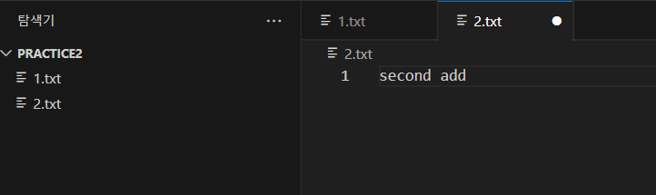

## merge 후 revert 실험하기


two 브랜치를 master에 merge 후의 결과이다. 


```
git revert HEAD
```

위의 코드를 통해서 master와 two가 merge 되기 전으로 되돌아갔다.


밑은 revert에 대해서 참고할 내용. commit2 커밋아이디를 revert 할 경우 commit2 내용이 삭제된 commit4가 자동적으로 등록되어진다. 


revert 자체는 Several Commit에서 특정 Commit을 제외하고 새롭게 나머지 Commit을 융합시켜주는 기능이라는걸 기억하자.


## git restore(복구) 사용방법



초기 "2.txt" 내용이 위와 같고


그리고 "2.txt"를 위와 같이 수정하고 변경시키고 싶다면.


```
git restore "2.txt"
```

해당 코드를 입력하게 되면 현재 "2.txt"가 commit 된 버전으로 백업되어진다. 


만약 전체를 복구하고 싶다면
```
git restore .
```


## git reset으로 해당 브랜치로 되돌아가기


만약 이렇게 여러 브랜치가 생성되었고 코드의 에러가 너무 심각하여 "first-commit"으로 되돌아가고 싶다면

```
git reset --hard e2da99e
```


이런식으로 코드를 적용해주는데 이렇게 되면 특정 commit이 제외되는 revert와는 다르게 커밋 아이디 e2da99e로 아예 회귀하게 되어버린다.


이런식으로 HEAD가 "first-commit" 부분으로 되돌아갔음을 알 수 있다.


## 현재 브랜치 이름을 변경하는 방법

```
git branch -M main
```


## 로컬 리포지터리를 원격 리포지터리에 옮겨보자 


git origin 변수를 위와 같이 "https:*//github.com/codingapple1/lesson.git*" 설정해 주겠다.

구조는 아래와 같음.


git remote add 변수명 저장소주소


설정해준다음 아래와 같이 코드를 작성하면,


```
git push -u origin main 
```

해당 -u 옵션은 입력한 주소를 기억하라는 의미.


## 원격 repo에서 로컬 repo로

```
git clone 원격저장소주소
```


## .gitignore를 사용해서 특정 파일 업로드 방지


현재 .gitignore 파일에는 

```
*.txt
```

와 같이 내용이 적혀져있고 "1.txt"와 "2.txt"는 이미 원격 repo에 upload되어진 상태.

"3.txt"와 "4.txt"는 아직 upload되어지지 않았고 이는 추후에 원격 repo upload시 반영되지 않는다.


## git push error


다른 원격 저장소로 향한 푸시로 인해 발생한 충돌이며, 일단 원격 저장소에서 업데이트된 내용을 결합한 뒤에 다시 Push 하라는 의미.

합작품을 만들때 주로 발생하는 문제이기 때문에 일단 pull해서 로컬 저장소를 원격 저장소 상태와 일치 시킨다.


```
git pull 원격 저장소 주소
```


**< 참고 사항 >**

**git pull 명령어는 git fetch + git merge 축약어임** 


일치 시킨 이후에는 원하는 수정 사항을 만든 뒤 Push를 다시 해주면 된다.


만약 팀원들이 같은 파일을 수정하고 있는 중에 Pull을 하였을 경우 Conflict가 발생할 텐데 이는 의사 소통을 통하여 합의를 보자.


## 로컬 저장소의 새로운 브랜치를 원격 저장소에 업로드하기

만약 현재 main 브랜치의 프로그램에서 새로운 채굴 기능을 탑재하고 이를 새로운 브랜치로 원격에 저장하고 싶다면,

```
git push 원격 저장소 주소 브랜치 이름
```


만약 branch이름이 mining이고 upload에 성공한다면 아래와 같이 새롭게 브랜치가 추가 된다.


여기서 위와 같이 branch를 만들 수 있다.


** 참고 사항 **

**git push 원격저장소주소 로컬브랜치명** 하면 특정 로컬저장소 브랜치 -> 원격저장소

**git push 원격저장소주소** 하면 모든 로컬저장소 브랜치 -> 원격저장소


## Pull request로 상위 책임자에게 해당 branch merge 요청하기


Github에는 "Compare & pull request" 버튼이 존재한다.


위 버튼을 누르게 되면 아래와 같은 화면에 진입하게 되는데 여기서 compare는 merge하고 싶은 branch 그리고 base는 해당 merge가 발생할 코드 기반을 말한다.


request를 만들게 되면 Github에서는 자동으로 main 브랜치와 해당 mining 브랜치가 충돌이 일어나는지를 검사해준다.


여기서 총 책임자가 merge 할 수 있는 방법이 총 3가지 있는데.

첫번 째는, Create a merge commit
두번 째는, Squash and merge

세번 쨰는, Rebase and merge


1번째와 같은 경우는 3-way merge이다. 
2번째는 해당 브랜치의 모든 코드들을 압축해서 base와 commit 하여 주는데 merge branch가 남지 않는다.

세번째는 해당 브랜치를 main의 마지막 브랜치로 끌고와 fast-fowarding 방식을 적용하는 이는 해당 merge branch의 남겨짐을 야기한다.


## 브랜치 관리 전략


### git flow 전략

\- main 브랜치

\- develop 브랜치 (개발용)

\- feature 브랜치 (develop에 기능추가용)

\- hotfix 브랜치 (main 브랜치 버그해결용)

\- 가끔 release 브랜치 (develop 브랜치를 main 브랜치에 합치기 전에 최종 테스트용)


main 브랜치는 최종 사용자가 이용할 프로그램이다.
develop 브랜치와 같은 경우 main 브랜치에서 파생되며 여기서 feature 브랜치가 파생되어진다.

feature 브랜치에서 각각 새로운 기능을 개발한 뒤에 완성 후 여러 merge방법으로 develop과 합친다.


이후 develop 브랜치에서 main으로 바로 병합하는게 아닌 release 브랜치를 만들어줘서 마지막 Test를 진행한다.

release 브랜치를 main에 병합한 뒤에 만약 main에서 에러가 났다면 바로 hotfix 브랜치를 파생시키고 수정되면 바로 main에 merge하는 방식이다.


**참고사항**

feature 브랜치의 작명은  feature/guild , feature/friend 즉 특정한 이름으로 지어준다.


< 전체 흐름도 >


### Trunk-based 전략

위와 같이 복잡하게 운영되어지는게 아니라 main에서 feature라는 브랜치를 따서 기능 개발 후 main에 merge시키는 아주 간단한 방식이다.


## git stash


stash 자체는 코드의 임시저장을 운영시킨다. 


```
git stash 
```

위와 같이 코드를 적용하게 된다면 현재 변화된 모든 파일 기록을 임시로 저장시켜놓고 commit 부분으로 코드를 되돌린다.


```
git stash list
```

stash되어진 목록을 관찰하는 코드이다.


```
git stash save 설명
```

stash할때 설명을 첨부가능한 기능.


Stash로 저장한 경우 비쥬얼 스튜디오 코드를 종료해도 메모리가 남아있다. (로컬 리포지터리에 저장됨)


만약 특정 저장된 Stash를 제거하고 싶다면 

```
git stash drop 해당 번호
```

코드를 이용한다.


```
git stash clear
```

전부 삭제할때는 clear.