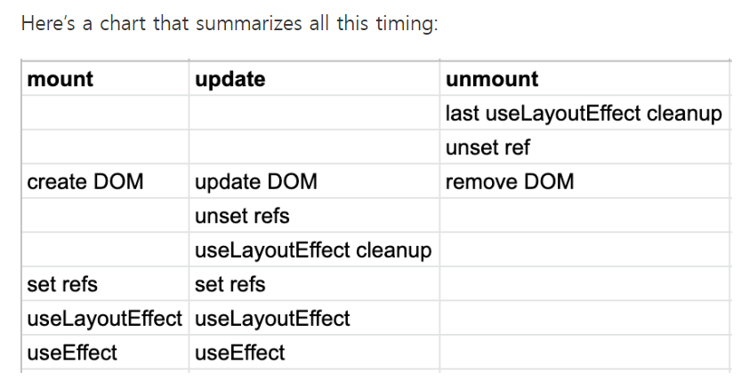
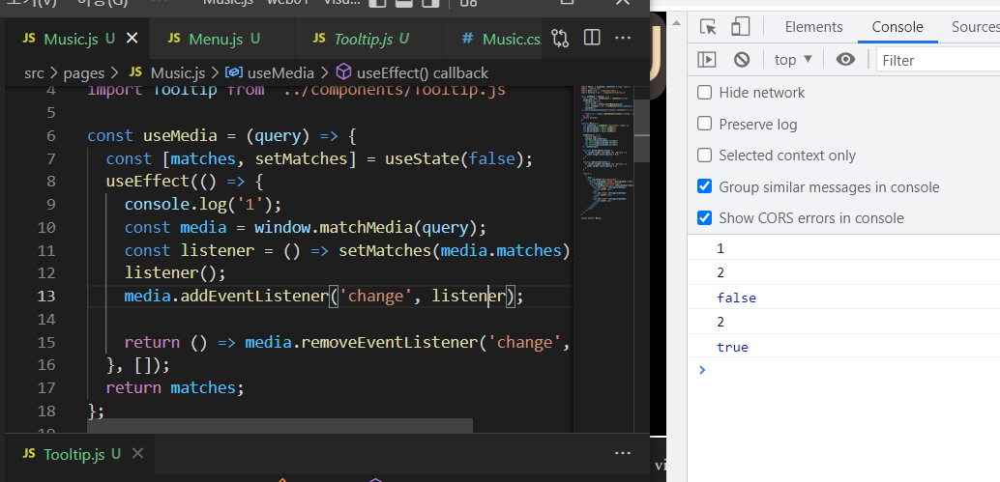

ref는 Dom 트리가 만들어지고 시작된다.

그리고 이벤트 설정과 같은 경우 onPointerMove={this.onpointer}

여기서는 this.onpointer는 최초 초기화된 인스턴스의 메소드를 **복사**해와서 이벤트에 집어넣기 때문에 이후 componentdidMount 호출 후 재선언이 안되고 있다.


결국 기기마다 display의 width와 height는 다르다.

그리고 현재 스크롤을 제외한 사용자에게 주어지는 화면이 viewport이고.

viewport는 가변적으로 움직일뿐이다.

개발자가 거기에 DOM을 맞추든지, 아니면 그냥 돔 객체를 특정위치에다 고정 시킬건지는

온전히 자기 몫이 된다.

기본적으로 div를 생성하게되면 width는 auto가 되는 것은 아마 viewport를 따라 반응형 웹을 만들라는 개발자의 의도가 존재하는 것이라고 생각된다.


music.js라는 page 컴포넌트를 출력한다.

menu.js => import menu.css를 통하여 다른 컴포넌트에서 css를 추출했지만.

music.js에서 menu.js를 불러오고 Menu.css는 music.js 컴포넌트에 영향을 미친다.


일반적으로, Viewport보다 DOM으로 설정한 컴포넌트의 레이아웃이 더 클 경우,
스크롤이 가능하지게 만들어놨다.


If your effect returns a function, React will run it when it is time to clean up:

useEffect의 return값이 함수일때, componentUnMount의 조건이 되면 실행하게 된다.


pointerdown되고 pointerup 될때 시간 계산


https://javascript.tutorialink.com/why-the-createref-current-always-null-in-react/
현재 Menu 컴포넌트에서 mediaQuery를 통해 Layout이 업데이트 될때마다 ref를 못받아오는 현상이 발생함.
해결방법을 보니, createRef()와 같은 메소드의 경우 class 컴포넌트에서만 사용가능하고 function 컴포넌트에서 사용하는 것은 useRef()메소드였던 것이다.


**Ref 타이밍 참조**






타이밍 순서문제.

해당 js파일에 해당하는 모든 useEffect는 순서대로 실행된다는 가정 아래 useEffect1 후 useEffect2를 실행하게 된다. 초기 matches값은 false였고, 모든 useEffect의 실행이 끝난 뒤 연동 variable의 변화가 있는지 확인하여 다시 useEffect함수를 실행하게 되는 구조이다.

```react
const useMedia = (query) => {
  const [matches, setMatches] = useState(false);
  useEffect(() => {
    console.log('1');
    const media = window.matchMedia(query);
    const listener = () => setMatches(media.matches);
    listener();
    media.addEventListener('change', listener);

    return () => media.removeEventListener('change', listener);
  }, []);
  return matches;
};
```

어떻게 보면 useMedia custom hook의 단점이기도 하다.