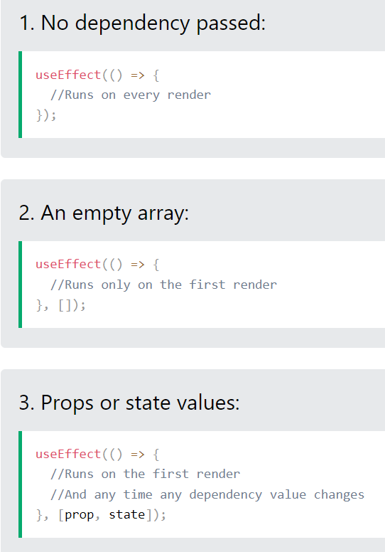
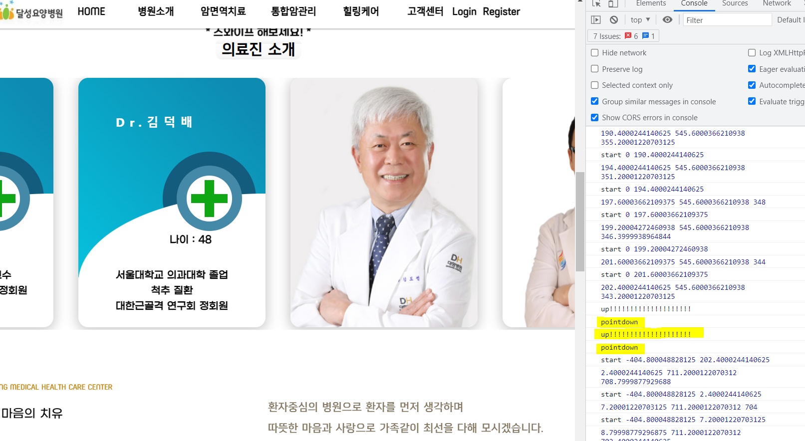

개발일지


https://developer.mozilla.org/ko/docs/Web/API/Page_Visibility_API


https://developer.mozilla.org/en-US/docs/Web/API/HTMLElement/transitionend_event


이벤트 들이 잘게 쪼개져있음 

ooooooooooooooooooooooooo (Macro-task)


background로 돌릴 시에, 다시 첫페이지로 돌아감.

그리고 다시 연계해서 시작함.


백그라운드에서 매크로 테스트, 마이크로 테스크 실행이 계속되는 현상 때문에 발생하는 문제.


이래서 transition animation을 빠르게 결정해놓음.


사실 그게 아니라 이미 다 반영되어서 그런 것이 아닐까? (맞음)


The absolutely positioned element is taken out of the natural flow of the document which means your container has zero height and width.

10% and 50% of that zero height and width are, of course, zero. **(부모 단에서 고정 값이 설정되어야 계산 가능함.)**

If you give your container a height and width, your percentage positions will start to work as you want.

[Here is a working example](http://jsfiddle.net/CjC4W/).

```css
.container { position: relative; width:500px; height:500px; } 
```


# Put the console.log inside the useEffect

Probably you have other side effects that cause the component to rerender but the useEffect itself will only be called once. You can see this for sure with the following code.

```js
useEffect(()=>{
      /*
      Query logic
      */
      console.log('i fire once');
},[]);
```

If the log "i fire once" is triggered more than once it means your issue is one of 3 things.

## This component appears more than once in your page

This one should be obvious, your component is in the page a couple of times and each one will mount and run the useEffect

## Something higher up the tree is unmounting and remounting

The component is being forced to unmount and remount on its initial render. This could be something like a "key" change happening higher up the tree. you need to go up each level with this useEffect until it renders only once. then you should be able to find the cause or the remount.

## React.Strict mode is on(중요)

> StrictMode renders components twice (on dev but not production) in order to detect any problems with your code and warn you about them (which can be quite useful).

This answer was pointed out by @johnhendirx and written by @rangfu, see [link](https://stackoverflow.com/a/61897567/2504407) and give him some love if this was your problem.


​    // slide.addEventListener('transitionrun', function() {console.log("transition run")});

​    // slide.addEventListener('transitionstart', function() {console.log("transition start")});

​    // slide.addEventListener('transitioncancel', function() {console.log("transition cancel")});


슬라이드 넘김 -> 더미 슬라이더 -> 딤드 처리 -> P 처리 -> transition end -> 슬라이드 트릭 -> 원하는 슬라이더 도착 


> I want to select the last child of elements with a specific attribute.

You can’t…with CSS

### Pseudo-selectors like `:last-child` or `nth-child` or `nth-of-type` only select based on **elements** not classes or attributes.

Either something is the `last-child` or it isn’t. If it’s the last **element** in a parent it will be selected.

Remember that CSS reads ‘right to left’

So, in your case, it’s testing for it to meet **all** the conditions.

It looks to see if something is the last child then if it has the attribute and class. If it doesn’t have all three…**in that order**…it fails.


**기본적으로 padding은 공백으로 치지 않아서 flex의 space-evenly가적용될 수 없다.**




1920 ~ 1200까지는 풀 엑세스

1200 ~ 414 대응

360 ~ 414 대응


아무리 absolute라도 container 외부로는 나갈수 없는건가. Layout요소에는 영향을 안주긴 함.

position이 absolute로 설정된 elem이라면 flex의 영향을 받지 않는다.


transform scale이 relative때 동작하지 않는다고??





fiip 애니메이션이 동작함에 따라 해당 div elem요소가 바뀌게 되고 pointer가 눌러져있는 상태이니 pointerdown이벤트 다시 한번 발생.
Swipe position은 much_move랑 관련되어 있고, 이것이 up이나 leave에서 초기화 되지 않기 때문에 전에 움직임 만큼 더해지면서 불미스런 움직임이 생겼다.


relative는 static였을 때의 위치를 layer에 적용시키고 top, left, bottom, right를 움직이게 되면 layout요소에서 벗어나는 움직임을 보여준다.


relative는 부모에 상대적으로 움직이는 것.

add, remove가 왜 안될까?

리렌더 되면서 함수가 다시 생성되므로, 가리키는 위치가 달라짐.

React는 코드 실행의 부하를 최소화하기 위해서 state가 변경된 부분만 코드를 실행한다.

useEffect나 훅으로 감싸지지 않은 부분들은 다 리렌더됨.


터치 디바이스 호버에 관한 글.


As touch devices like mobiles and tablets do not have mouse cursors like desktops and laptops, they display a hover state whenever you touch the element. They keep on displaying the hover state even when you are not touching the element anymore. Due to this, the overall user experience becomes confusing for the users as your website or web application is not giving the correct feedback.

The best way to display the touch state on mobile devices is to use “:active” pseudo-selector on an element.


Device Media query CSS

https://medium.com/@mezoistvan/finally-a-css-only-solution-to-hover-on-touchscreens-c498af39c31c


document.body.style.touchAction = 'none';
touch-action자체는 inherit 되지 않으므로 touchstart의 기본인 scroll 동작을 body에서 멈춰주기 때문에 스크롤이 멈춘다.


ref는 리렌더시 초기화되지 않는다.


Javascript is singled-threaded but the browser is not. The browser has at least three threads: Javascript engine thread, UI thread, and timing thread, where the timing of `setTimeout` and `setInterval` are done by the timing thread.

When calling `setTimeout` or `setInterval`, a timer thread in the browser starts counting down and when time up puts the callback function in javascript thread's execution stack. The callback function is not executed before other functions above it in the stack finishes. So if there are other time-consuming functions being executed when time up, the callback of `setTimeout` will not finish in time.


let viewport_Height = window.innerHeight(x) = document.documentelement.clientHeight


getBoundingClientRect는 margin을 포함하지 않는 값을 리턴시킨다.


**IOS(아이폰,,아이패드 등..), Android 등의 웹킷 기반 브라우저(크롬, 사파리 등)에서 화면을 터치하면,** 

 

해당위치에 파란박스 영역이 생긴다. (하이라이트)

 

이를 없애기 위해서는 

```css
-webkit-tap-highlight-color : 컬러;
```

를 사용해 색을 지정한다.

없애고 싶다면 

**rgba(0,0,0,0) 으로 투명하게 설정하거나 transparent로 투명하게 만들어준다. **


window scroll을 병행하기 위해서는 touchstart, touchmove, touchend 중 한개라도 block 하면 안된다.


(5.26 현재)
길게 누르고 탭할 시(long tap) 캐로셀 버그 현상 발생. (touchcancled의 상황)


5.29

pointer move와 touch move의 타겟 변환 로직에 차이점이 있는 것을 깨달음. pointer move와 같은 경우는 포인터를 움직일 시에 타겟이 변하지만 touch move는 down부터 포착된 타겟은 터치가 움직여도 변하지 않음.


(캐로셀 디버그용 코드)

```javascript
import Card from './Card';
import './Committee.css';
import Doctor1 from '../../Img/Card/Doctor1.jpg';
import Doctor2 from '../../Img/Card/Doctor2.jpg';
import Doctor3 from '../../Img/Card/Doctor3.jpg';
import Doctor4 from '../../Img/Card/Doctor4.jpg';
import Doctor5 from '../../Img/Card/Doctor5.jpg';
import Doctor6 from '../../Img/Card/Doctor6.jpg';
import Arrow from '../../Img/Arrow.jpg';
import { useCallback, useEffect, useRef } from 'react';
import { useMediaQuery } from 'react-responsive';
import { isMobile } from 'react-device-detect';

const committee_array = [
  {
    name: "신수봉",
    age: "62",
    content:
      `前 서울대학교 안과교수<br/>
      대한안과학회 정회원<br/>
      대한외안부연구회 정회원`,
    img: </img>
  },
  {
    name: "조철명",
    age: "53",
    content:
      `前 영남대학교병원 교수<br/>
    대한소화기 내시경 학회 정회원<br/>
    노인성 질환`,
    img: </img>
  },
  {
    name: "김덕배",
    age: "48",
    content:
      `서울대학교 의과대학 졸업<br/>
    척추 질환<br/>
    대한근골격 연구회 정회원`,
    img: </img>
  },
  {
    name: "김수철",
    age: "74",
    content:
      `서울대학교 의과대학 졸업<br/>
    위, 대장내시경<br/>
    대한 노인성 질환 연구회 정회원`,
    img: </img>
  },
  {
    name: "성문철",
    age: "65",
    content:
      `서울대학교 의과대학 졸업<br/>
    유방 및 여성배뇨장애<br/>
    대한유방암 연구회 정회원`,
    img: </img>
  },
  {
    name: "김환준",
    age: "27",
    content:
      `서울대학교 의과대학 졸업<br/>
    응급 진료<br/>
    외상, 골절`,
    img: </img>
  }
]

function Committee() {
  let intro_Text = useRef();
  let button_Prev = useRef();
  let button_After = useRef();
  let carousel_Wrap = useRef();
  let card_Area = useRef();
  let prev_Img = useRef();
  let after_Img = useRef();
  let card_Frame = useRef();

  const move_Width = 340;
  let pointdown_X = 0;
  let max_Carousel = -(committee_array.length - 3) * move_Width;

  let is_Mb = useMediaQuery({
    query: "(max-width:1200px)"
  })
  let Swipe_change_Tb = useMediaQuery({
    query: "(max-width:1024px)"
  })
  let Swipe_change_Mb = useMediaQuery({
    query: "(max-width:414px)"
  })

  const carousel_Resize = useCallback(() => {
    carousel_Wrap.current.style.marginLeft = (card_Frame.current.clientWidth - move_Width) / 2 + "px";
    console.log("carousel_Resized!");
  }, []);

  console.log("rerender");// 이 윗 부분이 계속해서 rerender된다 주의.

  useEffect(() => {
    setInterval(() => {
      intro_Text.current.classList.toggle('active');
    }, 1000);
  }, []);

  useEffect(() => {
    if (!is_Mb) {
      let position = 0;
      button_Prev.current.style.display = "inline-block";
      button_After.current.style.display = "inline-block";
      carousel_Wrap.current.style.transform = `translateX(0)`;
      carousel_Wrap.current.style.transition = "transform .7s";
      card_Frame.current.onpointerdown = null;

      button_Prev.current.onclick = () => {
        if (position != 0) {
          position = position + move_Width;
        }
        else {
          return false;
        }
        carousel_Wrap.current.style.transform = `translateX(${position}px)`;
      }

      button_After.current.onclick = () => {
        if (position != max_Carousel) {
          position = position - move_Width;
        }
        else {
          return false;
        }
        carousel_Wrap.current.style.transform = `translateX(${position}px)`;
      }

      card_Area.current.onpointerenter = () => {
        button_Prev.current.style.transition = "opacity .5s";
        button_After.current.style.transition = "opacity .5s";
        prev_Img.current.style.transition = "left .5s";
        after_Img.current.style.transition = "left .5s";

        if (position == 0) {
          prev_Img.current.style.left = -100 + 'px';
        }
        else if (position == max_Carousel) {
          after_Img.current.style.left = 100 + 'px';
        }

        requestAnimationFrame(() => {
          button_Prev.current.style.opacity = "1";
          button_After.current.style.opacity = "1";
        });
      }

      card_Area.current.onpointerleave = () => {
        console.log("leave");
        requestAnimationFrame(() => {
          button_Prev.current.style.opacity = "0";
          button_After.current.style.opacity = "0";
          prev_Img.current.style.left = 0 + 'px';
          after_Img.current.style.left = 0 + 'px';
        });
      }

      carousel_Wrap.current.ontransitionend = () => {
        if (position == 0) {
          prev_Img.current.style.left = -100 + 'px';
          after_Img.current.style.left = 0 + 'px';
        }
        else if (position == max_Carousel) {
          after_Img.current.style.left = 100 + 'px';
          prev_Img.current.style.left = 0 + 'px';
        }
        else {
          prev_Img.current.style.left = 0 + 'px';
          after_Img.current.style.left = 0 + 'px';
        }
      }
    }

    else {
      button_Prev.current.style.display = "none";
      button_After.current.style.display = "none";
      carousel_Wrap.current.style.transform = `translateX(0)`;
      carousel_Wrap.current.style.transition = "none";

      if (isMobile) {
        console.log("MB");

        let timestamp, ticker, reference, referenceY, velocity, amplitude;
        let now, elapsed, delta, v;
        let x, y, deltaX, deltaY;
        let elapsed_auto, delta_auto;
        let start_Move = 0;
        let offset = 0;
        let target_Distance = 0;
        let timeConstant = 325; // ms

        let mb_Debug = document.querySelector(".mobile_view");
        let mb_Count = 0;

        function block(event) {
          event.preventDefault();
        }

        function scroll(x) {
          offset = (x > -max_Carousel) ? -max_Carousel : (x < 0) ? 0 : x;
          carousel_Wrap.current.style.transform = `translateX(${-offset}px)`;
        }

        function track() {
          now = Date.now();
          elapsed = now - timestamp;
          timestamp = now;

          delta = offset - start_Move;
          start_Move = offset;

          v = 1000 * delta / (1 + elapsed);
          velocity = 0.6 * v + 0.4 * velocity;
        }

        function autoScroll() {
          if (amplitude) {
            elapsed_auto = Date.now() - timestamp;
            delta_auto = -amplitude * Math.exp(-elapsed_auto / timeConstant);
            if (Math.abs(delta_auto) > 0.0000000000001) {
              scroll(target_Distance + delta_auto);
              requestAnimationFrame(autoScroll);
            } else {
              scroll(target_Distance);
            }
          }
        }

        function dragFilter(event) { //필터
          if (event.touches.length > 1) {
            return false;
          }

          x = event.touches[event.touches.length-1].clientX;
          y = event.touches[event.touches.length-1].clientY;
          deltaX = reference - x;
          deltaY = referenceY - y;

          if ((deltaY > 20 || deltaY < -20)) {
            clearInterval(ticker);
            card_Frame.current.removeEventListener("touchmove", dragFilter, {passive: false});
            document.body.removeEventListener("touchmove", block, {passive: false});
            mb_Count++;
            mb_Debug.textContent = `${mb_Count}`;
          }
          else if ((deltaX > 10 || deltaX < -10)) {
            card_Frame.current.removeEventListener("touchmove", dragFilter, {passive: false});
            card_Frame.current.addEventListener("touchmove", dragX, {passive: false});
            reference = event.touches[event.touches.length-1].clientX;
          }
        }

        function dragX(event) {
          if (event.touches.length > 1) {
            return false;
          }

          x = event.touches[event.touches.length-1].clientX;
          deltaX = reference - x;
          scroll(offset + deltaX);
          reference = x;
        }

        function touchup(event) {
          
          if(event.touches.length === 0){
            clearInterval(ticker);

            if (velocity > 10 || velocity < -10) {
              amplitude = 0.6 * velocity;
              target_Distance = Math.round(offset + amplitude);
              timestamp = Date.now();
              requestAnimationFrame(autoScroll);
            }

            card_Frame.current.removeEventListener("touchmove", dragFilter, {passive: false});
            card_Frame.current.removeEventListener("touchmove", dragX, {passive: false});
            window.removeEventListener("touchend", touchup);
            document.body.removeEventListener("touchmove", block, {passive: false});

            document.querySelector("body").style.backgroundColor = "blue";
          }

          else {
            reference = event.touches[event.touches.length-1].clientX;

            document.querySelector("body").style.backgroundColor = "black";
          }
        }

        function touchstart(event) {
          if(event.touches.length === 1){
              reference = event.touches[event.touches.length-1].clientX;
              referenceY = event.touches[event.touches.length-1].clientY;
              timestamp = Date.now();
              velocity = 0;
              amplitude = 0;
              start_Move = offset;
    
              ticker = setInterval(track, 25);
              
              card_Frame.current.addEventListener("touchmove", dragFilter, {passive: false});
              window.addEventListener("touchend", touchup);
              document.body.addEventListener("touchmove", block, {passive: false});
              
              document.querySelector("body").style.backgroundColor = "orange";
          }
          
          else if (event.touches.length > 1) {
            if(event.touches.length === 2){
              document.querySelector("body").style.backgroundColor = "green";  
            }      
            else if(event.touches.length === 3){
              document.querySelector("body").style.backgroundColor = "red";  
            }
          }
        }

        function touchcanceled() {
          clearInterval(ticker);
          card_Frame.current.removeEventListener("touchmove", dragFilter, {passive: false});
          card_Frame.current.removeEventListener("touchmove", dragX, {passive: false});
          document.body.removeEventListener("touchmove", block, {passive: false});
          window.removeEventListener("touchend", touchup);
          document.querySelector("body").style.backgroundColor = "purple";
        }

        card_Frame.current.addEventListener("touchstart", touchstart, {passive: false});
        card_Frame.current.addEventListener("touchcancel", touchcanceled);
      }

      else {
        console.log("TB");
        card_Area.current.onpointerleave = null;
        let delta;
        let offset = 0;

        function scroll_X(x) {
          offset = (x > -max_Carousel) ? -max_Carousel : x < 0 ? 0 : x;
          console.log(`offset : ${offset}`);
          carousel_Wrap.current.style.transform = `translateX(${-offset}px)`;
        }

        function move_Carousel(event) {
          delta = pointdown_X - event.clientX;
          console.log(delta);
          if (delta > 2 || delta < -2) { //jitter prevention
            scroll_X((offset + delta));
            pointdown_X = event.clientX;
          }
        }

        function carousel_Pointerup() {
          card_Frame.current.removeEventListener("pointermove", move_Carousel);
          card_Frame.current.removeEventListener("pointerleave", carousel_Pointerleave);
          card_Frame.current.removeEventListener("pointerup", carousel_Pointerup);
        }

        function carousel_Pointerleave() {
          card_Frame.current.removeEventListener("pointermove", move_Carousel);
          card_Frame.current.removeEventListener("pointerleave", carousel_Pointerleave);
          card_Frame.current.removeEventListener("pointerup", carousel_Pointerup);
        }

        card_Frame.current.onpointerdown = (event) => {
          pointdown_X = event.clientX;

          card_Frame.current.addEventListener("pointermove", move_Carousel);
          card_Frame.current.addEventListener("pointerup", carousel_Pointerup);
          card_Frame.current.addEventListener("pointerleave", carousel_Pointerleave);
        };
      }
    }
  }, [is_Mb, Swipe_change_Tb, Swipe_change_Mb]);

  useEffect(() => {
    window.removeEventListener("resize", carousel_Resize);

    if (Swipe_change_Tb) {
      if (Swipe_change_Mb) {
        carousel_Wrap.current.style.marginLeft = (card_Frame.current.clientWidth - move_Width) / 2 + "px";
        window.addEventListener("resize", carousel_Resize);
        max_Carousel = -(committee_array.length - 1) * move_Width;
        console.log("414", max_Carousel);
      }
      else {
        carousel_Wrap.current.style.marginLeft = move_Width + "px";
        max_Carousel = -(committee_array.length - 1) * move_Width;
        console.log("1024", max_Carousel);
      }
    }
    else {
      carousel_Wrap.current.style.marginLeft = 0 + "px";
      max_Carousel = -(committee_array.length - 3) * move_Width;
      console.log("1200", max_Carousel);
    }
  }, [Swipe_change_Tb, Swipe_change_Mb]);

  return (
    <div className="committee_Wrapper">
      <div className="mobile_view"></div>
      <div className="committee_Title">
        <span className="committee_Title_Intro" ref={intro_Text}></span>
        <span className="committee_Title_Wrapper">
          <span className="committee_Title_Wrapper2">
            <span className="committee_Title_Center">의료진 소개</span>
          </span>
        </span>
      </div>
      <div className="committee_Card_Flex" ref={card_Area}>
        <div className="committee_Button_Prev" ref={button_Prev}></img></div>
        <div className="committee_Card_Frame" ref={card_Frame}>
          <div className="committee_Card_Wrapper" ref={carousel_Wrap}>
            {committee_array.map((value, index) => {
              return <Card key={index} >{value}</Card>
            })}
          </div>
        </div>
        <div className="committee_Button_After" ref={button_After}></img></div>
      </div>
    </div>
  );
}

export default Committee;
```

```css
.mobile_view{
    width: 100px;
    height: 100px;
    position: absolute;
    background-color: aqua;
}
```


targetTouches는 같은 element에서만 발생하는 터치를 잡는다.


event.preventDefault !== return false 
