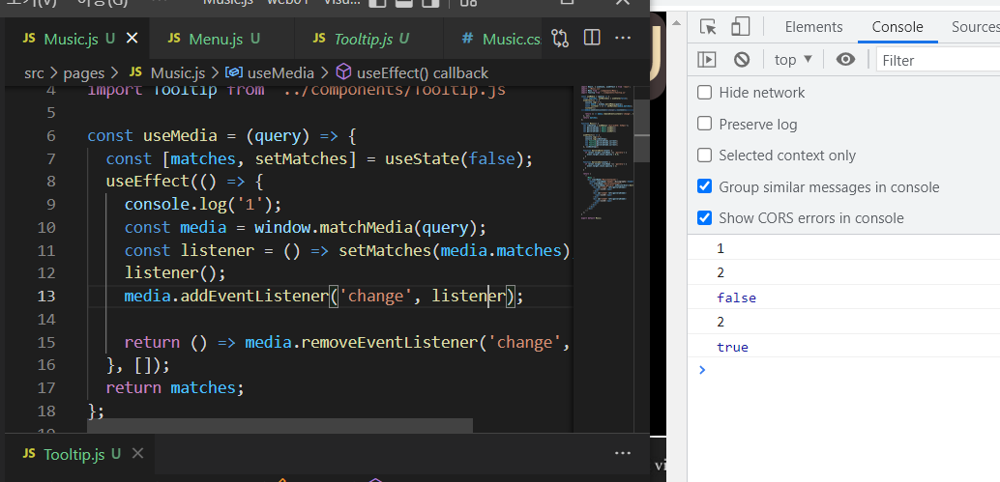

ref로 Component의 element링크는 Dom 트리가 만들어지고(mounted) 시작된다.

그리고 이벤트 설정과 같은 경우 onPointerMove={this.onpointer}

여기서는 this.onpointer는 최초 초기화된 인스턴스의 메소드를 **복사**해와서 이벤트에 집어넣기 때문에 이후 componentdidMount 호출 후 재선언이 안되고 있다.


결국 기기마다 display의 width와 height는 다르다.

그리고 현재 스크롤을 제외한 사용자에게 주어지는 화면이 viewport이고.

viewport는 가변적으로 움직일뿐이다.

개발자가 거기에 DOM을 맞추든지, 아니면 그냥 돔 객체를 특정위치에다 고정 시킬건지는

온전히 자기 몫이 된다.

기본적으로 div를 생성하게되면 width는 auto가 되는 것은 아마 viewport를 따라 반응형 웹을 만들라는 개발자의 의도가 존재하는 것이라고 생각된다.


music.js라는 page 컴포넌트를 출력한다.

menu.js => import menu.css를 통하여 다른 컴포넌트에서 css를 추출했지만.

music.js에서 menu.js를 불러오고 Menu.css는 music.js 컴포넌트에 영향을 미친다.


일반적으로, Viewport보다 DOM으로 설정한 컴포넌트의 레이아웃이 더 클 경우,
스크롤이 가능해지게 만들어놨다.


If your effect returns a function, React will run it when it is time to clean up:

useEffect의 return값이 함수일때, componentUnMount의 조건이 되면 실행하게 된다.


pointerdown되고 pointerup 될때 시간 계산


https://javascript.tutorialink.com/why-the-createref-current-always-null-in-react/
현재 Menu 컴포넌트에서 mediaQuery를 통해 Layout이 업데이트 될때마다 ref를 못받아오는 현상이 발생함.
해결방법을 보니, createRef()와 같은 메소드의 경우 class 컴포넌트에서만 사용가능하고 function 컴포넌트에서 사용하는 것은 useRef()메소드였던 것이다.


**Ref 타이밍 참조** (useEffect보다 ref 연결이 먼저다.)




타이밍 순서문제.

해당 js파일에 해당하는 모든 useEffect는 순서대로 실행된다는 가정 아래 useEffect1 후 useEffect2를 실행하게 된다. 초기 matches값은 false였고, 모든 useEffect의 실행이 끝난 뒤 연동 variable의 변화가 있는지 확인하여 다시 useEffect함수를 실행하게 되는 구조이다.

```react
const useMedia = (query) => {
  const [matches, setMatches] = useState(false);
  useEffect(() => {
    console.log('1');
    const media = window.matchMedia(query);
    const listener = () => setMatches(media.matches);
    listener();
    media.addEventListener('change', listener);

    return () => media.removeEventListener('change', listener);
  }, []);
  return matches;
};
```

어떻게 보면 useMedia custom hook의 단점이기도 하다.


CSS 스타일 적용 순서를 알아보자.

**요것은 css 중요도를 나타낸다**

1. 속성값 뒤의 !important 

2. 태그에 inline으로 style 속성 지정

3. 선택자가 #id

4. 선택자가 .class 및 pseudo 클래스(:hover같은 것)

5. 선택자가 tag 이름

만약 우선순위가 같다면 개수가 많이 나온 것이 우선시 된다는 설명도 있지만 어느 정도 맞는 말이지만 정확하지 않습니다. 정확한 설명은 스타일에 적용되어진 조합들을 토대로 특정도값을 계산해서 가장 많은 점수를 받은 것이 우선됩니다! 


특정도 계산식은 다음과 같습니다.

- 인라인 스타일 1000점
- ID 선택자 100점
- 클래스 선택자 및 가상 클래스(:before 같은), 속성 10점
- 태그 선택자 1점

```
* {

} /* a=0 b=0 c=0 d=0 => 0점 */
ul {
} /* a=0 b=0 c=0 d=1 => 1점 (태그)*/

li:first-child {
} /* a=0 b=0 c=1 d=1 => 11점 (pseudo-class, 태그)*/

ul li {
} /* a=0 b=0 c=0 d=2 => 2점 (2태그)*/

ul ol .red-tag {
} /* a=0 b=0 c=1 d=2 => 12점 (1클래스 2태그) */

#blue-tag {
} /* a=0 b=1 c=0 d=0 => 100점 (1아이디)*/
```


또한 개수마저 같다면 태그와 같은 경우는 <style> 태그나 CSS 파일에서 **나중에 나온 것**을 우선순위로 적용하게 된다.


addEventListener를 통해서 추가한 이벤트와 onpointer.. 이런 인라인 형태를 통해서 추가한 이벤트는 위치가 다른곳에 저장된다. 그러므로 removeEventListener를 통해서 이벤트를 삭제시켜줘야 한다.

화면에 보이는 것은 client 영역. border와 margin을 조정해도 Dom에 의한 display 영역이 확장되지 않았음.

너가 DOM elem을 사용자가 볼 수 있는 viewport보다 넓게 설정한다면, 브라우저는 drag기능을 지원하여 viewport 범위안에서 다른 영역을 볼 수 있게 만들어 주었다.

overflow와 같은 경우 viewport범위를 넘어 선 DOM elem의 부분을 scroll로 볼 수 있게 할 것이냐를 결정하는 style요소이다.


이벤트 발생 순서는, mouseOut -> mouseOver이다.


Viewport크기를 계산해서 그 크기만큼 출력해준다.


```javascript
reduce((previousValue, currentValue, currentIndex, array) => { /* ... */ }, initialValue)
```


tr은 테두리가 나오지 않는다.

부모 div가 자식 div의 크기에 영향을 받는 것이지, 그 반대가 아니다.

결국에 %는 부모div가 자식의 width와 height에서 영향 받는 것을 떼어내서 부모div의 부모 div의 width,height에 의존하게 만드는 것이다.


Img spread기법도 background-size를 잘 활용하면 reponsive-web을 만들 수 있다.(vw,vh)

현재는 고정값을 활용하여 Gallery DOM 객체를 부착하기로 결정함.

최대 갤러리 높이가 627px까지 차지하게 되면 최대 사용자 가용 뷰어 기준이 1080px일때,

자연스러운 위치를 선보이기가 가능함.


oveflow-x : auto / overflow-y: scroll 더 화면 가용치에서 벗어난 기기의 viewport를 지원하기 위함. 


Music => Modal => MusicDetail 순으로 props를 통해 전달하였지만, 이상하게 과거의 props 값과 현재의 터치된 gallery의 attribute에서 받아온 index값 2개가 전달되는 것을 확인할 수 있었다.

그 이유는 바로 React가 setModalOn을 통해 변경된 Component를 DOMcreate => DOMmount 시켜준(여기서 과거의 MusicIndex가 전달됨) 다음, setMusicIndex를 다시 설정하여 변동된 값을 Component에게 전달해주기 때문에 값이 2번이 나온 것이다.

올바르게 수정할려면, 먼저 Component의 setMusicIndex를 바꿔준뒤에 Component를 DOMmount시켜주는 setModalOn을 실행시키면 이러한 오류를 예방할 수 있다.

DOMmount된 것을 re-render시켜준다는 개념을 이해해야한다.


자식은 기본적으로 부모속성을 inherit한다.


부모박스에 opacity가 적용되어있으면, 그 자식도 영향을 받게된다.

 

예를들어 박스가 하나있고, 그 박스안에 3개의 박스를 배치하고싶은데

 

바깥 박스는 투명하게, 안쪽박스는 투명하지 않게 하고싶다.

 

그런데 이때 부모박스의 css 속성에 opacity값을 주게되면.. 안쪽박스까지 같은 투명도를 가지게된다.

이때 위에 보이는 아이콘들의 css속성에 opacity: 1; 값을 주어도 위와같은 상태가 그대로 유지된다..

 

하지만 이때 부모의 css에 opacity 대신

 

**background-color: rgba(0, 0, 0, 0.5);**

 

이처럼 rgba 로 투명도를 주게되면 원하는대로 나온다.


리액트에서는 이미지를 현재 컴포넌트에 import한 후 이미지 태그 src에 입력해준다.

형상관리는 visual Studio 콘솔에서 진행하면 된다.


[] character 1개 수용 가능, 그 다음 grouping '-_.'이 나오거나 아니면 0~9,a~z,A~Z가 나오게 되는데 이것은 infinity(*)한 숫자를 가질 수 있다. 그다음 @가 필수로 나온다. [] character 1개 수용 가능 그 다음 똑같이 grouping 후 . 이 필수로 나온다. character가 지정해준 범위 a-z A-Z로 나오는데 최소 2개 최대 3개를 가지고 이 character들의 대소문자(/i)는 구분하지 않겠다 이다.  (사진에서 틀린점이 있다면, . 이 metacharacter로 들어가게 되서 any single character가 존재할 시 true값을 반환하게 된다. 이것을 수정하기 위해서는 .앞에 백슬래쉬를 넣어줘 필수 pattern으로 인식하게 만드는 것이다.(아래코드 확인))

```react
let pattern = new RegExp(/^[0-9a-zA-Z]([-_.]?[0-9a-zA-Z])*@[0-9a-zA-Z]*\.[a-zA-Z]{2,3}$/i);
```


regex에 대한 아주 좋은 설명.(밑 링크 참조)

https://towardsdatascience.com/the-essentials-of-regular-expressions-b52af8fe271a


DOM elem 프로퍼티에는 non-boolean 값만 입력 가능함.(true, false와 같은 경우는 프로퍼티로 입력 불가하다.)


State가 변경되면 그 Component는 리랜더링 된다.

Mobile web 환경에서는 갤러리를 터치할 시 만약 손가락의 위치가 유튜브 링크가 덧씌어진 img파일위에 놓여져있었다면 a태그의 onclick이벤트 또한 발생되어 사용자가 albumDetail을 확인 할 시간도 없이 링크인되게 된다. 

이를 해결하기 위해서,
첫번째 시도 : 부모 Music Component에서 pointer down up이벤트가 발생하고 있을 때, 자식 component에 전달되어 있는 props로 AlbumDetail 컴포넌트의 pointer 이벤트를 막은다음(event.preventDefault) 끝이나면 자식쪽에서 state를 변경해서 pointer이벤트를 되살릴려고 했다.

문제점이 존재한다.

애초에 **이벤트가 발생하는 시점**은 모든 필요한 컴포넌트의 렌더링이 끝나고 발생하게 된다.
AlbumDetail 컴포넌트 useEffect()에서 설정한 로직은 onclick을 무조건 한번 차단시키는 것이기 때문에 위의 의도와는 상반된다.


그렇다면 비동기적으로 AlbumDetail컴포넌트가 띄어진 상태에서 몇 초간 onclick이벤트를 무효화시키면 어떨까라는 아이디어에서 해결방법을 찾아내었다.

좀 더 살펴보면 AlbumDetail 컴포넌트에는 onpointerdown, onpointerup 이벤트는 발생되지 않는다. 오로지 발생되는 것은 onclick이벤트이다. AlbumDetail 컴포넌트가 생성되지도 않은 시점에서 어떻게 click이벤트가 발생 할 수 있는 것일까?


Music DOM Mounted => useEffect 실행 => 포인터 다운 업(start01) => state변경으로 인한 Music Component re-render => AlbumDetail DOM Mounted => useEffect 실행 => Modal DOM Mounted => useEffect 실행 => AlbumDetail Onclick Event 발생(start02) => Onclick Event 무효화 해제 (setTimeoutDone)

주목해야 할 점은, Album Done! 이후 start02가 다음 순서에 오지 않는 것이다. AlbumDetail Component가 Modal Component안에 속하기 때문에  Modal Component가 완성된 이후에 이벤트가 발생하는 것 같다.


Music Component의 포인터 업이 끝나는 시점이(start01). 그 다음 Album Detail => Modal 순서대로 컴포넌트가 만들어지는데 click 이벤트가 어떻게 살아남을 수 있을까?


```react
import React, { useState, useEffect, useRef } from 'react';
import { useMediaQuery } from 'react-responsive';
import './Menu.css';
import { Link } from 'react-router-dom';
import styled from "styled-components";

const StyledLink = styled(Link)`
  text-decoration: none;
  color: white;
`
// for (let i = 0; i < this.listObj.current.children.length; i++) {
//   this.listObj.current.children[i].style.opacity = 1;
//   console.log(`${i} is fired.`);
// }

function Menu() {
  //console.log('컴포넌트 시작');
  let isPC = useMediaQuery({
    query: "(max-width:414px)"
  })
  let ManipulatedObj = {
    listObj: useRef(),
    button: useRef(),
  }
  let sw = 0;
  const fadein = fadeIn.bind(ManipulatedObj);
  const fadeout = fadeOut.bind(ManipulatedObj);

  function fadeIn() {
    this.listObj.current.style.visibility = 'visible';
    let pivotMoveSpeed = 0.2;
    for (let i = 0; i < this.listObj.current.children.length; i++) {
      this.listObj.current.children[i].style.opacity = 1;
      this.listObj.current.children[i].style.transition = "opacity " + pivotMoveSpeed + 's';
      pivotMoveSpeed += 0.4;
    }
    setTimeout(()=>{
      let pivotMoveSpeed = 1;
      for (let i = 0; i < this.listObj.current.children.length; i++) {
        this.listObj.current.children[i].style.transition = "opacity " + pivotMoveSpeed + 's';
        pivotMoveSpeed -= 0.4;
      }
    },1);
  }

  function fadeOut() {
    for (let i = 0; i < this.listObj.current.children.length; i++) {
        this.listObj.current.children[i].style.opacity = 0;
    }
    setTimeout(()=>{
      let pivotMoveSpeed = 0.2;
      for (let i = 0; i < this.listObj.current.children.length; i++) {
        this.listObj.current.children[i].style.transition = "opacity " + pivotMoveSpeed + 's';
        pivotMoveSpeed += 0.4;
      }
    },1);
  }

  function ButtonPointerEnter() {
    //this.listObj.current.style.visibility = 'visible';
    fadein();
  }

  function ButtonMouseLeave(event) {
    if (event.relatedTarget === window || event.relatedTarget === null) {
      //this.listObj.current.style.visibility = 'hidden';
      fadeout();
    }
    else if (!event.relatedTarget.closest('.list')) {
      //this.listObj.current.style.visibility = 'hidden';
      fadeout();
    }
  }

  function ListMouseLeave(event) {
    if (event.relatedTarget === window || event.relatedTarget === null) {
      //this.listObj.current.style.visibility = 'hidden';
      fadeout();
    }
    else if (event.relatedTarget === this.button.current) {
    }
    else if (!event.relatedTarget.closest('.list')) {
      //this.listObj.current.style.visibility = 'hidden';
      fadeout();
    }
  }

  function ButtonOnClick() {
    if (!sw) {
      this.listObj.current.style.visibility = 'visible';
      fadein();
      sw = !sw;
    }
    else {
      this.listObj.current.style.visibility = 'hidden';
      fadeout();
      sw = !sw;
    }
  }

  useEffect(() => {
    if (!isPC) {
      ManipulatedObj.button.current.onpointerenter = ButtonPointerEnter.bind(ManipulatedObj);
      ManipulatedObj.button.current.onmouseleave = ButtonMouseLeave.bind(ManipulatedObj);
      ManipulatedObj.listObj.current.onmouseleave = ListMouseLeave.bind(ManipulatedObj);
      ManipulatedObj.button.current.onclick = undefined;
    }
    else {
      ManipulatedObj.button.current.onpointerenter = undefined;
      ManipulatedObj.button.current.onmouseleave = undefined;
      ManipulatedObj.listObj.current.onmouseleave = undefined;
      ManipulatedObj.button.current.onclick = ButtonOnClick.bind(ManipulatedObj);
    }
  }, [isPC]);

  return (
    <div className="container">
      <button className="button" ref={ManipulatedObj.button}>MENU</button>
      <ul className="list" ref={ManipulatedObj.listObj}>
        <li><StyledLink to='/'>HOME</StyledLink></li>
        <li><StyledLink to='/music'>MUSIC</StyledLink></li>
        <li><StyledLink to='/contact'>CONTACT</StyledLink></li>
      </ul>
    </div>
  );
}

export default Menu;
```

CSS animation JS로 컨트롤.
일단 style 값을 js에서 변경하게되면 한 scope 범위가 끝나야 paint가 진행되게 된다. 고로 이러한 것을 방지할려면, setTimeout으로 js style 변경 블록을 메크로태스크 paint뒤에 집어넣어서 Animation이 가능하게 만든다.

=> 한 프레임에서 애니메이션 순서를 정하는 것임


기본 폰트 크기는 1rem으로 auto 설정됨.


애니메이션 진행 도중 Component를 바꾸게 되면 현재 진행중인 애니메이션의 DOM elem을 받아 올 수가 없게되어 Uncaught TypeError가 발생하게 된다.

```react
function refreshPageAnimationPc() {
    animate({
      duration: 2000,
      timing: makeEaseOut(bounce),
      draw(progress) {
        if(title.current)
        title.current.style.top = 265.6 * progress + 'px'
      }
    });
  };
```

if(title.current) 코드를 추가하게 되면 Dom elem이 없더라도 undefined의 style 프로퍼티 참조를 막을 수 있기 때문에 위의 에러문이 발생하지 않는다.


사파리는 하단 공백영역을 밑의 nav바를 띄우고서도 도달할 수 있는 것 같다.


positon:absolute에서 right값의 기준이 되는 위치는 가장 가까운 **부모 요소면서 조상 요소 중 position 속성이 relative인 요소**입니다.

하지만 position:fixed라면 position:relative인 제일 가까운 부모 혹은 조상 요소가 아닌 **브라우저 창이 기준**이 됩니다.

사파리 기준에서 밑의 네비게이션바 공간이 DOM의 bottom 끝에 도달했을때도 존재하기 때문에 페이지가 fullscreen으로 안뜨는 현상이 발생함.

사파리는 100vh가 상단바 끝에서 부터 시작해서 더해짐.

보여주는건 viewport크기(상단바+중앙+하단바)영역으로 보여줌. 대신 만약에 그 영역을 넘어선 DOM elem이 있으면 스크롤 가능하게 바뀜.


// html.style.overflowY = 'hidden';
// html.style.overflowY = 'scroll'; 로 변환시키면 스크롤이 초기화되는 현상 발생함.!

vw,vh는 스크롤의 넓이와 높이까지 포함해서 계산하게 됨.

scroll에서 보여주는건 elem가 차지하는 캔버스 크기만큼만 보여준다.
html overflow는 기본적으로 hidden.
안쪽 scroll은 html 바깥쪽 scroll은 body


사파리 환경, contact 컴포넌트에서 이미지가 보이지 않는 상황이 발생함. 기본적으로 터치는 가능하기 때문에 이상하게 생각했고 이미지를 살펴본 결과, 선이 검은색으로 그려져있어서 배경과 일치하기 때문에 눈에 보이지 않는 것이었다.

크롬 환경과 삼성 브라우저에서는 기본적으로 배경이 white 설정되어서 보여줌.
사파리 환경 X


body width: 100%; 하는 이유는 overflow-y가 scroll로 되어 있을 경우 100vw는 스크롤의 넓이를 포함 시켜 body 컨테이너의 크기를 결정하기 때문에 현재 뷰포트의 가로만큼 페이지를 꽉 채운다는 의도에서 벗어나게 된다.


css 미디어쿼리를 뒤에다가 놓게 된다면 일반적으로 쿼리에 덮히지 않은 css속성을 적용하고 해당되는 해상도의 디바이스만이 개별적으로 미디어쿼리로 덮힌 css를 적용하게 된다.


문제. scrollTop 0일때 safari에서만 opacity가 곧바로 transition 1s을 거치지 않고 바로 적용됨. 내 가설은 총 2가지 였다.

첫번째 opacity가 초기 1(auto)로 설정되있음.
두번째 transition이 설정 안되어 있음.

두번째와 같은 경우 스크롤 뒤 1s transition 적용을 확인하여 이 case는 아닌것으로 판정함. 그렇다면 첫번째 case인데 이를 수정하기 위해 초기값을 수동으로 0을 주고 setTimeout을 사용하여 macrostack으로 opacity 1을 주어서 애니메이션을 주니 해결됨.

사파리는 이상하게 초기 css 설정이 입력안되는 경우가 있음. 이때는 수동 js설정을 이용해야 할 듯함.


vw는 말그대로 뷰포트의 넓이만큼만 설정하는 것이어서 만약 DOM elem의 가로길이가 vw를 초과한다면 x축으로 scroll이 생길 수 있는점을 유의하여야 한다.


https://noonnu.cc/font_page/786

눈누에서 무료로 폰트 다운 가능함.

var(--vh,1vh)
두번째 argument는 fallback임.


# 1. 상속(Inheritance)

상속이란 상위(부모, 조상) 요소에 적용된 프로퍼티를 하위(자식, 자손) 요소가 물려 받는 것을 의미한다. 상속 기능이 없다면 각 요소의 Rule set에 프로퍼티를 매번 각각 지정해야 한다.

하지만 모든 프로퍼티가 상속되는 것은 아니다. **프로퍼티 중에는 상속이 되는 것과 되지 않는 것이 있다.**

https://poiemaweb.com/css3-inheritance-cascading

참조.