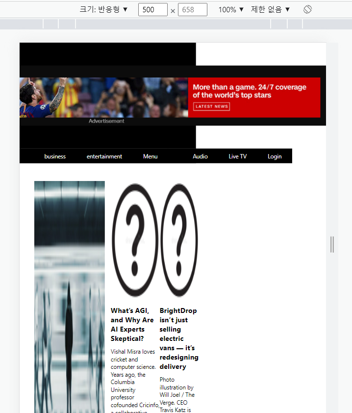

# 뉴스 서비스 개발일지


## Sass 프로젝트 호환성 실패 문제

Sass Compatible error


파일 패키저를 NPM이 아닌 YARN으로 재설치할경우 해결가능함. NPM은 버전 매니징이 불안정한 경우가 있음.

웹팩 버전을 다시깔거나 해당 Node js 버전에 맞는 Sass를 설치해도 해결할 수 없었음.

CORS 문제를 해결하기 위해서 프록시 서버에서 대신 요청을 받아와 Client에게 'Access-Control-Allow-Origin' 

헤더를 붙여줘 회피하는 방식. 원래는 서버에게 헤더를 붙여달라고 요청하면 해결할 수 있다. 헤더를 보는 방법은 개발자 도구 Network란에서 확인.


## CSS oveflow


Width, Height가 고정되었을때만 oveflow 및 text-overflow hidden이 적용된다.


## flex 문제

#### 기본적으로 flex-direction이 default(row)일때 모든 flex item의 높이가 같은 이유가 궁금해졌다.


만약 `flex-direction` 속성을 통해 주축을 설정하지 않은 경우, 기본값으로 `flex-direction: row`이 적용되며, 이 경우 주축은 가로 방향입니다. 그리고 `align-items` 속성의 기본값은 `stretch`입니다. 이때, `align-items: stretch`는 flex items의 크기를 자동으로 늘려서, **모든 flex item의 높이를 같게 만듭니다.**


즉, `display: flex`가 적용되면 flex container 내부의 flex items들은 높이가 같아지는 것이 아니라, **`align-items: stretch` 속성이 적용되어 자동으로 높이가 늘어나면서 같아지는 것입니다.** 만약 `align-items` 속성의 값이 `flex-start`, `flex-end`, `center` 등으로 설정되면, flex items의 높이는 서로 다를 수 있습니다.


**Tip**

**flex-grow**를 통해서 **넓이**가 재분배되게 된다.

```scss
a1 {
    flex-grow: 2; (2/4)
}

a2 {
    flex-grow: 1; (1/4)
}

a3 {
    flex-grow: 1; (1/4)
}
```


## CSS에서 height 150%가 적용되지 않았다.


`height: 150%;`는 부모 요소의 높이를 기준으로 자식 요소의 높이를 150%로 지정하는 CSS 속성입니다. 따라서, 이 속성을 적용하려면 부모 요소의 높이가 명확히 정의되어 있어야 합니다.

만약 부모 요소의 높이가 명확하지 않거나, 부모 요소의 높이가 상대적인 값(%, em 등)으로 지정되어 있을 경우, `height: 150%;`는 적용되지 않을 수 있습니다.

따라서, `height: 150%;`와 같은 상대적인 높이 값을 가진 요소를 정확하게 지정하려면, 부모 요소의 높이와 `overflow` 속성 등을 고려하여 CSS 스타일링을 해주어야 합니다.


**부모 요소의 높이가 명확하게 지정되어 있어야함 (px와 같은 문법)**


## Responsive Web에 대해서 고찰

기본적으로 모든 디스플레이의 크기가 다르기 때문에 이를 고려한 마크업 디자인이 필수다.

이를 확인하기 위해서 **구글 개발자 도구를 활용하여 width를 크게 늘려보고 디자인을 파악한다.**


##### 500px 넓이에서 확인 (요소가 망가짐을 확인할 수 있다.<잘못된 마크업>)



##### 3000px 넓이에서 확인 (요소가 제대로 정착함<올바른 마크업>)


## 부모 elem이 flex가 설정되었고 이를 줄였을때 더이상 자식의 width 가 줄어들지 않는 결과가 보였다.

Width 고정값이나 padding때문에 더이상 줄어들 수 없었던 것이다.

Shrink로 줄어들지 않는다면 Padding과 같은 content 영역이 이미 확보되어서 더 이상 공백이 존재하지 않는 것이다.


----

# Font 적용법


1. 폰트를 다운받는다.
2. 아래와 같이 css에서 적용시켜준다

```scss
@font-face {
    font-family: "MyFont";
    src: url("../Font/Robot.ttf"); 
}
```


```react
@font-face {
  font-family: "MyFont";
  src: url("폰트 파일 경로/폰트 파일 이름.ttf") format("truetype");
}

body {
  font-family: "MyFont", sans-serif;
}
```


`@font-face`는 CSS에서 사용할 폰트를 정의하기 위한 at-rule 중 하나입니다.

이를 사용하여 사용자가 지정한 폰트 파일을 웹 페이지에 내장하고, 이를 CSS에서 사용할 수 있습니다.

`@font-face` 규칙은 폰트를 내장할 때 사용하는 방법을 브라우저에 알려주는 역할을 합니다.

예를 들어, `@font-face` 규칙을 사용하여 `MyFont`라는 이름으로 폰트 파일을 정의하면, 해당 폰트를 CSS에서 `font-family` 속성을 사용하여 쉽게 사용할 수 있습니다.


위의 코드에서는 `MyFont`라는 이름으로 폰트를 정의하고, 이를 `body` 요소에 적용하였습니다. 이제 `body` 요소에는 `MyFont` 폰트가 적용됩니다.


----

# SCSS 단점이 있음

똑같이 구조를 채택하여서 적용해야 함.


```scss
.background {
    @extend .sorted;
    height: 300px;
    justify-content: center;
    align-items: center;
    
    .adver {
        width: 1024px;
        padding: 0;
        margin: 0;

        &:hover {
            cursor: pointer;
        }
    }
}
```


예를 들어, 위와 같이 구조화 scss가 적용되어 있다면 다른 media query에서는 아래와 같이 적용되어야 한다.

```scss
.background {
   .adver {
            visibility: hidden;
        }
}
```


아래와 같은 식으로 적용하면 동작하지 않는다.

```scss
.background {

}

.adver {
     visibility: hidden;
}
```


----

# 스크롤 헤더 만들기


### 첫번째 실험 방법 / 높이를 계산해 수동으로 고정 시켜주기 (실패)

```react
 window.onscroll = ()=>{
      if(menu_all){
        if(menu_all.current){
          if(header_switch && menu_all.current?.getBoundingClientRect().top <= 0){
            menu_all.current.style.position = "fixed";
            menu_all.current.style.top = "0px";
            header_switch = false;
          }
    
          if(!header_switch && window.scrollY <= 300){
            menu_all.current.style.position = "static";
            menu_all.current.style.top = "300px";
            header_switch = true;
          }
        }
      }
    }
```

**바닐라 자바스크립트를 활용하여 수동으로 element의 layour요소를 설정해주는 방법.**

위의 코드를 사용해서 정해진 높이를 넘어가게 되면 수동으로 헤더를 fixed 해서 scroll 시 헤더가상위에 고정되게끔 만들려고 했지만 어색한 동작이 발생한다.

이는, window.onscroll 이벤트 리스너가 동작할때 발생하기 때문에 애니메이션 주사율안에 적용이 안되어 발생하는 것같음. 


**scroll => layout transformation transpired!! => but before it become applied, scrolling layout transformation event happens before.**


## 두번째 실험 방법 / position : sticky 활용 (성공)

#### 1.첫번째 시도

고안한 해결 방법은, 헤더 부모 영역을 position : absolute로 두고 height를 100vh 즉 뷰포트 높이 만큼 가지게 만들어준다.


### **-실패-** 

하지만 이렇게 된다면 헤더 바로 아래부분을 position : relative를 적용해서 헤더 높이 영역 만큼 top을 내려줘야 하는 불상사가 발생하게 되고 더군다나 body 영역에 모든 element가 들어맞지 않는 상황이 발생하게 된다. 즉 스크롤을 끝까지 내린다고 한다면 해당 헤더 영역의 높이 만큼은 sticky가 적용되지 않는 오동작이 발생한다.

이를 해결하기 위해서 document.documentelement의 scrollHeight를 참조한다고 해도 이 영역은 애초에 헤더 높이가 제외되어있으므로 해결이 불가함.

**결국 absolute로 정해진 element는 height에 합산이 안되기 때문에 body 높이와 최대 스크롤 끝 지점이 맞지 않는 경우가 발생함. **


#### 2.두번째 시도

그렇다면 header 영역이 body 영역안에 차지하게끔 만들어보자.


#### **-구조-**

Body

​	Header

​		Background

​		Menu

header 영역의 부모가 바로 body 영역이므로 header부문안의 Menu영역을 sticky로 만들지말고 header 그 자체를 position : sticky를 대입해준뒤에 top에 Menu가 맨 위 끝에서 떨어진 거리만큼 -값을 넣어주면 해결이다.


position : sticky에 따른 top값의 영향도

if it is    **+**   부모 영역에서 + 값만 큼 아래로 떨어진다.

it is   **-** 부모 영역에서 스크롤될때 - 값만큼 아래에서 떨어진 값 부터 stick 된다.

it is **0** 부모 영역에 처음부터 붙어있는다.


min-width : 768

max-width : 768 <==


뷰포트가 정확히 768인 경우 max-width에 맞춰서 적용됨


## 헤더가 줄어들면서 Menu 가 생기는 기능에 오동작이 생겼다


이 상황에서 새로 고침을 하게되면 아래와 같이 노출된다.


document.documentElement.clientWidth가 스크롤을 제외한 뷰포트의 넓이라고 알고 있었다만 사실은 초기에 로딩 될때 스크롤의 넓이를 포함한 값을 지불한다.


초기 useEffect를 통해서 불러지는 값은 830이다. 그리고 hospital의 right 값은 818.6125030...이므로 당연히 hospital이 노출되는 경우가 맞다. 하지만 뷰포트를 움직였을때 이 지점에서는 분명 hospital이 없어져야 하는게 맞는 상황임. 

그러니까, 여기서 뷰포트를 조금 움직여보게되면,


처음 DOM 객체  생성 후 불려지는 객체 넓이는 826이지만 resize에서 알려주는 객체 넓이는 810이다...
즉. document.documentElement.clientWidth는 처음 useEffect 함수에서 불려질때는 **스크롤을 포함한 뷰포트 넓이를 제공**하고 그 이후에는 **스크롤을 포함하지 않은 뷰포트 넓이를 제공하는 구조**라고 할 수 있다.


고로 처음과 resize에서 똑같이 **스크롤을 포함한 뷰포트 넓이를 제공**하게 되면 통일된다.

그래서 window.innerWidth를 사용하면 해결.


## 구글 에뮬레이터에서 PC 복귀 시 헤더 MENU 줄임이 안되는 동작이 발생함

User-agent => PC 영향 있음.
미디어 쿼리 => PC 영향 없음. **하지만 뷰포트 감소할때 깜빡임이 노출될 수 있음.(깜빡임 노출)**

저 깜빡이는 부분을 useEffect() 실행 파트로 나누어서 객체가 마운트될때 한번만 실행되게끔 만들어서 해결했다. 하지만 이벤트를 연결하거나 초기화 하는 부분은 Viewport 가 해당 제한 구역을 넘어가면 자동으로 계속 실행되는 단점이 있음.


미디어 쿼리를 통한 뷰포트 조절로 MB / PC 영역을 나눠서 적용 가능하게끔 만들었다.


## Skeleton UI 만들기(퍼블리셔의 중요성을 깨닫다.)

`max-width: 1440px;`는 요소의 최대 너비를 1440픽셀로 제한하는 CSS 속성입니다. 요소의 너비가 1440픽셀 이하인 경우에는 해당 값으로 유지됩니다. 너비가 1440픽셀보다 크다면, 요소는 최대 너비 1440픽셀까지만 확장됩니다.

`min-width: 300px;`는 요소의 최소 너비를 300픽셀로 지정하는 CSS 속성입니다. 요소의 너비가 300픽셀 이하인 경우에는 해당 값으로 유지됩니다. 너비가 300픽셀보다 작아진다면, 요소는 최소 너비 300픽셀 이상으로 확장됩니다.

이 두 속성을 함께 사용함으로써 요소의 너비가 300픽셀보다 작거나 1440픽셀보다 크게 늘어나지 않도록 제한할 수 있습니다. 너비가 이 범위 내에 있을 때는 요소가 유동적으로 크기를 조절할 수 있습니다.


생각해보면 여기서 Layout을 CSS를 통해서 넓이를 및 높이를 제한해놨고 부모의 크기를 따르는 % 규율은 결국 제한된 디자인 크기를 만들 것이라고 생각함. 

최대 크기 해봤자 왼쪽 절반 전체 크기 정도가 되겠다.


% 비율을 차지하게 만들어 대규모의 Viewport에서 이용 가능한 웹 SW는 솔직히 UI 적으로 불편한점이 크기 때문에 Markup이 위와 같은 식으로 대량으로 넓이를 크게 만들어 세세하게 표현을 관리하는 방식으로 진행.


#### %비율을 적용했을때의 Skeleton UI


어떻게 보면 가장 중요한 레이아웃 CSS아닐까 싶다.

 

**뷰포트가 300보다 작을때는 300으로 고정시켜줌**
**뷰포트가 1440보다 클때는 1440으로 고정시켜줌**


해당 넓이가 정해졌으므로 flex 레이아웃 구조에서 Content 개수 만큼 영역을 나눠가지게 되는데 기본 Skeleton UI의 **Width를 400px**로 정했으므로 만약 컨텐츠가 로드 된다면 **최대 640px**까지는 얻을 수 있게 되어 위와 같은 현상이 발생한다.


위 문제를 해결하는 방법은,
해당 컨텐츠 넓이를 고정하는 방식으로 해결 가능하다. 다른 2개의 고정된 컨텐츠에서 남은 차는 자유롭게 분배가 가능하므로 발생한 현상이므로 Single_container를 100%로 추종하게 만드는 CSS를 제거하고 고정값을 넣어준다. 만약 고정값을 집어넣게 되면 "뷰포트의 넓이에 따라 UI 관찰이 불가능하지 않느냐?"라는 말이 나올 수 있음.


그래서 **넓은 뷰포트**에서는 아래와 같이 max-width 안에서 컴포넌트 요소들을 분배하고...


뷰포트 넓이가 작은 곳에서는 미디어 쿼리를 활용하여 요소를 재배지하는 형식이 일반적이다.


## 상위 부모 요소를 relative로 지정하고 하위 요소를 absolute로 지정하면 html이 이 영역을 다 포함할까에 대한 질문

포함하지 않는다. 

부모 요소가 relative인 영역에 포함된 엘리먼트라도 absolute 포지션을 가지게 되면 화면 UI 흐름에서 무조건 제거된다. 


## Height를 지정해서 엘리먼트 안의 글자 높이 간격을 줄이는게 가능할까?

안된다.
line-height 속성을 통해서 간격을 줄여야 한다.


## 왜 모든 Elem들의 높이 합산값과 html의 높이가 다를까

-168466045371218.png)


해당 영역을 보면 html 영역 보다 elem의 합산되어진 높이값이 더 길어서 영역 전체가 html안에 포함안되는 것을 확인할 수 있다.


그 원인은 r_right_one_ab의 자식 elem인 r_right_one이 position : relative에서 top :30px를 차지하여 html 영역 흐름에서 벗어나기 때문이다.


**Relative**

**위치를 이동하면 다른 요소에 영향을 미치지 않는다.**

**요소 자기 자신의 원래 위치(static일 때의 위치)를 기준으로 배치**한다.

여기서, "r_right_one_ab"를 position : relative로 하고 "r_right_one"을 각각 absolute / relative로 둬서 실험해봤다.

**"position : absolute"일 경우 r_right_one_ab 컨텐츠 영역 전체 자체가 html에서 벗어나게 된다.**

**"position : relative"일 경우 r_right_one_ab 컨텐츠 영역은 html안에 포함되어 있는데 중요한건, top,left,right과 같이 위치를 변경 시킨다면 그 부분 만큼은 html에서 벗어나게 된다.**

결국 relative 포지션은 **자기 자신의 원래 위치 자체는 html 문서 흐름에 편승시키되,** 포지션이 수동으로 이동되어진 부분은 포함시키지 않는 다는 것을 알 수 있다.


## media query에 대한 참조할 사실

만약 media query를 **@media screen and (max-width: 768px)**

위와 같이 설정했다면 적용되는 부분은 768을 포함한다.


하지만 만약 **@media screen and (min-width: 768px)**

위와 같이 설정했다면 768을 포함하지 않는다.


## onerror에 함수를 설정하였더니 무한 반복 루프가 발생된다.


원래는 img onError함수에 handleError 함수를 배정했었다. 이 경우 이미지 로드가 Error 400, 405등으로 실패했을 경우 함수가 실행되게끔 설정되어있는데 이상하게 무한 엑박이 반복되는 현상이 재현되었다.

(밑의 네트워크 기능을 파악하였을때 이상하게 Request 요청이 많은 것이 눈에 띄고 계속 진행되고 있는 모습이다.)


이를 해결하기 위해서 Error가 발생했을 경우 해당 컴포넌트의 image를 error 이미지로 대체 시켜 재렌더링을 실현시켜주고 image를 다시 찾지 않게끔 만들어서 방지하였다.


일단 **네트워크 레코딩 기능**을 통해서 어느정도 성능을 측정할 수 있다.


DOMContentLodaded와 Load에 대해서 설명.

1. `DOMContentLoaded`:

   - `DOMContentLoaded` 이벤트는 웹 페이지의 초기 HTML 문서가 완전히 파싱되고 로드된 후에 발생합니다.
   - 즉, HTML 문서의 모든 요소가 로드되었으며, 스타일시트, 이미지 및 하위 프레임에 대한 추가적인 로드를 기다리지 않습니다.
   - 이 이벤트는 보통 JavaScript 코드가 DOM 요소를 조작하거나 초기화하는 등의 작업을 수행하기에 적합한 시점입니다.
   - `DOMContentLoaded` 이벤트는 일반적으로 웹 페이지의 초기화 로직이나 DOM 조작을 수행하는 코드를 이벤트 핸들러로 등록하여 사용합니다.

   말그대로 돔 객체 트리가 완성되고 해당 태그의 해석이 표면에 적용되어 있다는 뜻으로 해석하면됨

   (하지만 Layout이나 Style은 적용되지 않음.)	
   

2. `load`:

   - `load` 이벤트는 웹 페이지의 모든 리소스(HTML, 스타일시트, 이미지, 스크립트 등)가 로드된 후에 발생합니다.
   - 즉, 웹 페이지의 모든 리소스가 완전히 로드되고 초기화된 후에 `load` 이벤트가 발생합니다.
   - 이 이벤트는 웹 페이지가 완전히 로드되어 사용자에게 보여지는 시점을 나타내며, 보통 웹 페이지의 초기화가 완료된 후 추가적인 작업이 필요한 경우에 사용됩니다.
   - `load` 이벤트는 이미지나 외부 리소스의 로딩이 완료된 후에 추가적인 동작이 필요한 경우에 유용하게 사용될 수 있습니다. 예를 들어, 이미지 슬라이더를 초기화하거나 외부 API와의 통신을 시작하는 등의 작업을 수행할 수 있습니다.

​	페이지의 스타일이나 외부 리소스 그리고 스크립트 이벤트등이 적용되어 있는 완전한 상태.


## Responsive Web 활용을 위해 Picture 및 source 태그에 대해서 알아보자


처음에 picture 태그를 활용할때 img 태그를 기입안하고 source 태그로 구성했었음.

그랬더니 이미지가 안나와버렸음.

기본적으로, < picture > 태그 안에는 **img 태그가 디폴트**로 존재해야 리스폰시브 웹에 맞춰서 노출이 가능하다는 사실을 깨달음.


#### 정의 및 특징

**picture 태그**는 요소의 다중 이미지 리소스(multiple image resources)를 위한 컨테이너를 정의할 때 사용합니다.

요소는 뷰포트(viewport)의 너비에 따라 커지거나 작아지는 하나의 이미지를 사용하는 대신 서로 다른 디스플레이나 기기에서 해당 뷰포트에 알맞게 채워질 수 있도록 여러 개의 이미지 중에서 적절한 이미지를 사용할 수 있도록 해줍니다. 이러한 요소는 웹 개발자가 이미지의 리소스를 보다 유연하게 지정할 수 있도록 해주므로, **반응형 디자인(responsive design)**에서 주로 사용합니다.

브라우저는 <source> 요소들의 속성값을 각각 확인해 나가며 조건을 만족하는 첫 번째 <source> 요소를 사용하고, 나머지 <source> 요소들은 무시합니다. 이 때  요소는 <picture> 요소의 자식 요소 중에서 가장 마지막에 위치해야 합니다. 이러한  요소는 <picture> 요소를 지원하지 않는 브라우저를 위한 하위 호환성(backward compatibility)을 위해 사용되거나 명시된 <source> 요소가 모두 조건을 만족하지 못 할 경우 사용됩니다.


```html
<picture>
    <source media="(max-width:300px)" srcset="./images/cayenne.jpeg">
    <source media="(max-width:500px)" srcset="./images/user.jpg">
    <source media="(max-width:700px)" srcset="./images/clothes.png">
    
</picture>
```

예를들어서, 뷰포트 크기에 따라 만약 각각이 최대 뷰포트 길이가 700 / 500 / 300 일경우,

700 => ./images/clothes.png 노출 시킴. 하지만 이 이미지의 넓이와 높이는 보장하지 못함.

500 => ./images/clothes.png 노출 시킴. 하지만 이 이미지의 넓이와 높이는 보장하지 못함.

300 => ./images/clothes.png 노출 시킴. 하지만 이 이미지의 넓이와 높이는 보장하지 못함.

```html

```

이 부분은 이외의 영역에서 노출될 이미지로 스타일을 지정해서 이미지의 넓이와 높이를 보장하고 있다.


## img src를 통해서 이미지를 요청할때 에러가 발생한다.

(필요) 서버 요구사항 확인: 400 (Header required) 에러가 발생하는 경우, 서버 측에서 요청에 필요한 특정 헤더를 명시적으로 요구하는지 확인해야 합니다. 서버의 문서나 API 문서를 참조하여 요구사항을 확인하고, 해당 헤더를 요청에 포함시켜야 합니다.


**똑같은 리소스를 img src를 통해 요청 했을 경우의 어플리케이션층 패킷의 상태** 


**똑같은 리소스를 Fetch를 통해 요청 했을 경우의 어플리케이션층 패킷의 상태** 


잘 살펴본다면 Fetch의 Request Headers 중에 Sec-Fetch-Mode 헤더값은 **"cors"**이고,
img src를 통한 Request Headers중에 Sec-Fetch-Mode 헤더값은 **"no-cors"**인것을 알 수 있다.

또한 Origin 헤더값도 존재하지않는다.
 

no-cors 모드인 경우는 Cross-origin-request를 통한 리소스 요청이 아니기 때문에 프록시 Server에서 cors만 요청을 받게끔 설정해놨으면 위와 같이 400 에러가 날 수 있는 상황.
 

#### -----**어떠한 요청이 CORS를 지원하는가??**-----


## [What requests use CORS?](https://developer.mozilla.org/en-US/docs/Web/HTTP/CORS#what_requests_use_cors)

This [cross-origin sharing standard](https://fetch.spec.whatwg.org/#http-cors-protocol) can enable cross-origin HTTP requests for:

- Invocations of the [`XMLHttpRequest`](https://developer.mozilla.org/en-US/docs/Web/API/XMLHttpRequest) or [Fetch APIs](https://developer.mozilla.org/en-US/docs/Web/API/Fetch_API), as discussed above.
- Web Fonts (for cross-domain font usage in `@font-face` within CSS), [so that servers can deploy TrueType fonts that can only be loaded cross-origin and used by websites that are permitted to do so.](https://www.w3.org/TR/css-fonts-3/#font-fetching-requirements)
- [WebGL textures](https://developer.mozilla.org/en-US/docs/Web/API/WebGL_API/Tutorial/Using_textures_in_WebGL).
- Images/video frames drawn to a canvas using [`drawImage()`](https://developer.mozilla.org/en-US/docs/Web/API/CanvasRenderingContext2D/drawImage).
- [CSS Shapes from images.](https://developer.mozilla.org/en-US/docs/Web/CSS/CSS_Shapes/Shapes_From_Images)

This is a general article about Cross-Origin Resource Sharing and includes a discussion of the necessary HTTP headers.


**위를 보면 "img src" 요청은 CORS를 사용하지 않고 "Fetch"는 사용하는 걸로 나와있다.**


`img src`를 통한 이미지 요청에는 일반적으로 브라우저에서 `Origin` 헤더가 포함되지 않습니다. `Origin` 헤더는 보통 Cross-Origin 요청에서 사용되는 헤더이며, `img src` 요청은 페이지의 동일한 출처에서 발생하는 것으로 간주되기 때문입니다.

또한 `Origin` 헤더는 브라우저가 요청을 보낼 때 출처 정보를 서버에 알리는 역할을 합니다. 이 헤더는 보안 및 CORS(Cross-Origin Resource Sharing) 정책을 준수하기 위해 사용되는 것이 일반적입니다. 하지만 `img src` 요청은 이미지를 가져오는 데 사용되며, 일반적으로 CORS 정책에 따라 처리되지 않습니다.

따라서, `img src`를 통한 이미지 요청에는 일반적으로 `Origin` 헤더가 포함되지 않습니다. 이는 브라우저의 기본 동작입니다.


`Sec-Fetch-Mode`는 HTTP 요청 헤더 중 하나로, 브라우저가 리소스를 가져올 때 요청 방식을 지정하는 데 사용됩니다. 이 헤더는 웹 사이트에서 클라이언트로부터의 요청이 어떤 컨텍스트에서 이루어지는지를 나타냅니다.

`Sec-Fetch-Mode` 헤더는 주로 보안 및 개인 정보 보호 관련 목적으로 사용됩니다. 다음과 같은 값들을 가질 수 있습니다:

1. `navigate`: 브라우저가 사용자의 탐색(네비게이션)을 처리하기 위해 리소스를 가져옵니다. 예를 들어, 사용자가 주소 표시줄에 URL을 입력하거나 링크를 클릭하는 경우에 해당합니다.
2. `cors`: 교차 출처 리소스 요청을 위해 사용됩니다. 브라우저가 보안 상의 이유로 추가적인 규칙을 적용하여 리소스를 가져옵니다.
3. `no-cors`: 교차 출처 요청이지만, 실제로 리소스를 가져오지 않고 보안 상의 검사만 수행합니다. 리소스에 접근하지 않기 때문에 서버로부터의 실제 응답은 받을 수 없습니다.
4. `same-origin`: 동일 출처 요청을 위해 사용됩니다. 리소스 요청이 동일한 출처에 속하는 경우에만 리소스를 가져옵니다.
5. `websocket`: WebSocket 프로토콜을 사용하여 웹 소켓 연결을 설정합니다.

이러한 `Sec-Fetch-Mode` 헤더 값은 브라우저가 웹 사이트의 요청을 보낼 때 추가적인 정보를 제공하여 서버나 프론트엔드 프레임워크에서 원하는 요청 처리 방식을 식별하고 보안 및 권한 검사를 수행할 수 있게 합니다.


The `mode` option is a safe-guard that prevents occasional cross-origin requests:

- **`"cors"`** – the default, cross-origin requests are allowed, as described in [Fetch: Cross-Origin Requests](https://javascript.info/fetch-crossorigin),

- **`"same-origin"`** – cross-origin requests are forbidden,

- **`"no-cors"`** – only safe cross-origin requests are allowed.

  

`Sec-Fetch-Dest`는 브라우저의 Fetch API 또는 리소스 요청에서 사용되는 요청 헤더입니다. 이 헤더는 요청한 리소스의 목적지를 나타냅니다.

`Sec-Fetch-Dest` 헤더의 값은 다음과 같은 목적지를 나타낼 수 있습니다:

- `document`: 요청이 HTML 문서를 가져오도록 지정합니다.
- `image`: 요청이 이미지를 가져오도록 지정합니다.
- `media`: 요청이 미디어(오디오, 비디오 등)를 가져오도록 지정합니다.
- `font`: 요청이 폰트 파일을 가져오도록 지정합니다.
- `script`: 요청이 JavaScript 파일을 가져오도록 지정합니다.
- `style`: 요청이 스타일 시트(CSS 파일)를 가져오도록 지정합니다.
- `worker`: 요청이 웹 워커(worker) 스크립트를 가져오도록 지정합니다.
- `sharedworker`: 요청이 공유 웹 워커(shared worker) 스크립트를 가져오도록 지정합니다.
- `fetch`: 요청이 Fetch API를 사용하여 다른 리소스를 가져오도록 지정합니다.
- `manifest`: 요청이 웹 앱 매니페스트(manifest) 파일을 가져오도록 지정합니다.

`Sec-Fetch-Dest` 헤더는 주로 웹 브라우저의 내부 동작을 나타내는 데 사용되며, 서버 측에서는 해당 헤더를 확인하여 요청에 대한 적절한 응답을 반환할 수 있습니다.

궁극적으로, 해당 NEWS API에서 받아온 데이터는 imgurl을 통해서 img를 갈구해야하기 때문에 img와 같은 경우 여러 독자적 서버에 널리 퍼져있고 이는 당연히 CORS 정책을 따라 가져와야 한다. 그러니 < img src > 요청은 사용할 수 없고 Fetch를 통해서 Response를 받은 뒤 해당 body의 내용을 blob화 시켜서 이를 Client에 URL로 저장하고 img src에서 불러오는 방법을 채택한다. 

해당 body의 내용은 Server에서 전달해준다.


`Response.blob()` 메서드는 `Response` 객체의 `body` 속성에서 가져온 데이터 스트림(`ReadableStream`)을 `Blob` 객체로 변환합니다.

`Response.blob()`을 호출하면, 비동기적으로 데이터 스트림을 읽고 이를 Blob 형식으로 변환합니다. 이 메서드는 Promise를 반환하며, Promise가 이행되면 Blob 객체를 반환합니다.

예를 들어, 다음은 `fetch()`를 사용하여 이미지 데이터를 가져온 후, `Response` 객체의 `body` 속성의 데이터 스트림을 Blob으로 변환하는 예시입니다:


**---Blob에 대한 자세한 설명---**

Binary : 0과 1...

Blob(Binary Large Object)은 바이너리 데이터의 집합을 나타내는 JavaScript 객체입니다. Blob은 일련의 바이너리 데이터를 나타내며, 주로 **파일이나 이미지와 같은 대용량의 데이터**를 처리하는 데 사용됩니다.

Blob 객체는 다양한 소스에서 생성될 수 있습니다. 대표적인 예로는 다음과 같습니다:

1. `Response.blob()` 메서드를 사용하여 `fetch()`를 통해 가져온 데이터 스트림을 Blob으로 변환합니다.
2. `Blob()` 생성자를 사용하여 메모리에 있는 데이터나 다른 Blob 객체를 결합하여 새로운 Blob 객체를 생성합니다.
3. `File` 객체의 `slice()` 메서드를 사용하여 Blob을 잘라내거나 조작합니다.
4. `Canvas` 요소의 `toBlob()` 메서드를 사용하여 그림을 Blob 형식으로 변환합니다.

Blob 객체는 다양한 작업을 수행할 수 있습니다. 주요 기능은 다음과 같습니다:

1. 데이터 읽기: `Blob` 객체는 `Blob.prototype.arrayBuffer()`, `Blob.prototype.text()`, `Blob.prototype.stream()`, `Blob.prototype.slice()` 등의 메서드를 통해 데이터를 읽을 수 있습니다.
2. 데이터 조작: `Blob` 객체는 `Blob.prototype.slice()`를 사용하여 데이터를 잘라내거나 조작할 수 있습니다.
3. URL 생성: `URL.createObjectURL()`을 사용하여 Blob을 가리키는 URL을 생성하고, 이를 사용하여 웹 페이지에서 Blob 데이터에 직접 접근하거나 표시할 수 있습니다.
4. 파일 다운로드: Blob을 사용하여 클라이언트 측에서 파일을 생성하고, 이를 사용자에게 다운로드하도록 유도할 수 있습니다.
   

Blob은 대용량 데이터의 처리, 파일 업로드 및 다운로드, 이미지 표시 등 다양한 용도로 사용됩니다. JavaScript에서 Blob 객체를 활용하여 바이너리 데이터를 다룰 수 있습니다.


**---URL의 장점---**

URL(Object)을 생성하면 주로 다음과 같은 장점이 있습니다:

1. 편의성: `URL.createObjectURL()` 메서드를 사용하여 Blob이나 File 객체를 가리키는 고유한 URL을 생성할 수 있습니다. 이 URL을 사용하면 Blob이나 File 데이터에 직접 접근하거나 표시하는 데 용이합니다. 예를 들어, 이미지를 Blob으로 변환한 후 이를 `` 태그의 `src` 속성에 설정하여 웹 페이지에 이미지를 표시할 수 있습니다.
2. 성능 개선: `URL.createObjectURL()`을 사용하여 Blob이나 File 데이터에 대한 URL을 생성하면, 해당 데이터는 메모리에 저장되어 별도의 네트워크 요청 없이 사용할 수 있습니다. 이는 데이터를 다운로드하거나 서버에 요청하는 데 필요한 시간과 대역폭을 절약하는 데 도움이 됩니다.
3. 보안: 생성된 URL은 브라우저 세션이 유지되는 동안만 유효하며, 다른 웹 사이트나 도메인에서는 접근할 수 없습니다. 따라서 Blob이나 File 데이터를 URL로 변환하여 다른 사람이 직접적으로 접근할 수 없도록 보안 상의 이점을 얻을 수 있습니다.
4. 메모리 관리: 생성된 URL은 사용이 끝나면 `URL.revokeObjectURL()`을 호출하여 메모리에서 해제해야 합니다. 이렇게 함으로써 브라우저는 해당 URL과 연결된 리소스를 해제하고 메모리 누수를 방지할 수 있습니다.


## 컨테이너를 통해서 뉴스 상위 컴포넌트가 랜딩 될때 NewsTop 프리젠테이셔널 컴포넌트가 loading으로 나와 사용자 경험의 퀄리티 저하를 일으켜 수정해보았다.


**(초기화면)**


**(data가 로딩된 이후 화면)**


**-- Problem must be solved --**

##### 처음에 "...loading"이라는 글자가 나왔다가 후에 NewsTop 컨테이너가 나오는 문제가 있음.


```react
import React from 'react';
import { useSelector } from 'react-redux';
import { useState, useEffect } from 'react';
import { CategoryState } from '../../Modules/Category';
import { useQuery } from 'react-query';
import NewsTop from '../Presentational/NewsTop';

function NewsTopContainer() {

const category = useSelector((state : CategoryState) => state.category);

const fetchNews = async () => {
  const response = await fetch(`/api/everything?q=${category}&pageSize=5&apiKey=abe245f54440465c8aa82ed625c69cda`);
  const data = await response.json();
  return data;
};

const { isLoading, isError, data } = useQuery(category, fetchNews,{refetchOnWindowFocus : false, staleTime : 500000}); 
// fetch the data and caching
  return (
    <>
        {data ? <NewsTop datas={data}/> : <div>...loading</div>}
    </>
  );
}

export default NewsTopContainer;
```

컴포넌트가 화면에 표출될때까지의 순서를 복기해보자.

useQuery를 통해서 2번째 매개변수로 등록한 함수 "fetchNews"를 통해서 data를 반환하기 전까지는 data가 undefined이기 때문에 오른쪽 컴포넌트가 실행된다.
```react
<div>...loading</div>
```


처음 컴포넌트를 로딩한다면 먼저 DOM 객체를 생성하고 스타일을 입혀서 Layout, paint 작업을 해준뒤 스크립트를 실행하여 알맞은 사용자 설정 동작을 실행한다. 즉, **비동기 설정은 초기에 적용될 수 없다는 걸 명심하자.**


#### 수정 first try => 더미 데이터를 생성하여 전달하고 하위 프리젠테이셔널 컴포넌트에서 알아서 처리하게 만든다.


```react
import React from 'react';
import { useSelector } from 'react-redux';
import { useState } from 'react';
import { CategoryState } from '../../Modules/Category';
import { useQuery } from 'react-query';
import NewsTop from '../Presentational/NewsTop';

function NewsTopContainer() {

  const [dataFromServer, setData] = useState<object>(
    {
    articles : [
      { title: 'Title 1', content: 'Content 1', urlToImage: 'dump' },
      { title: 'Title 2', content: 'Content 2', urlToImage: 'dump' },
      { title: 'Title 3', content: 'Content 3', urlToImage: 'dump' },
      { title: 'Title 4', content: 'Content 4', urlToImage: 'dump' },
      { title: 'Title 5', content: 'Content 5', urlToImage: 'dump' }
    ]
    }
  );

const category = useSelector((state : CategoryState) => state.category);

const fetchNews = async () => {
  const response = await fetch(`/api/everything?q=${category}&pageSize=5&apiKey=abe245f54440465c8aa82ed625c69cda`);
  const data = await response.json();
  return data;
};

const { data } = useQuery(category, fetchNews,{
  refetchOnWindowFocus : false, 
  staleTime : 500000,
  onSuccess: (data) => {
    setData(data);
  }
}); 
// fetch the data and caching

  return (
    <>
      <NewsTop datas={data}/>
    </>
  );
}

export default NewsTopContainer;
```


```javascript
  const [dataFromServer, setData] = useState<object>(
    {
    articles : [
      { title: 'Title 1', content: 'Content 1', urlToImage: 'dump' },
      { title: 'Title 2', content: 'Content 2', urlToImage: 'dump' },
      { title: 'Title 3', content: 'Content 3', urlToImage: 'dump' },
      { title: 'Title 4', content: 'Content 4', urlToImage: 'dump' },
      { title: 'Title 5', content: 'Content 5', urlToImage: 'dump' }
    ]
    }
  );
```

위 부분이 더미 데이터인데 이 더미 데이터를 차례로 NewsTop ==> Singular로 내려가는 폭포수 모델에 집어넣어줌으로서 NewsTop과 Singular에서 undefined array나 object에 접근하여 오류가 생기는걸 방지한다.


```react
const { data } = useQuery(category, fetchNews,{
  refetchOnWindowFocus : false, 
  staleTime : 500000,
  onSuccess: (data) => {
    setData(data);
  }
}); 
// fetch the data and caching
```

또한 해당 코드에서 주목해야할 부분은 onSuccess 프로퍼티인데 해당 함수는 2번째 매개변수 fetch가 성공적으로 실현된다면 useState 훅을 건드려서 data가 채워진 컴포넌트로 재랜더링 시키는 코드 부분이다.

하지만 이 부분은 하위 presentational component의 비정규적인 문법 수정을 야기한다.

```react
useEffect(()=>{
    if(urlToImage !== "dump")
    ...
},[]);
```

 

만약 이러한 방식으로 나머지 middle 컴포넌트를 구성하게 된다면 container component에서 뉴스 데이터의 변하는 개수마다 dump 데이터를 수기로 추가해주거나 삭제해줘야하기 때문에 아주 큰 번거로움이 생긴다.

고로, 이 방식을 버리고 하위 presentational components 들에서 undefined되어진 데이터를 처리하게끔 만들어준다.


#### 수정 second try => 하위 프리젠테이셔널 컴포넌트에서 undefined를 처리하게 끔 만든다.

```react
import React from 'react';
import { useSelector } from 'react-redux';
import { CategoryState } from '../../Modules/Category';
import { useQuery } from 'react-query';
import NewsTop from '../Presentational/NewsTop';

function NewsTopContainer() {

const category = useSelector((state : CategoryState) => state.category);

const fetchNews = async () => {
  const response = await fetch(`/api/everything?q=${category}&pageSize=5&apiKey=abe245f54440465c8aa82ed625c69cda`);
  const data = await response.json();
  return data;
};

const { data } = useQuery(category, fetchNews,{
  refetchOnWindowFocus : false, 
  staleTime : 500000,
}); 
// fetch the data and caching

  return (
    <>
      <NewsTop datas={data}/>
    </>
  );
}

export default NewsTopContainer;
```


비동기적으로 useQuery의 data가 업데이트 된다면 해당 hook이 장착된 컴포넌트의 재랜더링이 일어나기때문에 초기에 undefined였던 data가 새롭게 news api에서 fetch되어진 데이터로 하위 프리젠테이셔널 컴포넌트에 배포하게 된다. 


여기서 의문점이 존재하는데 하위 프리젠테이셔널 컴포넌트를 결과적으로 다 재랜더링 되는줄 알았다만, Singular 컴포넌트에서 useEffect 훅을 통한 재랜더링이 아니면 결국 실현시키지 못하는 사실을 발견하였다.


아마도 이 특성은 리액트에서 **"변경된 부분만 바꿔준다"**에 의거하여 컴포넌트의 props 데이터는 변경해줬지만 새로운 Composition까지는 안이뤄주기 때문에 이를 수동으로 재랜더링 시켜줘야하나보다.


**결국 여기서 Hook 즉, 갈고리를 걸어놓고 어떠한 특정 변경이 실현되면 재랜더링을 만들어 준다.**


**참고 설명**

따라서, `NewsTopContainer` 컴포넌트에서 `useQuery`를 사용하여 데이터를 가져오고, `data` 값을 `NewsTop` 컴포넌트에 전달하더라도 `NewsTop` 컴포넌트 내부에 별도의 리렌더링을 유발하는 요소가 없다면 `NewsTop` 컴포넌트는 `useEffect`나 다른 변경 감지 메커니즘 없이는 재랜더링되지 않을 수 있습니다.


**useQuery 참조점**

하지만 데이터가 변경되어 새로운 데이터를 받아오는 경우, `useQuery`는 업데이트된 데이터를 감지하고 해당 데이터로 컴포넌트를 다시 렌더링합니다. 이는 React의 가상 DOM 비교 알고리즘을 통해 변경된 부분만 업데이트되므로 효율적인 리렌더링이 이루어집니다.


**< NewsTop Container >**

```react
import React, { useEffect } from 'react';
import './NewsTop.scss';
import Singular from './Singular';

function NewsTop(props : any) {
  const NewsInfo = props.datas?.articles;

  return (
  <div className='Layout_flex'>
  <div className='Layout'>
    <div className="Top_view">
      <div className='Layout_1'>
        <div className="l_left_one">
            <Singular article={NewsInfo ? NewsInfo[0] : undefined}/>
        </div>
      </div>
      <div className='Layout_2'>
        <div className="r_left_one">
            <div>
              <Singular article={NewsInfo ? NewsInfo[1] : undefined}/>
            </div>
            <div>
              <Singular article={NewsInfo ? NewsInfo[2] : undefined}/>
            </div>
        </div>
        <div className="r_right_one_ab">
          <div className="r_right_one">
            <div>
              <Singular article={NewsInfo ? NewsInfo[3] : undefined}/>
            </div>
            <div>
              <Singular article={NewsInfo ? NewsInfo[4] : undefined}/>
            </div>
          </div>
        </div>
      </div>  
    </div>
  </div>
  </div>
  );
}

export default NewsTop;
```

NewsTop 컨테이너에서 기존에 존재하던 

```react
<Singular article={NewsInfo = NewsInfo[4]}/>
```

위 형식을 버리고 아래와 같이 

```react
<Singular article={NewsInfo ? NewsInfo[4] : undefined}/>
```

NewsInfo가 없다면 아예 접근을 차단하게끔 삼항 연산자를 통해서 undefined를 하위 프리젠테이셔널 컴포넌트에 전달한다.


**< Singular Container >**

```react
import React, { useEffect, useState } from 'react';
import Question from '../../img/Question.jpg';
import './Singular.scss';

function Singular(props: { article: { title: string, content: string, urlToImage: string } }) {

  const [image, setImage] = useState<string | null>(null);
  const ErrorImg = new Blob([new ArrayBuffer(Question)], { type: "image/jpg" });
  let title = undefined;
  let content = undefined;
  let urlToImage : string | undefined = undefined;
  
  if(props.article){
    title = props.article.title;
    content = props.article.content;
    urlToImage = props.article.urlToImage;
  }

  function handleError(event: React.SyntheticEvent<HTMLImageElement, Event>) {
    const imgElement = event.currentTarget;
    imgElement.src = Question;
  }

  useEffect(() => {
    if(urlToImage !== undefined){
      async function fetchData() {
        await fetch(`https://cors-anywhere.herokuapp.com/${urlToImage}`)
          .then((response: Response) => {
            if (!response.ok) {
              return ErrorImg;
            }
  
            return response.blob();
          })
          .then(blob => {
            return setImage(URL.createObjectURL(blob));
          })
          .catch(() => {
            return Question;
          })
      }
  
      fetchData();
    }
  }, [urlToImage]);
```


처음 Singular 컨테이너의 중요 표현 요소들인 Image나 title, content, urlToImage와 같은 경우 초기값 undefined를 설정해준다. 해당 컴포넌트는 Image가 null이라면 Skeleton Component를 보여주게끔 설정되어 있다.


만약 Singular 컨테이너에서 props.article이 있다면 값이 배정될 수 있게끔 아래와 같이 설정해준다.
```react
  if(props.article){
    title = props.article.title;
    content = props.article.content;
    urlToImage = props.article.urlToImage;
  }
```


아래와 같은 코드 로직을 이용하지 않으면 초기 컴포넌트에서는 엉뚱한 Image 주소를  fetch하여 에러가 발생하고(아주 빠르게 발생하여 Skeleton 이미지가 노출됬었는지만 파악이 안된다.) 에러 이미지가 노출되게 되면 나머지 표현 데이터( title, content, urlToImage )들이 undefined이기 때문에 에러 이미지만 멀뚱히 떠있는 현상을 볼수 있다.


```react
if(urlToImage !== undefined) //비동기 부분
```


그래서 위와 같이 Image를 urlToImage 값이 초기값 undefined면 fetch하지 않게끔 설정하고, 만약 새롭게 데이터를 받아온다면 hook 변수인 urlToImage를 통해서 재랜더링을 수동으로 실현한다. 


```react
useEffect(() => {
    if(urlToImage !== undefined){
      async function fetchData() {
        await fetch(`https://cors-anywhere.herokuapp.com/${urlToImage}`)
          .then((response: Response) => {
            if (!response.ok) {
              return ErrorImg;
            }
  
            return response.blob();
          })
          .then(blob => {
            return setImage(URL.createObjectURL(blob));
          })
          .catch(() => {
            return Question;
          })
      }
  
      fetchData();
    }
  }, [urlToImage]); //urlToImage 존재해야함.
```


## News 헤더 부분에서 Menu에 hover 이벤트 발생시 Menu sub text 전체에서 white shadow가 적용되었다. 

#### **(수정본)**


처음 코드는 li.menu_text에서 **&:hover{text-shadow: 2px 2px 5px #fff} 연산자를 이용**하여 적용하였더니 해당 문제가 발생. 그 이유는 text-shadow가 li 객체안에 있는 모든 text에 적용되고 있어서 그렇다.

그리하여 해당 menu 컴포넌트만 독자적으로 class이름을 부착하여 **:nth-child(1)**을 통해 첫번째 text 즉, **menu**라는 글자에만 hover시 text-shadow가 발생하게 만들어서 해결했다.
