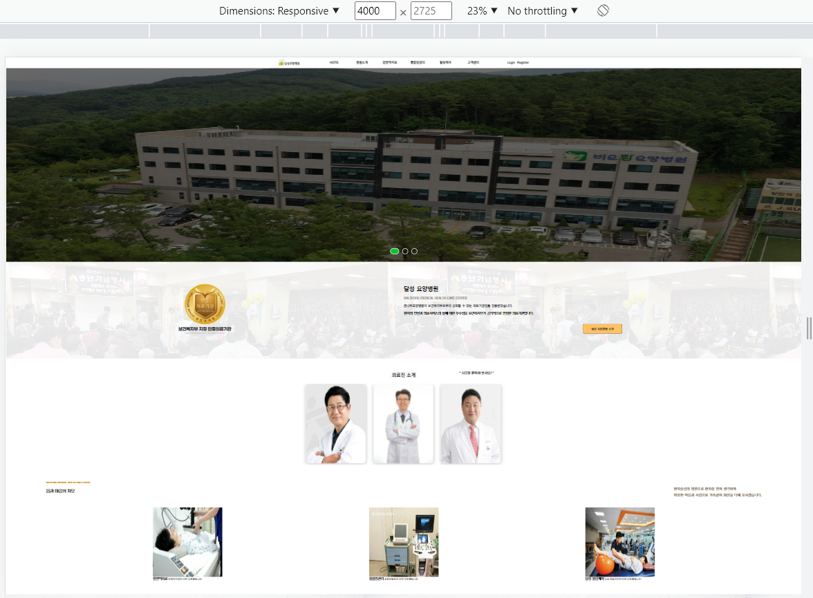
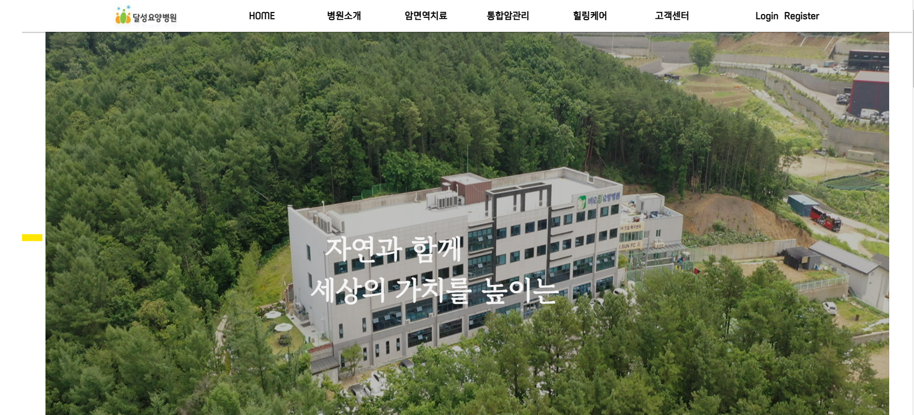
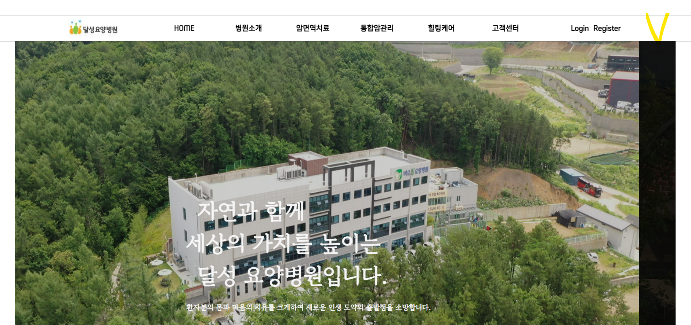
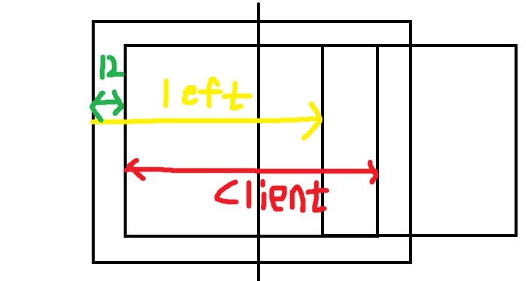
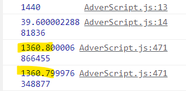
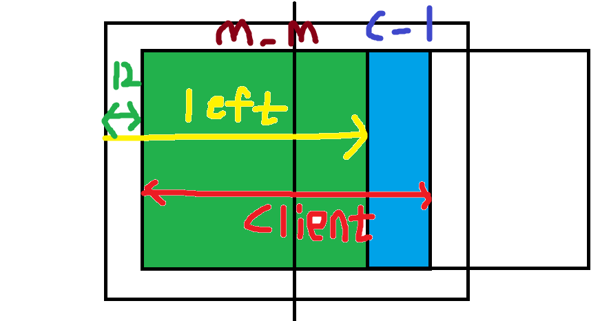
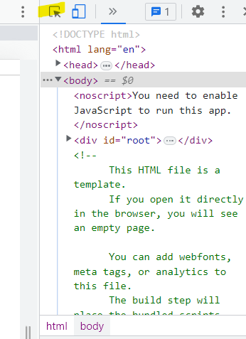
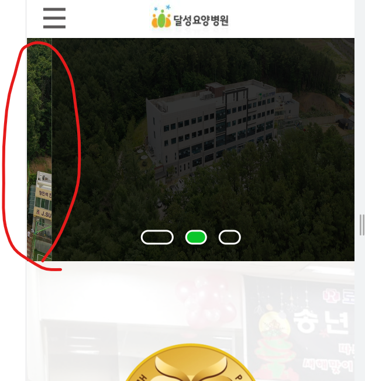
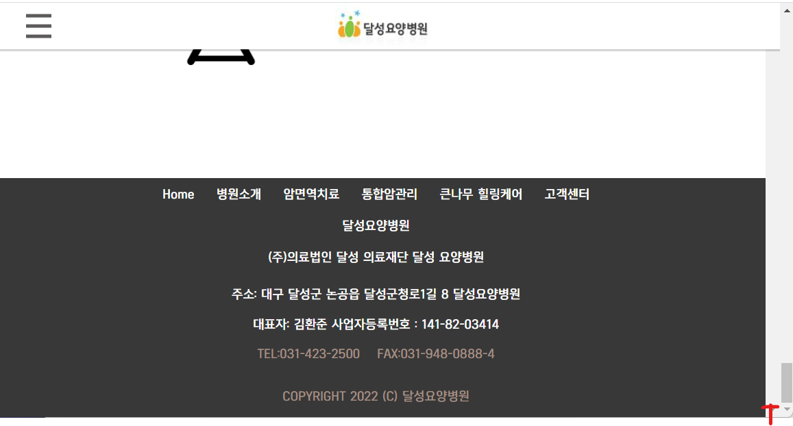

## 웹 서비스 UI 조절 중


#### Before




#### After


```react
   <Header />
      <div style={{width: "100%", display: "flex", justifyContent: "center"}}>
        <div style={{ maxWidth: "1440px", width: "100%" }}>
          <AdverUp />
          <Intro />
          <Committee />
          <Check />
          <Map />
        </div>
      </div>
   <Footer />
```


Header와 footer는 뷰포트의 넓이를 계속 추종해도 상관없으니 maxWidth 1440px 제한에서 이탈시켜줬다.

**(maxWidth 1440px)** ==> 1440px 이상으로 넓어 진다면 이 elem의 넓이를 1440으로 고정시키겠다는 뜻.

elem의 넓이를 1440으로 고정시켰으니 자식 elem이 만약 width 100%를 추종한다면 그에 맞게 UI가 재배치되게 된다. 만약 고정 width를 가지고 있다면 부모 넓이를 넘어서 배치될 수 있는점 유의.


그리고 1440 제한 부모 컴포넌트가 뷰포트 넓이를 추종하게 만들기 flex를 통해서 Center화 시켰다.


## UI 재배치로 인한 캐로셀 광고판 옆의 공백이 생겨 스와이프 이동 수정




옆의 형광판으로 표시해놓은 것처럼 "공백"이 생겨있음.


```react
    let frame_left_width = frame.getBoundingClientRect().left;
```

```react
    let frame_left_width = document.getElementsByClassName("carousel_Frame")[0].getBoundingClientRect().left;
```

위와 같은 식으로 공백의 길이를 받아왔는데 이는 윈도우가 resize 됬을 경우 값이 재선언이 안되는 상황이 발생한다. 

그래서 재선언을 위해서 아래 resize 이벤트가 발생한다면 재선언되게끔 만들어주었다.


```react
        window.onresize = () => {
            slide.style.transition = "none"; //transition은 inherit 안됨.
            slideWidth = slides[slid_index].clientWidth;
            slide.style.transform = `translateX(${-slideWidth * slid_index}px)`; //100%이기 때문에 재계산해줌.
            document_Width = document.documentElement.clientWidth;
            frame_left_width = document.querySelector(".carousel_Frame").getBoundingClientRect().left;
            carousel_Trick();
            console.log("resize");
        }
```

아래 부분에 주목하자. 다시 값을 재계산해준다.

```react
frame_left_width = document.querySelector(".carousel_Frame").getBoundingClientRect().left;
```


## 이상하게 1200px 뷰포트에서 넓이가 망가지는 현상이 발생


```react
        <div style={{ maxWidth: "1440px", width: "100%" }}>
```

자식의 넓이를 제한하는 부모 element Width 100%를 주었더니 해결되었음.


## 스와이프 후 포인터 다운 업을 했더니 스와이프로 빠르게 넘어간다.

포인터 업 이벤트가 발생하였을때 무언가 문제 있는 코드가 실행되는 것 같다는 에측하에 살펴보았다.


```react
        function slider_Pointer_Up() { //up의 문제파악
            if (flag === 1) {
                slide.style.transition = "transform 0.1s ease-out";
                slide.style.transform = `translateX(${(-slideWidth * slid_index) - move - (adver_Current.getBoundingClientRect().right - frame_left_width) }px)`;
                dimds[slid_index].style.backgroundColor = "rgba(0,0,0,0.8)";

                slid_index++;
                spans[span_index].style.width = "25px";
                spans[span_index].classList.remove("active");

                span_index++;
                span_index = span_index % spans.length;
                spans[span_index].style.width = "40px";
                spans[span_index].classList.add("active");

                for (let i = 0; i < adver_Text_Array[span_index + 1].children.length; i++) {
                    let j = i;
                    adver_Text_Array[span_index + 1].children[j].classList.add("active");
                }

                composition_Slid_End();
            }
            else if (flag === 2) { 
                slide.style.transition = "transform 0.1s ease-out";
                slide.style.transform = `translateX(${(-slideWidth * slid_index) - move + (slideWidth - adver_Current.getBoundingClientRect().left + frame_left_width)}px)`;
                dimds[slid_index].style.backgroundColor = "rgba(0,0,0,0.8)";

                slid_index--;

                spans[span_index].style.width = "25px";
                spans[span_index].classList.remove("active");
                span_index--;

                if (span_index === -1) {
                    span_index = spans.length - 1;
                }
                spans[span_index].style.width = "40px";
                spans[span_index].classList.add("active");

                for (let i = 0; i < adver_Text_Array[span_index + 1].children.length; i++) {
                    let j = i;
                    adver_Text_Array[span_index + 1].children[j].classList.add("active");
                }

                composition_Slid_End2();
            }
            else if (flag === 3) {
                slide.style.transition = "transform 0.1s ease-out";
                slide.style.transform = `translateX(${(-slideWidth * slid_index)}px)`;
                console.log("fired3");
            }

            flag = 0; //******이 부분으로 해결*********
            slide.removeEventListener("pointermove", slider_Pointer_Move);
            slide.removeEventListener("pointerleave", slider_Pointer_Leave);
            slide.removeEventListener("pointerup", slider_Pointer_Up);
            slide.style.cursor = "auto";
            carousel_Id = setInterval(carousel_Event, 5000);
        }
```

해당 flag값이 처음에 null이 였다가 move 이벤트에서 선언되어지는데 이후에 move이벤트를 발생시키지 않고 제자리에서 포인터 다운 업만하게 되면 해당 flag값에 알맞는 Up 이벤트가 동작되어지게 로직이 맞춰져있어 오류 모션이 발생하게 된다.


이를 위해서 Up 이벤트 발생 시킨 후 이동 모션이 포함된 If 모듈이 실행되지 않도록 flag를 0으로 초기화 시켜준다.


## 왼쪽으로 스와이프를 했더니 오른쪽에 빈공간이 남아 해결했다.




왼쪽으로 스와이프 시마다 끝까지 이동하지 못하고 어떤 부분이 지속적으로 남아있는 이슈가 존재했었음.

```react
slide.style.transform = `translateX(${(-slideWidth * slid_index) - move + (slideWidth - adver_Current.getBoundingClientRect().left - frame_left_width)}px)`;
```

처음 코드는 위와 같다.





캐러셀 윈도우 크기와 같게끔 1440 숫자가 나와야하는데 80정도가 어딜로 갔는가?

위 코드를 분석하게 된다면 특히 이 부분.

```react
(slideWidth - adver_Current.getBoundingClientRect().left - frame_left_width)
```

현재 광고판의 left값에서 frame_left_width를 제거해주면 되는데 중요한 건 현재 left값이 - 이므로 여기에서 값을 빼주기 위해서는 frame_left_width 값이 - 가 아니라 +가 되어야 한다.




그렇다면 해당 부분이 slideWidth 에서 제거될 수 있음.

m_m => 마우스로 이동된 거리.
c_l => 광고판 넓이에서 이동된 거리를 뺀 나머지.


## 모바일 에뮬레이터 시 컴포넌트 몇개가 미노출되는 이슈가 발생



이 부분을 누르게 되면 User-agent가 "모바일"에서 "PC"로 바뀌고 있음.

이렇게 바뀜으로써 모바일 뷰어에서도 PC의 CSS가 적용되는 현상이 발생함.


대부분 이렇게 되면 미디어 CSS 즉, 
```css
@media(any-pointer: coarse)
```

이 부분으로 적용되어진 부분은 모바일 에뮬레이터 DOM 셀렉트 버튼을 누를때마다 스타일이 바뀌게 되는 이슈가 발생함.


고로 해당 부분은 처음에 "어떤 플랫폼"에서 불러와지냐에 따라 **한번만 적용시켜** 에뮬레이터로 크로스 플랫폼을 진행하더라도 스타일이 바뀌지 않게끔 만들어준다. 

```react
useEffect(() => {
        AdverScript(dots.current.querySelectorAll("span"),carousel.current,carousel.current.children,dots,isMobile);
    
        if(isMobile){ //PC or Mobile
            let dom_dots = document.querySelectorAll(".dots");
            let dom_wrapper = document.querySelector(".dots_Parent_Wrapper");
    
            for(let i=0; i<dom_dots.length; i++){
                dom_dots[i].style.width = "25px";
                dom_dots[i].style.height = "15px";
            }
    
            dom_wrapper.style.position = "absolute";
            dom_wrapper.style.left = "50%";
            dom_wrapper.style.transform = "translate(-50%,-180%)";
        }
    
    }, []);
```


< 해결 방안 사고 논리 >


CSS에서 컨트롤 하는게 아니라 

자바스크립트에서 Opacity를 컨트롤 하면 어떨까?


Opacity가 적용되는가?

CSS

PC => 에뮬   적용됨

PC => PC  적용안됨

에뮬 => 에뮬 적용됨


Javascript

PC => 에뮬 적용 안됨 (요기를 고칠 수 있음.)

PC => PC 적용 안됨

에뮬 => 에뮬 적용됨 ( 맵의 애니메이션 등장 타이밍이 조금 이상함 )


## PC에서 구글 에뮬레이터로 전환시 옆에 공백이 남는 현상이 발생




발생의 원인을 파악하자면 이렇다.

PC => 모바일 에뮬레이터 => Resize 발생  (이 때 "세로 스크롤"이 사라지지 않고 존재함) => slides[slid_index].clientWidth 재측정 => 세로 스크롤이 사라짐 => 사라진 만큼 slide의 영역이 증가하나 그에 맞게 이동 거리 또한 증가가 안되어 옆에 공백이 생김.


```react
        window.onresize = () => {
            slide.style.transition = "none"; //transition은 inherit 안됨.
            slideWidth = slides[slid_index].clientWidth;
            slide.style.transform = `translateX(${-slideWidth * slid_index}px)`; //100%이기 때문에 재계산해줌.
            document_Width = document.documentElement.clientWidth;
            frame_left_width = document.querySelector(".carousel_Frame").getBoundingClientRect().left;
            carousel_Trick();

            setTimeout(()=>{
                slideWidth = slides[slid_index].clientWidth;
                slide.style.transform = `translateX(${-slideWidth * slid_index}px)`; //100%이기 때문에 재계산해줌.
            },100);
        }
```


현존하는 코드에 아래 코드를 추가해주었다.

```react
            setTimeout(()=>{
                slideWidth = slides[slid_index].clientWidth;
                slide.style.transform = `translateX(${-slideWidth * slid_index}px)`; //100%이기 때문에 재계산해줌.
            },300);
```


생각해봐야할 Condition은

그런데 SetTimeOut과 SetInterval 둘다 Web API에서 관리해줌.


둘다 slid_index를 추종함.

​								

​							 Slid_index증가         알맞은 Slid_index이동

​									 이동
Resize 발생 =>   SetInterval 발생  =>      SetTimeout 발생

​																			300ms

​											

​							

​						알맞은 Slid_index이동	 Slid_index증가

​																 	 	  이동

Resize 발생 =>   SetTimeout 발생 =>     SetInterval 발생

​									300ms


결국 독립 순차적으로 발생하기 때문에 아무 문제 없으나 PC에서 Resize 함수 실행으로 인한 자원 낭비가 있을 수 있다.


## 태블릿 전용 모달의 X 버튼을 눌렀더니 body Scroll이 생겼다.





```react
    mobile_Menu_Button.current.onclick = () => {
    
      mobile_Menu.current.style.width = "0px";
      mobile_Menu_Dimd.current.style.display = "none";
      mobile_Menu_Button.current.style.display = "none";

      document.body.style.overflowY = "scroll";
      document.body.style.touchAction = "auto";

      for (let i = 0; i < list.length; i++) {
        list[i].style.height = 0; 
        if(arrow[i].classList.contains("active")){
          arrow[i].classList.remove("active");
        }
      }

      setTimeout(() => {
        header_Button.classList.toggle("change");
      }, 500);
    }
```


```react
   document.body.style.overflowY = "scroll";
```

이 코드가 기능하여 원래는 scroll이 아니던 값을 scroll로 바꿔줘서 강제로 표출 시킨 경우이므로 이 코드를 삭제한다.


바깥쪽에 생기는 스크롤은 "html"의 스크롤이고 안쪽 빨간 표시가 되어 있는 스크롤은 "body"의 스크롤이다.


## 태블릿 전용 모달의 X 버튼을 눌러 모달이 노출될때 x축으로 스크롤바가 생성된다.

해당 모달의 가장 바깥쪽에 존재하는 부모 Elem의 넓이를 Content가 넘게 될때 발생하는 이슈이므로


```css
    .mobile_Menu {
        position: fixed;
        left: 0;
        top: 0;
        width: 0;
        height: 100%;
        background-color: whitesmoke;
        z-index: 3;
        display: flex;
        flex-direction: column;
        overflow-y: auto;
        overflow-x: hidden;
        transition: width .5s;
        white-space: nowrap;
    }
```


```css
        overflow-x: hidden;
```

해당 부분의 코드를 추가해서 스크롤 기능을 없엔다.


## 의사 명함 카드 부분이 PC에서 Mobile 에뮬레이터로 변경시 사라진다.

해당 CSS 컨트롤은 하단의 미디어 쿼리로 컨트롤되고 있었는데 이 경우 **"넓이"**에 **"변환성"**을 의존한다고 생각하면 편하다.

```css
@media screen and (max-width: 414px)
```


해당 414px 넓이에 따라 의사 명함 카드 오퍼시티 애니메이션 초기 설정이 되고 초기설정으로 Opacity가 0, 이는 ScrollEvent에서 1로 변화시켜줘야하는데 ScrollEvent는 모바일에서만 실행된다.

고로 PC에서는 모바일 에뮬레이터(넓이가 작아짐)로 전환시키면 Opacity가 0이 되므로 표출이 안되는 이슈가 발생한다.


이를 "넓이"에 의존하지 않고 "user-agent"에 의존시켜 처음 로드된 환경에 맞춰 CSS를 컨트롤한다면 해결할 수 있다.


```react
  useEffect(()=>{
        if(is_Mb){
          let committee = document.querySelector(".committee_Wrapper");
          committee.style.position = "relative";
          committee.style.transition = "top 1s, opacity .7s";
          committee.style.top = "100px";
          committee.style.opacity = "0";
        }
  },[]);

```


User-agent

PC                  |             MB

​								애니메이션1(CSS)...

​								애니메이션2

​                                애니메이션3

​								 scrollEvent


## PC에서 태블릿 넓이 일때 옆의 햄버거 버튼을 클릭하여 모달 출력 뒤 배경이 스크롤이 가능한 이슈

해당 부분은 html의 overflow를 컨트롤 하는게 아니라 body의 oveflow를 컨트롤해서 발생하는 문제.


```react
      header_Button.current.onclick = () => {
        header_Button.current.classList.toggle("change");
        mobile_Menu.style.width = "300px";
        mobile_Menu_Dimd.style.display = "block";
        mobile_Menu_Button.style.display = "inline-block";
        document.body.style.touchAction = "none";
        document.querySelector("html").style.overflowY = "hidden";
        document.querySelector("html").style.touchAction = "none";

        
        for (let i = 0; i < list.length; i++) {
          list[i].style.transition = "height 0.8s";
          arrow[i].style.transition = "transform .3s";
        }
      }
```


```react
        document.querySelector("html").style.overflowY = "hidden";
        document.querySelector("html").style.touchAction = "none";
```

원래는 body의 touchAction과 overflowY를 컨트롤 하였는데 html로 바꿔주었다.


요것을 참고하면 편하다. 맨 바깥쪽의 Scroll은 Html의 것이고 그 바로 안쪽이 Body의 것이다.


## 테블릿 화면 넓이에서 햄버거 버튼으로 모달을 열고 윈도우 창을 확대하여 컴포넌트를 제거하였더니 스크롤이 없어짐

이것은 햄버거 버튼 클릭 후 html oveflow가 hidden되고 touch가 막히는 코드가 적용되어서 그렇다.

해당 모바일 모달 컴포넌트가 반환 될때 어떤 실행을 할건지를 useEffect에서 정의 할 수 있으므로 return에서 처리해준다.


해당 밑의 코드는 Mb 메뉴 모달 컴포넌트의 useEffect임.

```react
  useEffect(() => {
    let menu_Top = document.querySelectorAll(".mobile_Menu_Top_Text");
    let list = document.querySelectorAll(".mobile_Menu_List_Sub");
    let arrow = document.querySelectorAll(".fa-solid.fa-angle-up");
    let header_Button = document.querySelector(".container");
    let list_height = Array(0);
    let open_Indic;

    for (let i = 0; i < menu_Top.length; i++) {
      let Str_arr = window.getComputedStyle(list[i]).height.split("px"); 
      list_height.push(Number(Str_arr[0]) + 10 + "px");
      list[i].style.height = 0;
      mobile_Menu.current.style.width = 0;

      menu_Top[i].onclick = () => {
        open_Indic = menu_Top[i].querySelector(".fa-solid.fa-angle-up").classList.toggle("active");
        if (open_Indic)
          list[i].style.height = list_height[i];
        else
          list[i].style.height = 0;
      }
    }

    mobile_Menu_Button.current.onclick = () => {
    
      mobile_Menu.current.style.width = "0px";
      mobile_Menu_Dimd.current.style.display = "none";
      mobile_Menu_Button.current.style.display = "none";
      document.body.style.touchAction = "auto";
      document.querySelector("html").style.overflowY = "scroll";
      document.querySelector("html").style.touchAction = "auto";

      for (let i = 0; i < list.length; i++) {
        list[i].style.height = 0; 
        if(arrow[i].classList.contains("active")){
          arrow[i].classList.remove("active");
        }
      }

      setTimeout(() => {
        header_Button.classList.toggle("change");
      }, 500);
    }

    return ()=>{
      document.body.style.touchAction = "auto";
      document.querySelector("html").style.overflowY = "scroll";
      document.querySelector("html").style.touchAction = "auto";
    };
  }, []);
```


리턴에서 정의해주는 중.


```react
    return ()=>{
      document.body.style.touchAction = "auto";
      document.querySelector("html").style.overflowY = "scroll";
      document.querySelector("html").style.touchAction = "auto";
    };
```

